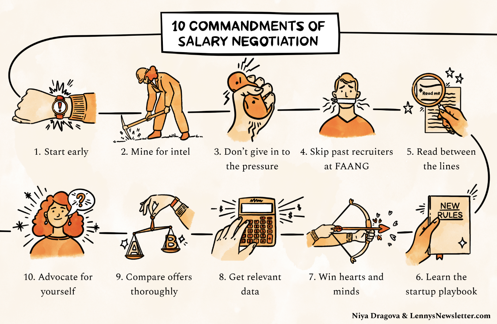

# Questions to company

Always don't say yes to any offer at that time, always sleep over it

### Interview - Keep in mind

1. Ask Good Questions
2. Don't use buzzwords if you don't have a knowledge about them
3. Clear and organized thinking
4. Drive Discussions (80-20 rule, You must talk 80% of the time and interviewer 20%)

https://www.lennysnewsletter.com/p/negotiating-comp

https://auren.substack.com/p/lets-talk-about-founder-compensation

## What is your current day-to-day like in last company?

1. Mentoring and helping other developers
2. Taking interviews
3. Architecture meetings for next products
4. Business meetings for driving value from products
5. Discussing about how to improve current solutions using new technologies (graphql, kubernetes, terraform)

## What is the most difficult project/thing that you have done?

1. Getting the domain knowledge of the project I have been working on

## Metrics that I follow

1. Happiness (solving real world problems)
2. Compensation
3. Learning
4. ~~Productivity~~

## Questions

1. What are your biggest weaknesses?
2. What are your biggest strengths?
3. Where do you see yourself in five years?
4. Out of all the candidates, why should we hire you?
5. How did you learn about the opening?

- What will be my roles and responsibilities as Solution Architect?

1. **Always find the person who you will be working under, because you will learn from that person only.** - Why - Engineering productivity is key to building good software. It comes down to the manager to make sure the developer team is performing as expected.
2. Find how can you grow in the company. (Both professionally and academically)
3. Teaching must be a part of the company. (Best way to learn is to teach)
4. More higher positions (Experience needed or knowledge needed)
5. If you can go back 5 years ago and change one thing what would it be

## Finance Questions from Company

- Yearly bonus or Stocks
- EPF Contributions
- Medical benefits
  - Life Insurance
  - Term Insurance
- Renumeration for devices/hardwares
- Travel grants for Conferences
- Cloud access for ML/AI
- Relocation reimbursements
- Joining bonus
- Equity - Preference stack when getting an equity package
- Compensatory leaves (since I like to work on weekends)
- Study Leaves / Training / Certifications / Reimbursements
- Gratuity (The sum of money paid by an employer to an employee for his/her rendered services to the organisation for the tenure of his/her services)
- Work from home (WFH)

https://neilpatel.com/training/growth-hacking-unlocked/raise-money

## Job Questions

- Notice period - Max 2 months (**with buyout policy**)
- Internal Switching Policy for long term
- Probation Period (3 months to analyze the company) - What if I didn't like the culture or anything else. I want to be in company for a long haul so I will first analyze the company.
- Working hours (flexible timings)
- **Laptop (System)**

## Legal Questions

- Indemnification
- non-compete

## Other Question to company (Culture)

- Is this a new position being created or a existing position being filled
- **Meet people in the company who are their for long term**
- How do you ensure that people ideas are heard
- How do you access performance of individuals
- How do you tackle failure (one fails to deliver on something that is new)
- Decision making process
- How are raises calculated and awarded?
- Functional and Non functional requirements?
- **Career Path / Engineering Competency Matrix** - https://drive.google.com/open?id=131XZCEb8LoXqy79WWrhCX4sBnGhCM1nAIz4feFZJsEo

1. What do the day-to-day responsibilities of the role look like?
2. What are the company's values? What characteristics do you look for in employees in order to represent those values?
3. What's your favorite part about working at the company?
4. What does success look like in this position, and how do you measure it?
5. Are there opportunities for professional development? If so, what do those look like?
6. Who will I be working most closely with?
7. What do you see as the most challenging aspect of this job?
8. Is there anything about my background or resume that makes you question whether I am a good fit for this role?

## Good Questions for the company

- What would be an ideal candidate for your group/company
- How do you test your software? (dedicated test engineers?)
- How you do peer reviews? (core reviews, branching strategies, methodologies they follow?)
- What programs do you have for continuous education.
- What's the software development process that you use?
  - How many projects could I expect to work on in a month?
  - What's the process for managing the code?
  - How long are the typical sprints?
  - How many developers are on the team?
  - Do developers get time to learn on the job?
  - Learning initiatives for growing people?
  - What's the typical length of a project?
  - How are vacation days handled?
  - Are there any emergency processes in place? / Disaster Recovery
- How is project management handled?
  - **Project Management and Task Management Tools**
- Are there technical debts in the current architecture/code base?
- How do you tackle technical debt?
- What's your company culture like?
  - How is working at this company different from working at others?
- How much discretionary power will I have to take decisions?
- How do you manage Documentation / Knowledge base?

## Question to Team

- Tech Stack
  - Python 3
  - Latest codebase
  - Codebase should be clean
  - Technical Debt
  - VCS - git / github (so that my contributions can be added to my profile)
  - Containerization
  - CI/CD pipelines
  - Open source contributions/repositories
  - Do you use chaos testing (resiliency tool / Fault injection)
- Team Size
- Data flow / data pipeline architecture
- Architecture diagram
- User flows
- Different modules/components
- What are tools/technologies you are using
- Different types of storage
- Different teams (data science / data collection / backend / frontend)
- On cloud / on premise

## Startup Questions

- Background of founders before joining company
- Do you have product-market fit? - If not, they don't have real money, and there's no guarantee they ever will.
- What is your current growth rate?
- What is your runway? - The longer the runway, the more financially stable the company is. "Cashrunway" refers to the length of time in which a company will remain solvent, assuming that they are unable to raise more money.
- What's the company's/department's strategy for the next 6-18 months
  - Keep the title & position of the interviewer in mind

## Check about company

- tofler.in
- glassdoor
- crunchbase
- Talk to previous ex-employees and some existing employees

## ESOPS, Restricted Stock, Stock Options, and Phantom Stock

Restricted stock gives the employees the right to receive shares as a gift ora purchased item after meeting particular restrictions, such as working for a specific period or hitting specific performance targets.Stock options provide employees with the opportunity to buy shares at a fixed price for a set period, while phantom stock provides [cash bonuses](https://www.investopedia.com/terms/c/cash-bonus.asp)for good employee performance.

These bonuses equate to the value of a particular number of shares.Stock appreciation rights give employees the right to raise the value of an assigned number of shares. Companies usually pay these shares in cash.

- Once an ESOP scheme is approved, aLetter of Grantshould be issued to the employee informing him how many options are being granted to him, what the vesting period would be and how the exercise price will be determined, should he choose to exercise the vested options.
- In the event an employee wishes to exercise any of his vested options, he should make anExercise Applicationto his employer company pursuant to which his options would be converted into equity.

https://yourstory.com/2015/09/esop/amp

https://www.investopedia.com/terms/e/esop.asp

## Equity offer questions

- What percent of the company do these shares represent? - Your percentage of ownership means more than your number of shares
- What is your total preference stack? - The more owed in liquidation perference, the less your equity is likely worth
- What's the minimum price you would exit for? - Gives reference point for valuing your potential payout

https://angel.co/blog/30-questions-to-ask-before-joining-a-startup

https://dev.to/flippedcoding/10-questions-you-should-ask-in-a-web-dev-interview-1c2d

The important thing is to have **realistic expectations** about how much money my equity could turn into.

https://www.trica.co/equity/blog/evaluating-esops-questions-that-cxos-should-ask

https://superops.ai/startup/esops-101-blog

1. What percent of the company do these shares represent?

Your percentage of ownership means more than your number of shares

Percentage of the company that the ESOP pool represents

2. What is the my **preference stack**? (What is the total preference) (Classes of preferred shares) (multiples 1.5x?)

- **dilution**
- What was our most recent valuation?
- What is our current yearly growth rate?
- How much would the company need to sell for before my equity has value?
- If your most recent valuation is close to or exceeds the needed sale price, your equity offer has value. If the needed sale price is much higher than the company's most recent valuation, though, you have something to consider: Based on its current growth rate, how many years would you need to stay before its value comes close to that needed sale price? Are you comfortable investing that much time?
- The more owed in liquidation preference, the less your equity is likely worth
- it had investors and board members whose equity was [protected](https://www.sec.gov/Archives/edgar/data/1089196/000119312515079062/d520327ds1a.htm#toc520327_13)by high liquidation preference - a guarantee that they get paid first and at least a certain amount when the company sells. When startup investors make millions in a sale, but money runs dry before reaching employees, a bad preference stack is often the cause.
- Liquidation preference give investors the protection they need to make the high-risk investments that startups thrive on.
- If there had been a 1x liquidation preference in place, the investor would be guaranteed to get $3 million back.
- The more money a startup raises, the harder it gets to fetch a high enough acquisition price.

3. Preemptive rights - What are preemptive rights and who has them? - Preemptive rights allow common shareholders to maintain their proportional ownership in a company by buying more shares in the event that the company issues another offering. These are sometimes issued to holders of common stocks. Holders of preferred shares typically also have other protections against dilution.

4. While the first company offers you 1000 options out of 1,00,000, the second offers 500 out of 10,000. You have more skin in the game in the second company but you have to ask the founder why the ESOP pool is so small? Is he or she averse to sharing equity with early team members? When will the ESOP pool be expanded? These questions will help you better understand the founder's vision.

5. Total money we have raised, and how much it's liquidated the shares?

6. Annexure 1 > point 3 > "provided the Participant is in the employment of the Company at such time", what if the employee is no longer employed after some vesting? How will it be handled?
    - What if you decide to leave the company before all your options have vested? Is there a policy for accelerated vesting in the time of a merger? Can you exercise your ESOPs early? Is there a possibility of a potential buyback in the upcoming years?
    - **Let's say I own shares at the company I am working for. I decide to leave. What happens to my shares?**

Generally, you have 90 days to buy the vested shares. Once you buy them, your shares will remain with you until the company goes IPO, secures a round of funding, or gets acquired. If you don't do so, all your vested share units will lapse. There will be nothing you can do about it.

There's a catch here as well. Just like your favorite jar of peanut butter, your stock units have a shelf life which is usually 10 years from the date of purchase. If you buy the shares but the company doesn't go public, secures the next round of funding, or gets acquired, your purchase options will expire. But most companies that are doing well get approval from the board to push the expiry by another year.

7. Red Flags

**A Small ESOP Pool At An Early Stage Startup**

Founders, with a wealth-sharing motive, will always create larger ESOP pools at an early stage. If an early-stage startup has an ESOP pool that is lesser than 10% of total equity, you might reconsider your decision of joining the startup

**Formal Grant Letters Are Not Issued**

Ensure that a formal grant letter will be issued when you join. If ESOPs are just promised verbally, there might be a possibility that your grants will be delayed or you will face complications while completing the ESOP lifecycle

8. How is Equity Linked Upside different from Stock Options?
9. What will be the Mode of payment of the Equity Linked Upside?
10. How will taxes be calculated and when?
11. In what cases will the unvested grant be accelerated?
12. What's the minimum price you would exit for?

Gives reference point for valuing your potential payout

**best estimate of the Company's valuation upon an exit?**

1. **Secondaries**

At the time of a funding round, the investors will buy a small portion of the vested common shares from founders and early employees. This is done to give them a partial exit and keep them motivated to scale the organization. The recent stories of secondaries in Razorpay, Zerodha, Paytm, and Ola are encouraging signs for employees.

### ESOPs

Wealth creation through ESOPs is a major reason why people join startups. But most people struggle to correctly evaluate job offers that also includes ESOPs

Here is a framework that should help:

For an employee to make meaningful money through ESOPs, 2 things must happen:

- Growth in company value
- Employee friendly ESOP policies that ensures employees make money when company grows

#### a) Growth in Company Value

This is where employees need to think like investors

Just like investors are particularly wary of what valuation they are coming in, entry valuations should matter for employees too

ESOPs are allotted basis the current valuation

The likelihood of a 10x growth in your ESOPs if you are joining a startup valued at 100 million $ is much higher compared to joining a startup already valued at 5 billion $

If you happen to join a startup just after the company raised a round which you think was overvalued, the chances of your ESOPs growing reduces

One mistake that people often make is comparing the allotted ESOPs from 2 companies at different stages. A 75 lakh ESOP allotment in a 1000 cr valued org with chances of a 10x growth could be a better offer than 2 cr ESOP allotment at a 20000 cr valued org with lower chances of future growth

The second thing to judge is the business model and the likelihood of the business to grow( very important for Seed/Series A/B startups)

Access to data is a challenge, but basic secondary research and asking the right questions and metrics in the interviews should help here

#### b) ESOP Policies

The startup ecosystem is full of stories where employees didn’t make money despite the company growing and having multiple liquidity events.

Here are the things that should matter most while evaluating policies:

##### 1. Vesting Schedule

The standard is 25% vesting after every year. Any schedule which has higher vesting towards the later years is a red flag

Vesting should never be performance linked

If performance is bad, it is management’s responsibility to fire

##### 2. Vesting on Leaving/Startups Exit

If you exit, you should retain all options that has vested

If a startup gets acquired before all your options vest, there should be accelerated vesting

##### 3. ESOP Communication

There should always be written communication( preferably through ESOP portal)

Verbal communication for ESOPs is a huge red flag

##### 4. Strike Price

Strike Price should be as low as possible( Re 1 ideally). This maximizes the value creation for the employee

##### 5. Holding/Exercise Period

Converting options to shares is a major tax liability exercise. With limited exercise period, it becomes impossible for employees to exercise as it means paying up to 40% real taxes on notional capital gains in an asset class that is not liquid

Ideally, holding period should be infinite for vested options, even after exit

This enables employees to wait for liquidity events without incurring upfront taxation to be paid out of own pocket

## How to ask for raise / Salary negotiation

- Problem - I want a 20% raise, I did my research and my average salary should be 20% more. The positioning of the question, leaves the employer with a yes or no choice
- Go the boss in the middle of this continuum. I worked here for two and a half years. I have been here through the high times and low times. You know I am loyal. My aspirations are to stay here and grow with the organization. Can you help me figure out a path that gets me to this salary.
- It's not a yes or no game, it's allowing for conversation, it's allowing somebody to recognize that you view your own career with the organization, can you invest in me, can you take a bet on me, rather than meet my demands.
- Therefore a lot of these things fail because they're poorly presented
