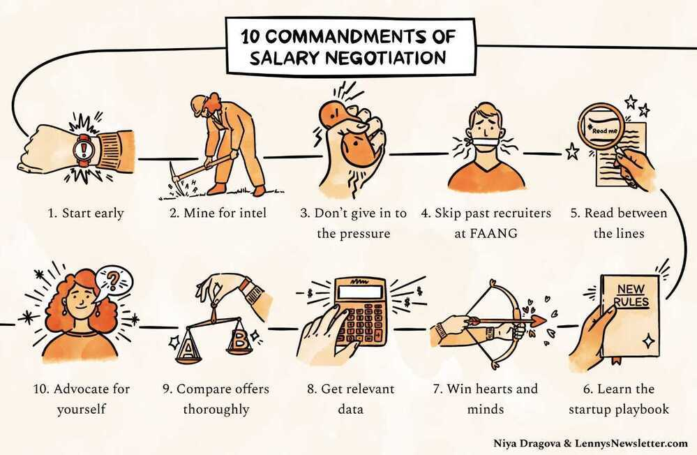

# Questions to company

Always don't say yes to any offer at that time, always sleep over it

### Interview - Keep in mind

1. Ask Good Questions
2. Don't use buzzwords if you don't have a knowledge about them
3. Clear and organized thinking
4. Drive Discussions (80-20 rule, You must talk 80% of the time and interviewer 20%)

https://www.lennysnewsletter.com/p/negotiating-comp

https://auren.substack.com/p/lets-talk-about-founder-compensation

## What is your current day-to-day like in last company?

1. Mentoring and helping other developers
2. Taking interviews
3. Architecture meetings for next products
4. Business meetings for driving value from products
5. Discussing about how to improve current solutions using new technologies (graphql, kubernetes, terraform)

## What is the most difficult project/thing that you have done?

1. Getting the domain knowledge of the project I have been working on

## Metrics that I follow

1. Happiness (solving real world problems)
2. Compensation
3. Learning
4. ~~Productivity~~

## Questions

1. What are your biggest weaknesses?
2. What are your biggest strengths?
3. Where do you see yourself in five years?
4. Out of all the candidates, why should we hire you?
5. How did you learn about the opening?

- What will be my roles and responsibilities as Solution Architect?

1. **Always find the person who you will be working under, because you will learn from that person only.** - Why - Engineering productivity is key to building good software. It comes down to the manager to make sure the developer team is performing as expected.
2. Find how can you grow in the company. (Both professionally and academically)
3. Teaching must be a part of the company. (Best way to learn is to teach)
4. More higher positions (Experience needed or knowledge needed)
5. If you can go back 5 years ago and change one thing what would it be

## Finance Questions from Company

- Yearly bonus or Stocks
- EPF Contributions
- Medical benefits
    - Life Insurance
    - Term Insurance
- Renumeration for devices/hardwares
- Travel grants for Conferences
- Cloud access for ML/AI
- Relocation reimbursements
- Joining bonus
- Equity - Preference stack when getting an equity package
- Compensatory leaves (since I like to work on weekends)
- Study Leaves / Training / Certifications / Reimbursements
- Gratuity (The sum of money paid by an employer to an employee for his/her rendered services to the organisation for the tenure of his/her services)
- Work from home (WFH)

https://neilpatel.com/training/growth-hacking-unlocked/raise-money

## Job Questions

- Notice period - Max 2 months (**with buyout policy**)
- Internal Switching Policy for long term
- Probation Period (3 months to analyze the company) - What if I didn't like the culture or anything else. I want to be in company for a long haul so I will first analyze the company.
- Working hours (flexible timings)
- **Laptop (System)**

## Legal Questions

- Indemnification
- non-compete

## Other Question to company (Culture)

- Is this a new position being created or a existing position being filled
- **Meet people in the company who are their for long term**
- How do you ensure that people ideas are heard
- How do you access performance of individuals
- How do you tackle failure (one fails to deliver on something that is new)
- Decision making process
- How are raises calculated and awarded?
- Functional and Non functional requirements?
- **Career Path / Engineering Competency Matrix** - https://drive.google.com/open?id=131XZCEb8LoXqy79WWrhCX4sBnGhCM1nAIz4feFZJsEo

1. What do the day-to-day responsibilities of the role look like?
2. What are the company's values? What characteristics do you look for in employees in order to represent those values?
3. What's your favorite part about working at the company?
4. What does success look like in this position, and how do you measure it?
5. Are there opportunities for professional development? If so, what do those look like?
6. Who will I be working most closely with?
7. What do you see as the most challenging aspect of this job?
8. Is there anything about my background or resume that makes you question whether I am a good fit for this role?

## Good Questions for the company

- What would be an ideal candidate for your group/company
- How do you test your software? (dedicated test engineers?)
- How you do peer reviews? (core reviews, branching strategies, methodologies they follow?)
- What programs do you have for continuous education.
- What's the software development process that you use?
    - How many projects could I expect to work on in a month?
    - What's the process for managing the code?
    - How long are the typical sprints?
    - How many developers are on the team?
    - Do developers get time to learn on the job?
    - Learning initiatives for growing people?
    - What's the typical length of a project?
    - How are vacation days handled?
    - Are there any emergency processes in place? / Disaster Recovery
- How is project management handled?
    - **Project Management and Task Management Tools**
- Are there technical debts in the current architecture/code base?
- How do you tackle technical debt?
- What's your company culture like?
    - How is working at this company different from working at others?
- How much discretionary power will I have to take decisions?
- How do you manage Documentation / Knowledge base?

## Question to Team

- Tech Stack
    - Python 3
    - Latest codebase
    - Codebase should be clean
    - Technical Debt
    - VCS - git / github (so that my contributions can be added to my profile)
    - Containerization
    - CI/CD pipelines
    - Open source contributions/repositories
    - Do you use chaos testing (resiliency tool / Fault injection)
- Team Size
- Data flow / data pipeline architecture
- Architecture diagram
- User flows
- Different modules/components
- What are tools/technologies you are using
- Different types of storage
- Different teams (data science / data collection / backend / frontend)
- On cloud / on premise

## Startup Questions

- Background of founders before joining company
- Do you have product-market fit? - If not, they don't have real money, and there's no guarantee they ever will.
- What is your current growth rate?
- What is your runway? - The longer the runway, the more financially stable the company is. "Cashrunway" refers to the length of time in which a company will remain solvent, assuming that they are unable to raise more money.
- What's the company's/department's strategy for the next 6-18 months
    - Keep the title & position of the interviewer in mind

## Check about company

- tofler.in
- glassdoor
- crunchbase
- Talk to previous ex-employees and some existing employees

## How to ask for raise / Salary negotiation

- Problem - I want a 20% raise, I did my research and my average salary should be 20% more. The positioning of the question, leaves the employer with a yes or no choice
- Go the boss in the middle of this continuum. I worked here for two and a half years. I have been here through the high times and low times. You know I am loyal. My aspirations are to stay here and grow with the organization. Can you help me figure out a path that gets me to this salary.
- It's not a yes or no game, it's allowing for conversation, it's allowing somebody to recognize that you view your own career with the organization, can you invest in me, can you take a bet on me, rather than meet my demands.
- Therefore a lot of these things fail because they're poorly presented

[EXACTLY How To Negotiate Your Salary: Watch and Learn - YouTube](https://www.youtube.com/watch?v=kBIN2h16Rc4)

## Links

- [Business questions to ask before taking a startup data role | Yanir Seroussi | Data & AI for Startup Impact](https://yanirseroussi.com/2024/05/06/business-questions-to-ask-before-taking-a-startup-data-role/)
