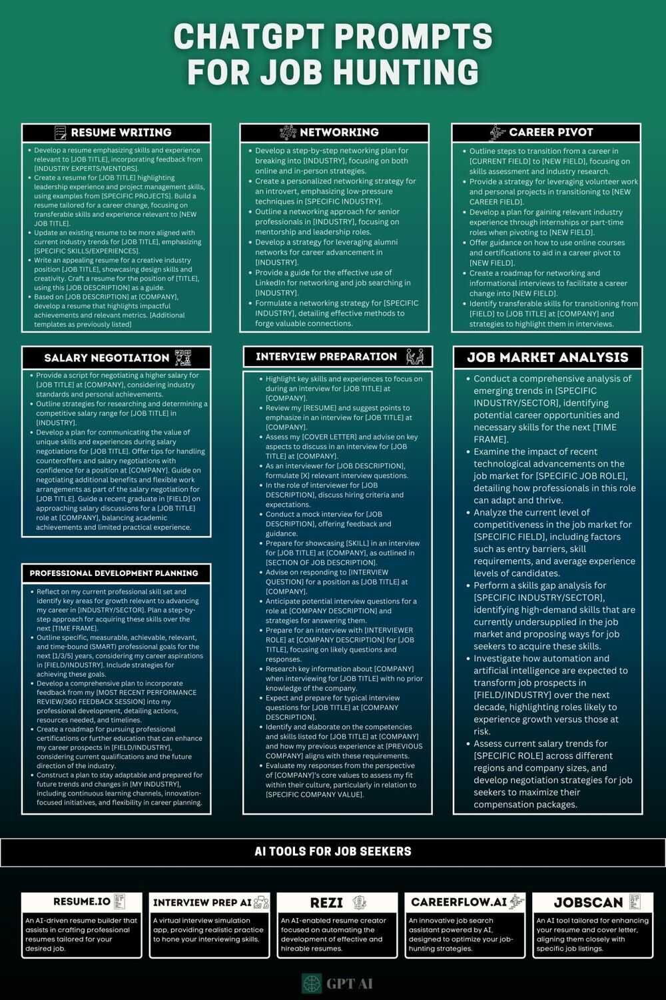

# Job Hunting

- [Career](management/jobs/career.md)
- [Companies](management/jobs/companies.md)
- [Questions to Company](management/jobs/questions-to-company.md)
- [Finance / Equity / Stocks / ESOPS Questions](management/jobs/finance-equity-stocks-esops-questions.md)
- [Good Profiles](management/jobs/good-profiles.md)
- [Resume Keywords Pointers](management/jobs/resume-keywords-pointers.md)
- [Hiring Plan / HR / Recruiting](management/jobs/hiring-plan-hr-recruiting.md)

### Future

- Learn the fastest

### Shotgun approach

Where you apply to a lot of jobs

In early career, taking bets vs random job hopping is critical

### Tests + Outsourcing

- Crossover test
- Cutshort test
- Turing test
- Andela
- Uplers

### Vendors

1. [HuntingCube Recruitment Solutions](https://www.linkedin.com/company/huntingcube/)
2. [Careernet](https://www.linkedin.com/company/wearecareernet/)
3. [Weekday (YC W21)](https://www.linkedin.com/company/weekdayworks/)
4. [Zyoin Group](https://www.linkedin.com/company/zyoin/)

## Platform

- BrainTrust
- [Pesto Tech: Hire Top Remote Developers Using The World’s First AI Recruiter](https://pesto.tech/)
- Hirist
- https://tophire.co/home?
- LinkedIn
    - [linkedin.com/company/call-for-referral/](https://www.linkedin.com/company/call-for-referral/)
- [https://www.instahyre.com](https://www.instahyre.com/)
- https://welcome.turing.com

- Job board - [The Pragmatic Engineer Test: 12 Questions on Engineering Culture - The Pragmatic Engineer](https://blog.pragmaticengineer.com/pragmatic-engineer-test/)
- [Build for everyone - Google Careers](https://www.google.com/about/careers/applications/)
- https://cutshort.io/
- [Jobs in Crypto & Web3 Companies | Crypto Jobs List](https://cryptojobslist.com/)
- **IIITD AlmaIIITD Alma MaterConnect**
- AllRemote - skuad - allremote.jobs
- https://eazyhire.in
- https://www.bigshyft.com/jobs
- Naukri
- https://www.geektrust.in
- Stackoverflow
- stanton chase - executive search
- Vettery
- https://edwisor.com
- humanforte
- [www.computer.org/jobs](http://www.computer.org/jobs)
- Triplebyte
- GlassDoor
- Wantedly
- Angel list
- Snaphunt
- optimhire
- [Propeller - Engineering Careers](https://startpropeller.com/)
- Antal International Network
- Hiration - LinkedIn, tech hiring platform for developers
- [Weekday - Hire top engineers vouched by other techies](https://www.weekday.works/)
- [Find the best startup jobs and remote jobs curated by Y Combinator](https://www.ycombinator.com/jobs)
- [Startup Jobs at YC Companies in Engineering, Product, Design, Remote and more | Y Combinator's Work at a Startup](https://www.workatastartup.com/)
- [https://hirehunch.com/](https://hirehunch.com/)
- Lenny's Newsletter, Job Board
- [https://japan-dev.com/](https://japan-dev.com/)
- [Platform for Showcasing Work](https://athenasquare.org/)
- [Austin Belcak on LinkedIn: 7 Offer-Winning Job Search Tools: | 70 comments](https://www.linkedin.com/posts/abelcak_7-offer-winning-job-search-tools-activity-7039234808589250561--U2q)
- https://www.pallet.com
- [**The Biggest Web3, Crypto & Blockchain Recruitment Agency | Plexus**](https://www.plexusrs.com/)

### Remote Job Sites

- **Andela**
- **Uplers**
- **Toptal**
- [Algora](https://console.algora.io/)
- FlexJobs
- We Work Remotely
- Remote Okay
- Virtual Vocations
- Pangian
- JustRemote
- Remotive
- Skip The Drive LLC
- Remote Dot
- Working Nomads
- JOBSPRESSO
- Crossover
- Talent
- Remote Circle
- Outsourcely
- Dynamite Jobs
- Authentic Jobs, Inc.
- Workew
- 100 Telecommute Jobs
- Remote Jobs
- Werk
- Remotee
- Remote4U
- We Work Remotely
- DailyRemote
- torre.co

### TechJob Boards With Remote Options

- ProBlogger
- Dribbble
- AngelList
- Stack Overflow
- GitHub JOBS
- Tech Junction
- PowerToFly
- LANDING AI JOBS
- BuiltInSoft

### Freelance and ContractJobs

- Freelancer.com
- freelancermap.com
- Upwork
- [Freeup](https://freeup.net/)
- Gun.io
- CloudPeeps
- Textbroker International
- CONTENTA
- SOLID GIGS
- Keylime (International Development)
- Fiverr

Forget [Fiverr](https://www.linkedin.com/company/fiverr-com/) , [Naukri.com](https://www.linkedin.com/company/naukri.com/) , [Shine.com](https://www.linkedin.com/company/shinecom/), and [Monster](https://www.linkedin.com/company/monster/) they are just overhyped.

Here are 30 websites to find remote jobs that pay in USD:

1. [Athyna](https://www.linkedin.com/company/athyna/)
	- Best site for finding your dream remote job and working for companies from all around the world.
	- Link: [www.athyna.com](http://www.athyna.com/)
2. [Wellfound](https://www.linkedin.com/company/wellfoundhq/)
	- Unique jobs
	- Top Companies
	- Over 130,000 jobs
	- Link: [https://wellfound.com/jobs](https://wellfound.com/jobs)
3. [RemoteOK](https://www.linkedin.com/company/remoteok/)
	- Over 600,000 jobs
	- Work from anywhere
	- The no. 1 remote job board
	- Link: [https://remoteok.com](https://remoteok.com/)
4. [Remotive](https://www.linkedin.com/company/remotive.io/)
	- Over 30,000 jobs
	- Vetted tech companies
	- Full remote job opportunities
	- Link: [https://remotive.com](https://remotive.com/)
5. [Remote](https://www.linkedin.com/company/remote.com/).co
	- Hand curated
	- Grow remotely
	- 146 remote companies
	- Link: [https://lnkd.in/eYgwD4bB](https://lnkd.in/eYgwD4bB)
6. [FlexJobs](https://www.linkedin.com/company/flexjobs-com/) - Vetted Remote & Flexible Jobs
	- 50+ categories
	- Over 42,000 jobs
	- 5,509 companies
	- Link: [https://www.flexjobs.com](https://www.flexjobs.com/)
7. [JustRemote](https://www.linkedin.com/company/justremote/)
	- Jobs that fit your life
	- Fully and partially remote
	- Top remote working companies
	- Link: [https://lnkd.in/d5ZqAXm](https://lnkd.in/d5ZqAXm)
8. [PowerToFly](https://www.linkedin.com/company/powertofly/)
	- 2987 Remote jobs
	- Jobs tailored to your skillset
	- Land a job at a company committed to diversity & inclusion
	- Link: [https://powertofly.com/](https://powertofly.com/)
9. [RemoteWoman](https://www.linkedin.com/company/remotewoman/)
	- Women have the opportunity to work from home, enhancing their productivity and flexibility
	- Link: [remotewoman.com](http://remotewoman.com/)
10. Toptal
	- Top Companies
	- Exclusive network
	- Community of experts
	- Link: [https://www.toptal.com](https://www.toptal.com/)
11. [Working Nomads](https://www.linkedin.com/company/working-nomads/)
	- 100% remote jobs
	- Work from anywhere
	- For digital working nomads
	- Link: [https://lnkd.in/efQwAr7V](https://lnkd.in/efQwAr7V)
12. Simply Hired (simply [hired.com](http://hired.com/))
13. Angel List ([angel.co/Jobs](http://angel.co/Jobs))
14. Virtual Vocations ([virtaalvocations.com](http://virtaalvocations.com/))
15. Stack Overflow Jobs (Stack [Overflow.com/Jobs](http://overflow.com/Jobs))
16. Remote Work (Remote [work.com](http://work.com/))
17. Dice ([dice.com](http://dice.com/))
18. Jobspresso ([Jobspresso.co](http://jobspresso.co/))
19. Upwork ([upwork.com](http://upwork.com/))
20. Outsourcely ([Outsourcely.com](http://outsourcely.com/))
21. Europe Remotely ([europeremiely.com](http://europeremiely.com/))
22. [WeWork](https://www.linkedin.com/company/wework/)
23. Remote ok Europe ([remoteok.io](http://remoteok.io/))
24. Flex Jobs ([flexjobs.com](http://flexjobs.com/))
25. Remole of Asia ([remoteok.io/asia](http://remoteok.io/asia))
26. Remote Jobs [remotejobs](https://www.linkedin.com/company/remote-jobs/)
27. remote4me : Customize your remote job search based on location, salary, and more. Link ([https://remote4me.com/](https://remote4me.com/))
28. [AutoApply.Jobs](http://autoapply.jobs/) Jobs [https://autoapply.jobs/](https://autoapply.jobs/)
29. @Finalclub - Transform your LinkedIn connections into email lists with this ChatGPT-Powered Email Finding Extension. [https://finalscout.com](https://finalscout.com/)
30. [Yoodli AI Communication Coach](https://www.linkedin.com/company/yoodli/): Enhance your online meeting job interviews with private, real-time speech coaching. [https://app.yoodli.ai/](https://app.yoodli.ai/)

### General Interest Job Sites with Remote Search Filters

- idealista
- Monster
- Glassdoor
- Growthub
- LINKEDIN JOBS
- The Muse
- INDEED
- CAREER BUILDER

### A few more

- WAW ASIA
- THE REMOTE NURSE
- TALENTROO
- Remotasks
- VANHACK
- BairesDev
- REMOTERS (DOT) NET
- Growmotely
- SPEAK
- Jonusta TALENT
- ROOTSTOCKJOBS

### Tools

- https://www.cvtemplatemaster.com
- https://relevel.com
- jain.arunabh@nirvanaerecycling.com
- **Salaries -** [https://www.levels.fyi/#](https://www.levels.fyi/)

### How to apply

[IndiaTechSalaries | Explore & Compare Tech Salaries in India](https://indiatechsalaries.com/)

#### 1. Make a list of target companies

- Not just companies you'll submit an app to, but companies you'd be psyched to work for!
- Aim for 15.

#### 2. Do deep research on those companies

- Listen to earnings calls, read articles, find interviews and podcasts with executives.
- What are their goals, challenges, and initiatives for the next 6-12 months?
- How can you add relevant value?

#### 3. Make a list of contacts at those companies

- Find 10-15 people at each company who could influence your ability to get hired for the role you want.
- Find their email with Mailscoop.io and save them in a spreadsheet.
- 10-15 at each company = ~150 total people.

#### 4. Schedule your emails for the new year

- One of the biggest complaints I hear from job seekers is that they don't have enough time.
- Both Gmail and Outlook have schedule send features.
- Draft up notes to every person on your contact list and schedule them to send in January.

## Others

