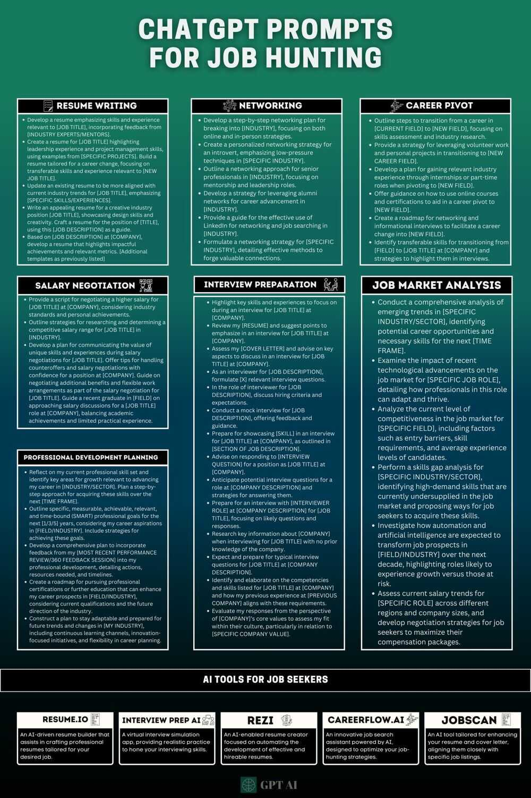

# Job Hunting

- [Career](management/jobs/career.md)
- [Companies](management/jobs/companies.md)
- [Questions to Company](management/jobs/questions-to-company.md)
- [Finance / Equity / Stocks / ESOPS Questions](management/jobs/finance-equity-stocks-esops-questions.md)
- [Good Profiles](management/jobs/good-profiles.md)
- [Resume Keywords Pointers](management/jobs/resume-keywords-pointers.md)
- [Job Descriptions / JD](management/jobs/job-descriptions-jd.md)
- [Hiring Plan / HR / Recruiting](management/jobs/hiring-plan-hr-recruiting.md)
- [platforms](management/jobs/platforms.md)

### Future

- Learn the fastest
- ["Learn to Code" Backfires Spectacularly as Comp-Sci Majors Suddenly Have Sky-High Unemployment](https://futurism.com/computer-science-majors-high-unemployment-rate)
- [Will Middle Managers Exist Next Year? - YouTube](https://www.youtube.com/watch?v=hA98C-6rATk)

### Shotgun approach

Where you apply to a lot of jobs

In early career, taking bets vs random job hopping is critical

### Tests + Outsourcing

- Crossover test
- Cutshort test
- Turing test
- Andela
- Uplers

### Vendors

1. [HuntingCube Recruitment Solutions](https://www.linkedin.com/company/huntingcube/)
2. [Careernet](https://www.linkedin.com/company/wearecareernet/)
3. [Weekday (YC W21)](https://www.linkedin.com/company/weekdayworks/)
4. [Zyoin Group](https://www.linkedin.com/company/zyoin/)

## Taking Interviews

Given that AI is remarkably good at LeetCode-esque questions, do these still give the signal that we want in our hiring process? As a prime example, I just finished an interview with an L2 candidate who finished school last month. In the [Account Balance question](https://leetcode.com/problems/account-balance/), it states under Part 4: "This part is not expected to be reached by almost any candidate.", yet this new-grad just implemented a solution in < 5 minutes that perfectly aced every single test case we have. They were also able to defend its implementation and time complexity, etc.

What I leave this interview feeling is that I can not discern between if this person:

- Has seen this exact question before and studied for it
- Was cheating / using AI without telling us
- Is legitimately one of the most impressive coders I've ever interviewed

I know that these technical questions are only part of the interview process, but I'm curious if the leadership believes it still accurately gives signal to the kind of person we want to hire. As an interviewer, I find myself extremely confused on how to feel after an interview that maybe 5 years ago would've been an instant "we have to hire them!"

This is a standard problem with a well known solution and isn't really signal that the candidate was using AI. Solving this problem in 5m also doesn't even remotely make you an impressive engineer, there is 10 other factors for that before leetcode skill comes into play.

Overall, I also believe that these problems are no longer good signal, but they never were good signal even pre ai, just a convenient way to conduct mass interviews.

## Others

[Leading Computer Science Professor: Students Are Struggling to Get Jobs - Business Insider](https://www.businessinsider.com/computer-science-students-job-search-ai-hany-farid-2025-9)
