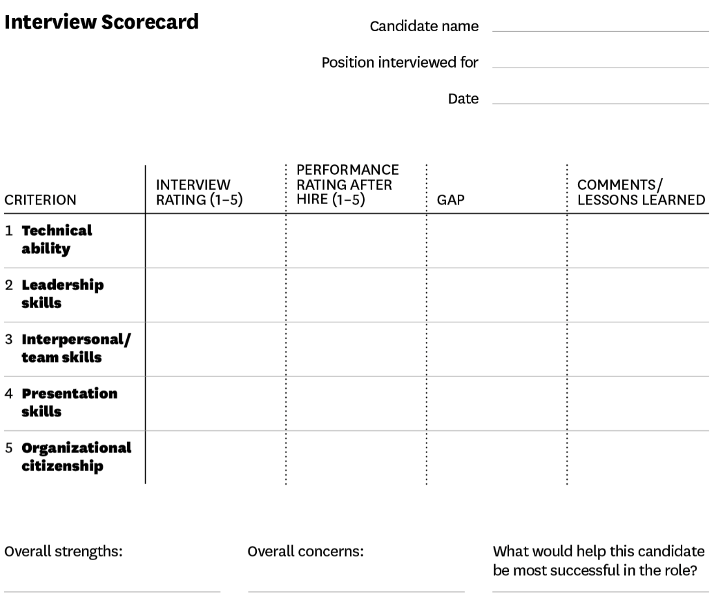

# Resume Keywords Pointers

### Backend - PHP

#### Must Have

- Creating APIs
- **Language - PHP, SQL**
- **Framework -** CodeIgnitor / Laravel / or any other relevant (for PHP)
- Databases - MySQL / Postgres / Redshift
- Algorithms and Data Structures
- Git / Version Control

#### Plus

- System design / Design patterns / Microservices
- OOPS
- Additional language - Python
- NoSQL experience (mongodb, redis, etc)
- DevOps / Docker / Cloud (AWS)

### Backend - Python

#### Must Have

- Creating APIs
- **Language - Python**
- **Framework -** Flask / Django / or any other relevant (for Python)
- Databases - MySQL / Postgres / Redshift
- Algorithms and Data Structures
- Git / Version Control

#### Plus

- System design / Design patterns / Microservices
- OOPS
- Additional language - PHP
- NoSQL experience (mongodb, redis, etc)
- DevOps / Docker / Cloud (AWS)

### DevOps

#### Must Have

- Docker
- Kubernetes
- Jenkins
- Python/Bash (any one scripting language)

#### Plus

- AWS / gcloud / Azure
- Monitoring tools - Prometheus / Grafana / other relevant
- Terraform
- ELK
- Istio - Keycloak

### Frontend

- **Javascript (Language)**
- React/ReactJS/Redux/NextJS
- CSS / Bootstrap / SCSS
- Web development
- Good to have (backend)
    - NodeJS / NestJS (Any JS frameworks)
    - SQL
    - API Integration / API creation

### Full Stack

#### Must Have

- Languages - Python, JavaScript, SQL
- Backend frameworks - Flask, Django, NodeJS, NextJS, any other backend JS frameworks
- Frontend frameworks - React, Angular, ReactNative, HTML, CSS

#### We Value

- Deep understanding of algorithms and data structures
- Excellent knowledge of SQL and noSQL databases
- Understanding of cloud tools and technologies
- Understanding of CI/CD, Docker, Kubernetes is a plus
- Proficiency in software engineering tools
- Ability to document requirements and specifications

### Mobile Frontend

- React / React Native / JSX
- Good to have (backend)
    - NodeJS / NestJS / NextJS (Any JS frameworks)
    - SQL

### Data Engineer

- ETL (Extract Transform Load)
- Data Warehouse / Data Lake
- AWS S3
- Redshift
- PySpark

### Data Science

- Machine Learning (ML) / Building models
- Data mining
- Natural Language Processing (NLP)
- Python
- Linear Regression / Logistic Regression
- Data Analysis

### Android

| **Keywords**                                     | **Points**    | **Max Points** |
|------------------------------------------|-----------------|-------------|
| Version Control / Git                            | 1             |               |
| Number of Projects                               | 1 per project | 4              |
| Years of experience                              | 1 per year    | 4              |
| Number of companies                              | 1 per company | 3              |
| MVVM / MVC / MVP / Design Patterns               | 1             |               |
| Firebase (Analytics / Crashlytics)               | 1             |               |
| Libraries - Retrofit / Volley / Picasso / RxJava | 1             |               |
| GCM / FCM / Notifications                        | 1             |               |
| Java                                             | 2             |               |
| Databases - SQLite / MySQL                       | 1             |               |
| Java + Kotlin                                    | 3             |               |
| Jetpack / Room                                   | 2             |               |
| iOS                                              | 3             |               |
| Plus - Kotlin (Only Kotlin is a negative)        | 1             |               |
| Plus - React Native                              | 1             |               |
| Plus - iOS                                       | 1             |               |
| Degree - CSE                                     | 2             |               |
| Degree - MCA                                     | 1             |               |
| Plus - Tier - 1                                  | 2             |               |
| Plus - Tier - 2                                  | 1             |               |

