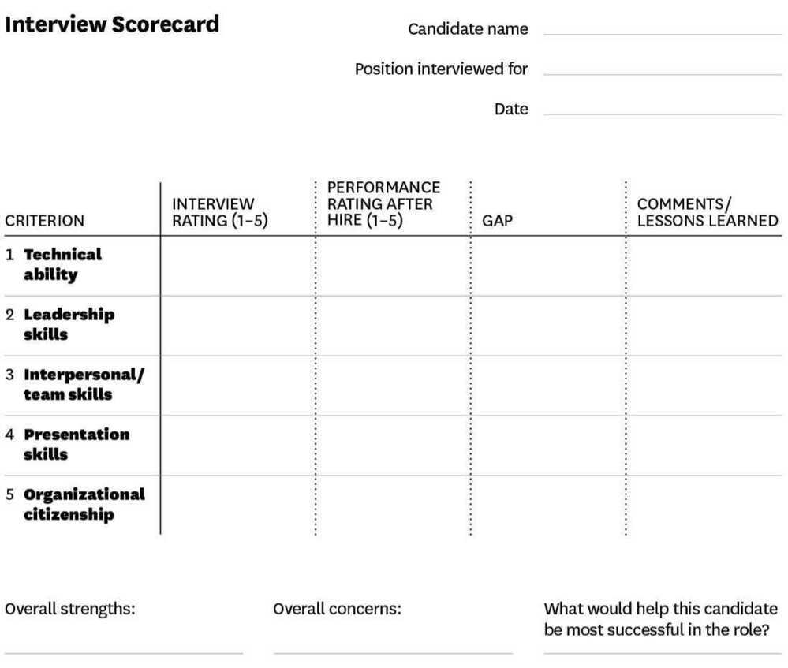

# Resume Keywords Pointers

### Backend - PHP

#### Must Have

- Creating APIs
- **Language - PHP, SQL**
- **Framework -** CodeIgnitor / Laravel / or any other relevant (for PHP)
- Databases - MySQL / Postgres / Redshift
- Algorithms and Data Structures
- Git / Version Control

#### Plus

- System design / Design patterns / Microservices
- OOPS
- Additional language - Python
- NoSQL experience (mongodb, redis, etc)
- DevOps / Docker / Cloud (AWS)

### Backend - Python

#### Must Have

- Creating APIs
- **Language - Python**
- **Framework -** Flask / Django / or any other relevant (for Python)
- Databases - MySQL / Postgres / Redshift
- Algorithms and Data Structures
- Git / Version Control

#### Plus

- System design / Design patterns / Microservices
- OOPS
- Additional language - PHP
- NoSQL experience (mongodb, redis, etc)
- DevOps / Docker / Cloud (AWS)

### DevOps

#### Must Have

- Docker
- Kubernetes
- Jenkins
- Python/Bash (any one scripting language)

#### Plus

- AWS / gcloud / Azure
- Monitoring tools - Prometheus / Grafana / other relevant
- Terraform
- ELK
- Istio - Keycloak

### Frontend

- **Javascript (Language)**
- React/ReactJS/Redux/NextJS
- CSS / Bootstrap / SCSS
- Web development
- Good to have (backend)
    - NodeJS / NestJS (Any JS frameworks)
    - SQL
    - API Integration / API creation

### Full Stack

#### Must Have

- Languages - Python, JavaScript, SQL
- Backend frameworks - Flask, Django, NodeJS, NextJS, any other backend JS frameworks
- Frontend frameworks - React, Angular, ReactNative, HTML, CSS

#### We Value

- Deep understanding of algorithms and data structures
- Excellent knowledge of SQL and noSQL databases
- Understanding of cloud tools and technologies
- Understanding of CI/CD, Docker, Kubernetes is a plus
- Proficiency in software engineering tools
- Ability to document requirements and specifications

### Mobile Frontend

- React / React Native / JSX
- Good to have (backend)
    - NodeJS / NestJS / NextJS (Any JS frameworks)
    - SQL

### Data Engineer

- ETL (Extract Transform Load)
- Data Warehouse / Data Lake
- AWS S3
- Redshift
- PySpark

### Data Science

- Machine Learning (ML) / Building models
- Data mining
- Natural Language Processing (NLP)
- Python
- Linear Regression / Logistic Regression
- Data Analysis

### Android

| **Keywords**                                     | **Points**    | **Max Points** |
|------------------------------------------|-----------------|-------------|
| Version Control / Git                            | 1             |               |
| Number of Projects                               | 1 per project | 4              |
| Years of experience                              | 1 per year    | 4              |
| Number of companies                              | 1 per company | 3              |
| MVVM / MVC / MVP / Design Patterns               | 1             |               |
| Firebase (Analytics / Crashlytics)               | 1             |               |
| Libraries - Retrofit / Volley / Picasso / RxJava | 1             |               |
| GCM / FCM / Notifications                        | 1             |               |
| Java                                             | 2             |               |
| Databases - SQLite / MySQL                       | 1             |               |
| Java + Kotlin                                    | 3             |               |
| Jetpack / Room                                   | 2             |               |
| iOS                                              | 3             |               |
| Plus - Kotlin (Only Kotlin is a negative)        | 1             |               |
| Plus - React Native                              | 1             |               |
| Plus - iOS                                       | 1             |               |
| Degree - CSE                                     | 2             |               |
| Degree - MCA                                     | 1             |               |
| Plus - Tier - 1                                  | 2             |               |
| Plus - Tier - 2                                  | 1             |               |

### MySQL SQL Developer

1. Proficient in writing complex SQL queries, stored procedures, functions, and triggers.
2. Strong experience in database design, normalization, and optimization techniques.
3. Skilled in creating and maintaining relational database models for high-performance applications.
4. Expertise in query performance tuning and debugging.
5. Hands-on experience with data integration and ETL processes using MySQL.
6. Knowledge of version control systems like Git for SQL script management.
7. Familiarity with reporting tools (e.g., Tableau, Power BI) and data visualization using SQL is a plus

### MySQL DBA

1. Expertise in MySQL installation, configuration, and server administration.
2. Strong experience in backup, recovery, and replication strategies (e.g., Master-Slave, GTID).
3. Proficient in monitoring and tuning MySQL database performance and query optimization.
4. Experience in managing high-availability and disaster recovery environments.
5. Skilled in managing database security, user roles, and access controls.
6. Hands-on experience with tools like Percona Toolkit, MyDumper/MyLoader, MySQL Enterprise Monitor, Monyog, etc
7. Familiarity with cloud-based MySQL solutions (e.g., AWS Aurora, AWS RDS, Azure Database for MySQL).

## Resume Builders / Helpers

Ats Resume, Remote jobs - [https://lnkd.in/g7JewuEj](https://lnkd.in/g7JewuEj)

𝗧𝗵𝗲𝘀𝗲 𝟳 𝗦𝗶𝘁𝗲𝘀 𝗰𝗮𝗻 𝗺𝗮𝗸𝗲 𝘆𝗼𝘂𝗿 𝗥𝗲𝘀𝘂𝗺𝗲 𝗶𝗻 𝟮𝗺𝗶𝗻𝘀.

1. 𝐎𝐯𝐞𝐫𝐥𝐞𝐚𝐟-𝐂𝐫𝐞𝐚𝐭𝐢𝐯𝐞 𝐓𝐞𝐦𝐩𝐥𝐚𝐭𝐞𝐬: [https://lnkd.in/gPdZSRMX](https://lnkd.in/gPdZSRMX)  -Overleaf rocks with free, amazing templates for a clean, professional look.
2. 𝐙𝐞𝐭𝐲 - 𝐂𝐫𝐚𝐟𝐭 𝐘𝐨𝐮𝐫 𝐒𝐭𝐨𝐫𝐲: [https://zety.com/](https://zety.com/)  -18 sleek templates for a professional look. - Zety: Resume Builder & Career Website
3. 𝐅𝐢𝐱𝐌𝐲𝐑𝐞𝐬𝐮𝐦𝐞-𝐅𝐢𝐱 𝐲𝐨𝐮𝐫 𝐫𝐞𝐬𝐮𝐦𝐞 𝐮𝐬𝐢𝐧𝐠 𝐀𝐥: [https://lnkd.in/gwbgqJb3](https://lnkd.in/gwbgqJb3)  -Find out if your resume fits the job you're applying for.
4. 𝐑𝐞𝐬𝐮𝐦𝐞𝐇𝐞𝐥𝐩𝐞𝐫 𝐛𝐲 𝐌𝐲𝐬𝐡𝐞𝐥𝐥: [https://lnkd.in/g26iEQBn](https://lnkd.in/g26iEQBn)  -Create your FREE resume in a snap with commands.
5. 𝐆𝐨𝐭 𝐑𝐞𝐬𝐮𝐦𝐞 𝐁𝐮𝐢𝐥𝐝𝐞𝐫-𝐖𝐞𝐛 𝐖𝐢𝐳𝐚𝐫𝐝: [https://lnkd.in/gdnyE5gr](https://lnkd.in/gdnyE5gr)  -Craft a pro resume for free with tips to beat the ATS!
6. 𝐀𝐩𝐩𝐥𝐲𝐢𝐬𝐡-𝐂𝐨𝐦𝐩𝐥𝐞𝐭𝐞 𝐣𝐨𝐛 𝐚𝐩𝐩𝐥𝐢𝐜𝐚𝐭𝐢𝐨𝐧 𝐟𝐨𝐫𝐦𝐬 𝐟𝐚𝐬𝐭𝐞𝐫:  [https://applyish.com/](https://applyish.com/)   -Say goodbye to draining job questions and hello to effortless job form completion.
7. 𝐑𝐞𝐬𝐮𝐦𝐞 𝐆𝐞𝐧𝐢𝐮𝐬 - 𝐘𝐨𝐮𝐫 𝐑𝐞𝐬𝐮𝐦𝐞 𝐁𝐮𝐝𝐝𝐲: [https://lnkd.in/gAnjJyC6](https://lnkd.in/gAnjJyC6)   -240+ free templates for a rockstar resume.

𝗨𝘀𝗲 𝘁𝗵𝗲𝘀𝗲 𝟭𝟬 𝗔𝗜 𝗧𝗼𝗼𝗹𝘀 𝘁𝗼 𝗴𝗲𝘁 𝗮 𝗿𝗲𝗺𝗼𝘁𝗲 𝗷𝗼𝗯 𝗨𝘀𝗶𝗻𝗴 𝗴𝗼𝗼𝗱 𝗥𝗲𝘀𝘂𝗺𝗲

1. [1] Al Resume Builder - [http://kickresum.com](http://kickresum.com/)
2. [2] ATS resume checker - [http://Jobscan.co](http://jobscan.co/)
3. [3] Mock interview with Al - [http://interviewai.me](http://interviewai.me/)
4. [4] Optimize your resume - [http://Gixmyresume.xyz](http://gixmyresume.xyz/)
5. [5] LinkedIn outreach - [http://Lemonrecruiter.com](http://lemonrecruiter.com/)
6. [6] Job search - [http://Matchthatroleai.com](http://matchthatroleai.com/)
7. [7] Apply automatically - [http://Applyish.com](http://applyish.com/)
8. [8] Al Interviews - [http://Rhetorai.com](http://rhetorai.com/)
9. [9] Extract Resumes - [http://Hirelake.ai](http://hirelake.ai/)
10. [10] Interview questions - [http://Interviewgpt.ai](http://interviewgpt.ai/)
