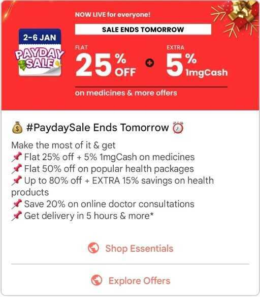

# Communications - Email / SMS Marketing

- [Emails](management/marketing-sales/emails.md)

## SMS Marketing

https://yourstory.com/2018/03/5-point-guide-sms-marketing

## Cloud Services

https://www.gigsmedia.in

## Channels

### SMS

- msg91
- pinpoint

### Push notifications

- Firebase (FCM)

### IVR

### In-app messaging

- in-app notification (banners)
- native notification
- in-app with deep linking notification
- [https://developers.google.com/business-communications/rcs-business-messaging/guides/learn/what-can-rbm-do](https://developers.google.com/business-communications/rcs-business-messaging/guides/learn/what-can-rbm-do)

### App Inbox / Notification Center

- https://docs.clevertap.com/docs/app-inbox
- https://docs.leanplum.com/docs/app-inbox-messages

### Others

- Telegram
- Whatsapp
    - YellowMessenger
    - https://netcorecloud.com/blog/new-pricing-model-for-whatsapp-api-1st-february-2022/

## Metrics

On the available statistics reports, you will find that your deliverability is broken down by the following metrics. Each one gives you a different piece of information about how SendGrid or your recipients interact with your email.

- [Blocks](https://sendgrid.com/docs/glossary/blocks/)- The number of emails that were not allowed to be delivered by ISPs.
- [Bounces](https://sendgrid.com/docs/glossary/bounces/)- The number of emails that bounced instead of being delivered.
- [Clicks](https://sendgrid.com/docs/glossary/clicks/)- The number of links that were clicked in your emails.
- [Delivered](https://sendgrid.com/docs/glossary/deliveries/)- The number of emails SendGrid was able to confirm were actually delivered to a recipient.
- Invalid Emails- The number of recipients that you sent emails to, who had malformed email addresses or whose mail provider reported the address as invalid.
- [Opens](https://sendgrid.com/docs/glossary/opens/)- The total number of times your emails were opened by recipients.
- [Requests](https://sendgrid.com/docs/glossary/request/)- The number of emails you requested to send via SendGrid.
- [Spam Reports](https://sendgrid.com/docs/glossary/spam-reports/)- The number of recipients who marked your email as spam.
- [Unique Opens](https://sendgrid.com/docs/glossary/opens/)- The number of unique recipients who opened your emails.
- [Unique Clicks](https://sendgrid.com/docs/glossary/clicks/)- The number of unique recipients who clicked links in your emails.
- Unsubscribes- The number of recipients who unsubscribed from your emails.
- Unsubscribe Drops- The number of emails dropped by SendGrid because the recipient unsubscribed from your emails.

## SMS Metrics

- Delivery Rate - The percentage of texts that are actually delivered from those you sent
- Open Rates - This allows you to know how many texts were open
- Response Rate - If the message required a response how did it go?
- Offers Used - This is also easy to track, check how many users took advantage of the offer
- Click Rate - Find out how many people have accessed your link
- Opt-Out Rate - The percentage of people who unsubscribed after receiving your SMS
- Conversion Rate - The percentage of subscribers who turned into customers by taking the required action

## Tools

- [Novu - The open-source notification infrastructure](https://novu.co/)
- [GitHub - knadh/listmonk: High performance, self-hosted, newsletter and mailing list manager with a modern dashboard. Single binary app.](https://github.com/knadh/listmonk)
    - [listmonk - Free and open source self-hosted newsletter, mailing list manager, and transactional mails](https://listmonk.app/)
    - [listmonk](https://demo.listmonk.app/admin/)
- [GitHub - dittofeed/dittofeed: Open-source customer engagement. Automate transactional and marketing messages across email, SMS, mobile push, WhatsApp, Slack, and more 📨](https://github.com/dittofeed/dittofeed)
