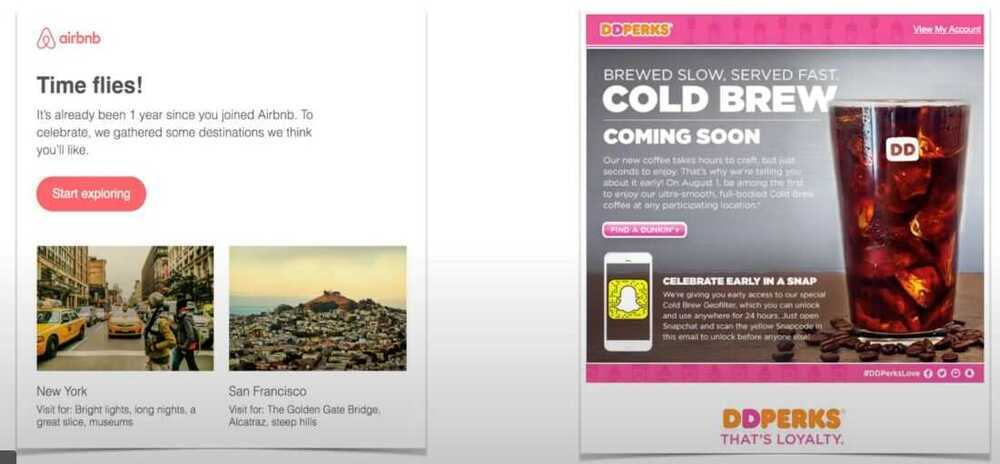
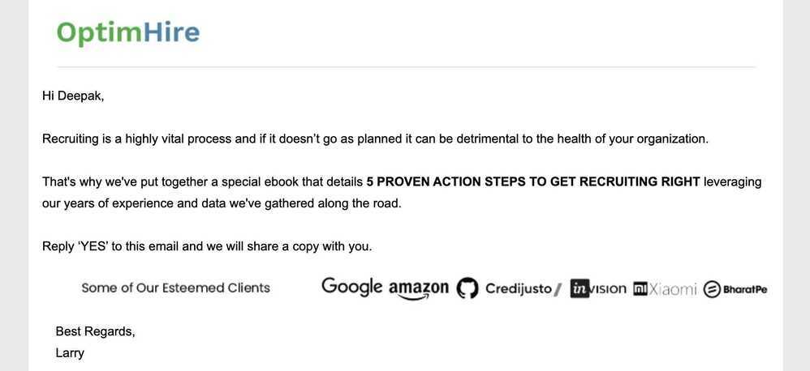
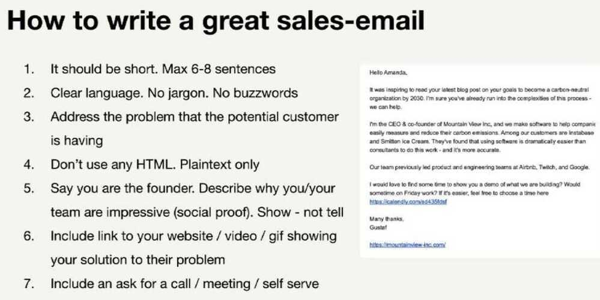

# Emails

## Email Clients

- Thunderbird
- [Proton Mail: Get a free email account with privacy and encryption \| Proton](https://proton.me/mail)
- Gmail
- Outlook - Microsoft 365
- Zoho One - [Zoho One - Plan Details \| Zoho](https://www.zoho.com/one/plan-details.html)
- [Private Email: Your All-in-One Business Email Hosting Solution](https://privateemail.com/)
- [Home \| Open-Xchange](https://www.open-xchange.com/)

## Sending Emails / SMS / Notifications

- MailChimp
- [lemlist \| Prospecting tool to automate multichannel outreach & get replies](https://www.lemlist.com/)
- Twilio SendGrid (Twilio)
- Resend
- mailgun
- Amazon SES
- AWS Pinpoint
- **sendinblue** / Brevo
- **sendpulse**
- **Onesignal**
- msg91
- Yellowmessenger
- https://convertkit.com
- Gmass
- [Pricing | Mailjet](https://www.mailjet.com/pricing/)
- [Ecommerce Email Marketing and SMS Platform \| Omnisend](https://www.omnisend.com/)
- [Postmark: Fast, Reliable Email Delivery Service \| SMTP \| API](https://postmarkapp.com/)
- [GitHub - useplunk/plunk: The Open-Source Email Platform](https://github.com/useplunk/plunk)

## [Resend](https://resend.com/home)

[Introduction - Resend](https://resend.com/docs/introduction)

```python
import resend

resend.api_key = "api_key"

r = resend.Emails.send({
  "from": "onboarding@resend.dev",
  "to": "tech@tech.com",
  "subject": "Hello World",
  "html": "<p>Congrats on sending your <strong>first email</strong>!</p>"
})
```

## SMTP Server

**Mailpit** is a small, fast, low memory, zero-dependency, multi-platform email testing tool & API for developers.

It acts as an SMTP server, provides a modern web interface to view & test captured emails, and includes an API for automated integration testing.

- [GitHub - axllent/mailpit: An email and SMTP testing tool with API for developers](https://github.com/axllent/mailpit)
- [Mailpit - email & SMTP testing tool](https://mailpit.axllent.org/)

### Others

- [GitHub - mailhog/MailHog: Web and API based SMTP testing](https://github.com/mailhog/MailHog)
- [MailCatcher](https://mailcatcher.me/)

### MTA (Mail Transfer Agent)

Within the Internet email system, a message transfer agent (MTA), mail transfer agent, or mail relay is software that transfers electronic mail messages from one computer to another using the Simple Mail Transfer Protocol. In some contexts, the alternative names mail server, mail exchanger, or MX host are used to describe an MTA.

An SMTP MTA (Simple Mail Transfer Protocol Mail Transfer Agent) is a software application on a mail server responsible for routing and delivering emails. While SMTP defines the protocol for email transfer, the MTA handles the operational tasks like queueing, routing, and establishing connections to other MTAs or delivery agents to get the message to its destination

#### Role of the MTA

1. **Message Routing:** MTAs determine the path an email should take, forwarding it from one server to another until it reaches the recipient's mail server.
2. **Queuing:** If a recipient's server is unavailable, the MTA holds the email in a queue and tries to resend it later.
3. **Server Identification:** MTAs use DNS lookups (specifically MX records) to find the mail server handling incoming messages for a recipient's domain.
4. **Throttling:** MTAs regulate the rate of email transmission to prevent overwhelming the recipient's server.

#### Interaction with Other Email Components

- **MUA (Mail User Agent):** An MUA is the email client (like Outlook or a webmail interface) that users interact with to send emails.
- **MSA (Mail Submission Agent):** After an MUA sends an email, the mail server's MSA receives it, often requiring authentication, before passing it to the MTA for routing.
- **MDA (Mail Delivery Agent):** Once the MTA delivers the email to the recipient's server, the MDA places it into the user's mailbox.

#### Core Architecture

MTAs usually have:

- **Inbound queue:** Messages accepted for delivery.
- **Outbound queue:** Messages waiting to be delivered.
- **Routing logic:** Determines next hop based on MX lookup and local rules.
- **Spool/queue manager:** Handles retries, bounces, and deferred mail.

Understanding the queue system explains most MTA behavior—why delivery can be delayed, why retries happen, etc.

#### Tools

- **Exim:** Common on Debian systems.
- **Postfix:** Modern, secure, widely used.
	- [Postfix (software) - Wikipedia](https://en.wikipedia.org/wiki/Postfix_(software))
	- [Postfix Documentation](https://www.postfix.org/documentation.html)
	- [GitHub - postfixadmin/postfixadmin: PostfixAdmin - web based virtual user administration interface for Postfix mail servers](https://github.com/postfixadmin/postfixadmin)
	- [Integrating Amazon SES with Postfix - Amazon Simple Email Service](https://docs.aws.amazon.com/ses/latest/dg/postfix.html)
- **Sendmail:** Legacy, complex configuration, still foundational.
- SMTP2GO - [SMTP2GO: Reliable & Scalable Email Delivery Service](https://www.smtp2go.com/)
- [Dovecot \| The Secure IMAP server](https://dovecot.org/)

[Message transfer agent - Wikipedia](https://en.wikipedia.org/wiki/Message_transfer_agent)

[Mail Transfer Agent (MTA) Explained \| Mailtrap Blog](https://mailtrap.io/blog/mail-transfer-agent/)

[Is postfix the proper email solution? : r/selfhosted](https://www.reddit.com/r/selfhosted/comments/1bbvwtr/is_postfix_the_proper_email_solution/)

## Emails

- Newsletters
- Welcome/Signup Emails
- Thank You Emails
- Abandonment/Recovery Emails
- New Product/Service Launch Emails
- Feedback/Survey Emails
	- [/r/SampleSize: Where your opinions actually matter!](https://www.reddit.com/r/SampleSize/)
- Transactional Emails
- Year-in-review Emails

So, how do you make the most of this channel so as to guarantee maximum engagement? The important thing to note here is irrespective of the nature of email, there are a few best practices you can follow to ensure your efforts are in the right direction and your email engagement rates are always on the rise:

- Use powerful and persuasive subject lines to optimize for high open rates
- Ensure your emails are mobile-friendly as more than 50% of your emails are opened on mobile
- To make your email stand out in a congested inbox, offer value and utility -- keep the copy informative and interesting, share useful resources, make emails interactive, and avoid being too promotional
- Share customer success stories and social proof to build trust in your products/services and motivate customers
- Send out targeted emails basis interests and behavior to enhance its relevance and engage better

### AMP Emails

AMP email, also known as AMP for Email, is a technology that allows you to create interactive and dynamic email experiences, enabling users to take actions like filling out forms, browsing content, or making purchases directly within their inbox, rather than being redirected to a website. This enhances user engagement and provides a more seamless experience.

## Email Marketing

[Stripo - FREE Email Template Builder: Drag and Drop Html Email Editor](https://stripo.email/)

I see email being used, by and large, exactly the way I envisioned. In particular, it's not strictly a work tool or strictly a personal thing. Everybody uses it in different ways, but they use it in a way they find works for them. -- Ray Tomlinson (Inventor - Email)

- Abandon Cart Campaign
    - Email 1: 4 hours later
    - Email 2: 16 hours later
    - Email 3: 2 days later


- Flash sale: This is a simpe campaign with a few emails and a discount/promotion with a time-limit which persuades your customers to buy right now AKA Impulse Buying. [This campaign works well during holidays like Christmas, Halloween, Black Friday]
    - Email 1: Day 1
    - Email 2: Day 2
    - Email 3: Day 4
    - Email 4: Day 5


- Customer Nurturing: This is basically a flow to show your new customers that you care about them! It's a chance to educate them more about your brand
    - Email 1: Immediately
    - Email 2: 2 days later
    - Email 3: 4 days later
    - Note: Tell the customer how to use the product in the best way possible



- Win-Back: A meticulously crafted campaign designed to pique the interest of existing leads and customers that haven't visited or purchased in around 120 days. It's a great way to encourage them to come back


- Emails with personalized subject lines generate 50% higher open rates
- Sending three abandoned card emails results in 69% more orders than a single email
- Videos added to your email increase click rates by 300%
- The most popular days to send emails are Tuesdays, Wednesdays & Thursdays
- Since these days are very popular, you may have a better chance at an open rate if you send them on Mondays and Fridays instead.


#### Free goodies to engage with clients



- Creating a Flow Template
- Most Used Flows
- Welcome Flow
- Post Purchase flow
- Cross Sell Sequence
- Value & Engagement Sequence
- UGC sequence
- Customer Surveys
- Incentive Video Reviews
- Win Back Flow
- Creating a flow template
- Repeat Purchase Flow
- Sales Cycle Abandon Flow & Trigger
- Shopping Cart Abandonment Flow
- Abandonment Sequences
- Holidays & Specials
- Social Proof
- How to Create Urgency and Scarcity
- Limited Offers: Countdown Timer
- How to Develop Relationships with LeadNurturing
- Automating your emails
- Email Retargeting
- How to Fix Email Errors
- How Spam Filters React to Your CampaignEmail
- How To Bypass Spam Filter
- Why Your Audience is Not Receiving anyEmails
- A/B Split Testing for Email Marketing
- Viewing the Reports
- Monitoring clicks and Conversions
- Email Marketing Tools You Should Use
- Achieving Maximum Engagement
- Best Times To Send Emails
- Webinars
- Automation triggers
- Cold email
- How Email Marketing Fits into Your OmniChannelStrategy
- How to Use This Course
- SummaryLESSON 2 - Testing & Tweaking
- Contact Profiling: Understanding Your Contacts Want
- 11 Type of Emails To Generate a Response
- Proven Layout & Wireframing
- Email Templates
- How To Optimize Body Content
- Best Practices for Optimizing CTA
- Optimize for Mobile
- How to Write Effective Subject Lines
- Copywriting Hacks for Email Marketing

- Lead Nurturing
    - You can follow-up with your leads for weeks, months and years to come
    - You can give them value & build good will for years to come

- You don't need a fortune to be fortunate -- Neil Patel

## Lesson 1 - Email Optimization

- Contact Profiling: Understanding Your Contacts Want
- 11 Type of Emails To Generate a Response
- Proven Layout & Wireframing
- Email Templates
- How To Optimize Body Content
- Best Practices for Optimizing CTA
- Optimize for Mobile
- How to Write Effective Subject Lines
- Copywriting Hacks for Email Marketing

  https://neilpatel.com/blog/ultimate-guide-to-copywriting/

## Lesson 2 - Testing and Tweaking

- How to Develop Relationships with LeadNurturing
- Automating your emails
- Email Retargeting
- How to Fix Email Errors
- How Spam Filters React to Your CampaignEmail
- How To Bypass Spam Filter
- Why Your Audience is Not Receiving anyEmails
- A/B Split Testing for Email Marketing
- Viewing the Reports
- Monitoring clicks and Conversions
- Google Analytics Email Reports
- Email Marketing Tools You Should Use

## Lesson 3 - Workflows & Sequences

- Creating a Flow Template
- Most Used Flows
- Welcome Flow
- Post Purchase flow
- Cross Sell Sequence
- Value & Engagement Sequence
- UGC sequence
- Customer Surveys
- Incentive Video Reviews
- Win Back Flow
- Creating a flow template
- Repeat Purchase Flow
- Sales Cycle Abandon Flow & Trigger
- Shopping Cart Abandonment Flow
- Abandonment Sequences
- Holidays & Specials
- Social Proof
- How to Create Urgency and Scarcity
- Limited Offers: Countdown Timer

https://sendgrid.com/resource/complete-email-metrics-guide

https://blog.hubspot.com/blog/tabid/6307/bid/30684/the-ultimate-list-of-email-spam-trigger-words.aspx

## Acquiring Leads

- **Identify your target audience**


- Use Exit Intent

- **Conduct market research**
    - Learn about customer's buying habits through direct contact, such as:
        - Surveys
        - Interviews
        - Focus groups
- **Create an irresistible offer**
- **Use personalization to reel them in**
- **Setting up Email Campaigns**
    - Document your campaign's requirements
    - Draft email copy
    - Add copy to template
    - Set up tracking
    - Test your email
    - Use data and make iterations
- **Campaign Requirements**
    - Know the goal of the campaign
    - Utilize the right tone & voice in the copy that represents your brand
    - A clear "from" address & name
    - A segmented email list
    - Compelling subject line

## Workflows and sequences

- **Welcome sequence**
    - You should have a lead nurturing sequence - That warms up your leads with the best offers you company has
    - Once the first 15-day lead nurturing sequence ends, you will have to take them from off the autoresponder list and put them into a brodcast list
- **Autoresponder vs Broadcase**
    - Autoresponder - One the subscriber signs up to a chosen list automatically emails will be delivered to their inbox as per your preset rules (Date, time, e-mails...)
    - Broadcast - can be sent out right now or scheduled the email as per your requirement at any time or list you choose
- **Campaign stacking**
    - You can't build ONE email campaign or workflow to make your email marketing work
    - It just isn't enough to provide value & build a relationship
    - **The secret:** You campaign to stack them back-to-back to get the maximum sales from your contacts
- **Segment Subscribers**
- **Segmentation**
    - Dividing your list into manageable segments of people that have something in common
    - Used as a personalization to deliver more relevant email marketing to subsribers will increase conversions

## Strategies for getting a higher open-rate

- **The Double Opt-In Technique**
    - Write one email and two subject lines. Send the email with subject line one.Then the next day, send the email with subject line two to the people who didn't open subject line one. This has been shown to increase open-rateby30%.
- **Test Send Days & Times**
    - Don't listen to the myths. Every email list is different when it comes to thebest day and time to send your email. In fact many are opened as far as 2 days after they are sent. Test to see what works for you.
- **Name From Company**
    - Make sure that your readers know who is sending them messages. Make your send-from address "Name fromCompany". For example, Neil fromNeil Patel.
- **Optimize Your Preheader**
    - Most major email providers now have a"preheader"-an area next to the subject line displayed in your inbox that gives a preview of the email inside. Use this real estate wisely!
- **Optimize Your Subject Lines**
    - Constantly test subject lines to see which gets you a better open-rate. This is almost always the biggest reasonwhy someone does or does not open an email.
- **Optimize for Mobile Readers**
    - More than 50% of emails are read on a mobile device. Make sure that your email is optimized for mobile reading, so you don't miss out on getting an openfrom a mobile reader!
- **Segment Your Emails For Better Targeting**
    - People want to feel like they'respending their precious time on something that was specially meant for them. Segment your emails as specifically as possible to better give them that thoughtful one-on-one experience with your emails.

## Conversion sequence brainstorm worksheet

1. What can I use as an immediate upsell? (i.e. Email Course, Postcards/Mail, Exclusive Newsletters, Tele-Coaching, Live Events)
2. How can I leverage Facebook Custom Audiences with my list? What will I advertise regularly to stay in front of my clients on Facebook?
3. What is the best way I can leverage retargeting? What offer can I make to those people that said no to my lead magnet, tripwire, etc. to get them coming back? (Hint: You want to segment what you send them based on where they left your sales process. Personal targeting ALWAYS converts better)
4. What other product, service, or experience can I offer to expand upon, compliment, or complete my initial offer?
5. What other outside products, services, or experiences areavailable to offer from complimentary JV or Affiliate Partners?
6. What products or services can I offer with recurring billing? What product, service or experience can I offer that I can bill my customers for ongoing?
7. What different pricing levels can I offer as a billing option?How many levels of access will I offer? What will be included with each level? What price will each level be? And what pain should they fear if they disconnect?


