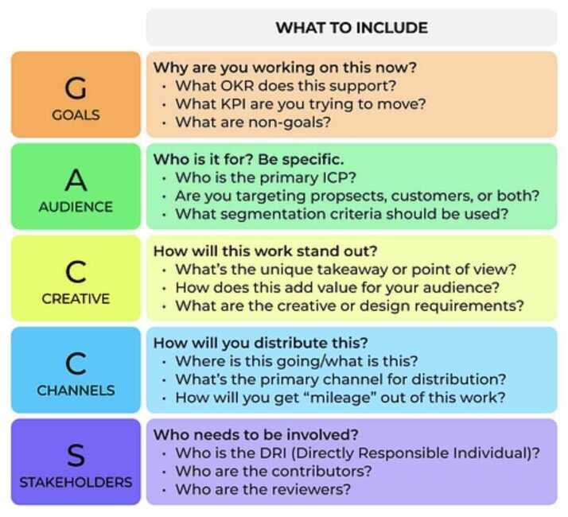
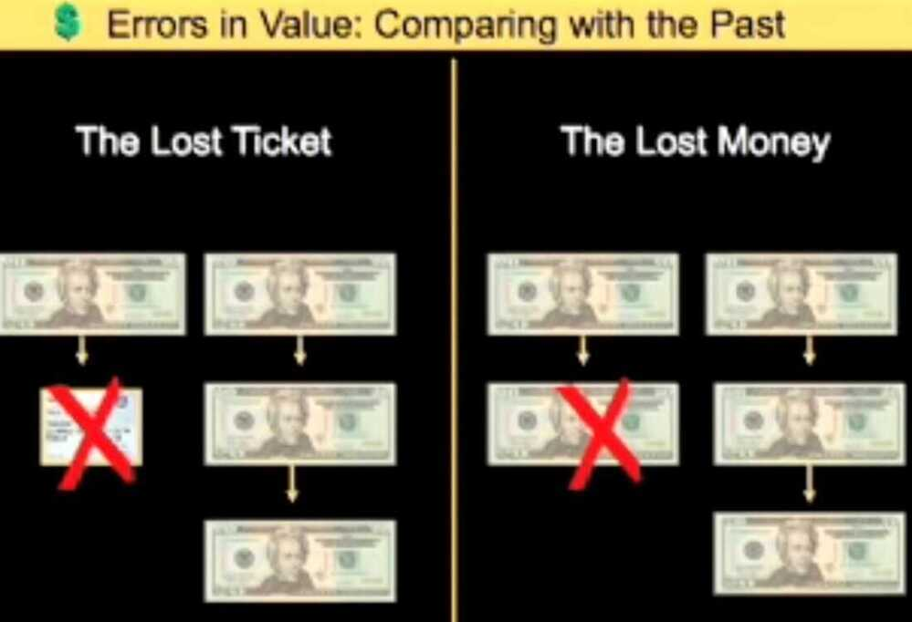
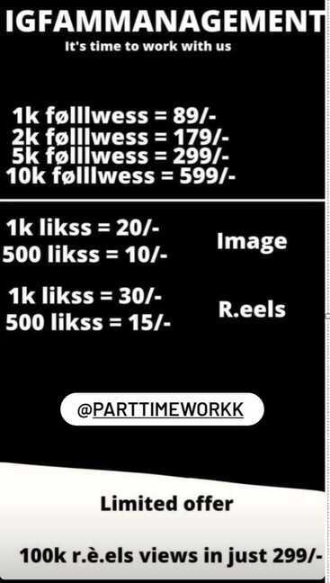
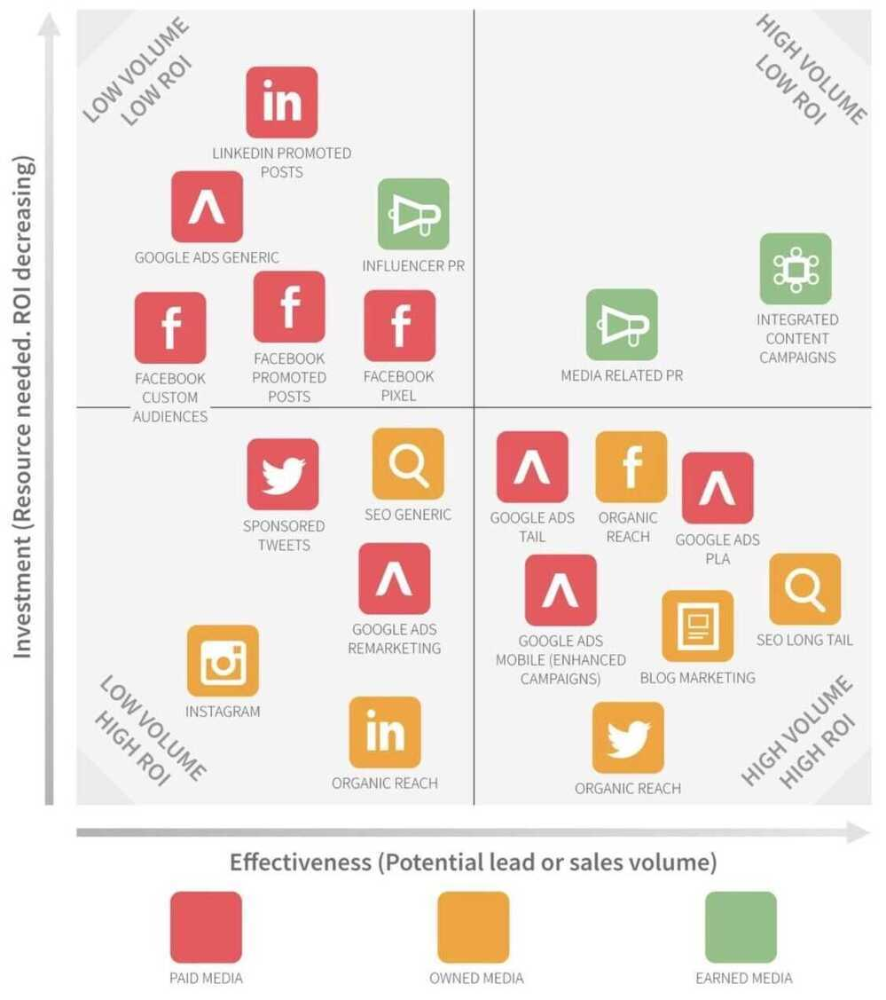

# Marketing Intro

## Consumer Immersion Exercise

## ORM - Online Reputation Management

## Charm Pricing

involves pricing just Re 1 less from the bigger whole number. For example Rs. 1999 than Rs. 2000

Good marketing can sell once, but only a good product can sell twice.

In the long run, your performance reverts to the value you provide.

Great Marketing kills a bad product faster

[**https://www.helloroketto.com/saas-marketing**](https://www.helloroketto.com/saas-marketing)

## Customer satisfaction

Jean-Louis Gassée, the former Head of Apple France, wisely stated that when it comes to handling customer compliants, there are two possible options. You can treat the complaint as highly important or you can shrug your shoulders and deem it trivial. Whatever position you choose to take, your customer will choose the other. That means that you'd better that every customer complaint seriously, because if youd don't the customer will.

So, the next time a customer complains, remember to choose the right attitude. If you don't, you're forcing them to up the ante and ultimately burdening yourself with more conflict.

## Traditional Sales Funnel

A sales funnel allows you to view the entire process of acquiring a user in a simple format. This format makes it much easier to spot areas for improvement by detecting "leaks" in the funnel.

Sales funnels allow for a numbers-based approach to improvement. Without them, efforts to improve an app's profitability would be far less focused and therefore less efficient, further reducing profit margins.

https://www.toptal.com/app/profit-from-mobile-funnel

## Halo effect

The halo effect is a term for a consumer's favoritism toward a line of products due to positive experiences with other products by this maker. The halo effect is correlated to brand strength, [brand loyalty](https://www.investopedia.com/terms/b/brand-loyalty.asp), and contributes to brand equity.

The opposite of the halo effect is the horn effect, named for the horns of the devil. When consumers have an unfavorable experience, they correlate that negative experience with everything associated with a brand.

- Companies chase the halo effect because it establishes both brand loyalty and repeat, loyal customers.
- The concept of the "halo effect" can be traced back to 1920 from a paper written by American psychologist Edward L. Thorndike.
- Companies use the halo effect to establish themselves as leaders in their industries.
- The halo effect can be a double-edged sword: if a brand has an extremely positive perception, this can extend into its new products and boost customer retention and loyalty. If not, a poor brand image can also be passed onto new products.
- The opposite of the halo effect is called the horn effect, which is when a company releases a bad product that destroys loyalty and positive market perception.

https://www.investopedia.com/terms/h/halo-effect.asp

https://answerthepublic.com

[Why we make bad decisions | Dan Gilbert](https://www.youtube.com/watch?v=c-4flnuxNV4)

## Digital Marketing

https://neilpatel.com/blog/social-media-shortcuts

- Analytics
    - What was the ROI of the billboard in Times Square?
    - Do people who use feature X have a higher LTV?
    - Do users in segment Y have higher engagement with feature Z?

[Home - Blockchain Ads](https://www.blockchain-ads.com/)

### Sexually Sugestive Ads

- [Is Sex in Advertising Effective?](https://www.businessnewsdaily.com/2649-sex-sells-more.html)
- [Sex in advertising - Wikipedia](https://en.wikipedia.org/wiki/Sex_in_advertising)
- sex sells

## Marketing Popups

One of the best compliments an interaction designer can get is when a user repeatedly uses and interacts with the platform over an extended period of time. Unfortunately, marketing pop-ups are known to achieve the exact opposite, due to their reputation of irritating users and visitors.

Pop-ups by themselves are not harmful, provided they are implemented correctly. For example, if a pop-up is employed as a way to interact with the end user to confirm if they really intended to delete a certain file or folder, a cautionary pop-up is useful and not irritating.

At the same time, marketing pop-ups are mainly focused on increasing the number of sign-ups, subscribers, etc.

This type of pop-up should be avoided in IxD if there isany other wayto get the project finished without them. If not, there are a few ways of making them less irritating

- Make them simple
- Make the close button very visible
- Reduce the amount of pop-ups
- Allow the user to unsubscribe/opt-out
- Avoid audible notifications
- Make them fast

## C-commerce / Conversational-commerce

- B2C2B
- Giveaway marketing

## Account Based Marketing (ABM)

Account based marketing (ABM) is a business marketing strategy that concentrates resources on a set of target accounts within a market. It uses personalized campaigns designed to engage each account, basing the marketing message on the specific attributes and needs of the account.

ABM also takes a more holistic view of marketing, beyond just [lead generation](https://www.optimizely.com/optimization-glossary/lead-generation/). Marketing to existing customer accounts to encourage upselling and cross-selling is one of the keys to getting the most value from your largest accounts.

https://blog.hubspot.com/marketing/account-based-marketing-guide

## Acquiring your first 1000 users

1. Go to your users, offline
2. Go to your users, online
3. Invite your friends
4. Create FOMO
5. Leverage influencers
6. Get press
7. Build a community

https://www.lennysnewsletter.com/p/how-the-biggest-consumer-apps-got

## Snake Oil

Snake oilis a term used to describe [deceptive marketing](https://en.wikipedia.org/wiki/False_advertising), [health care fraud](https://en.wikipedia.org/wiki/Health_care_fraud), or a scam. Similarly, "snake oil salesman" is a common expression used to describe someone who sells, promotes, or is a general proponent of some valueless or fraudulent cure, remedy, or solution. The term comes from the "snake oil" that used to be sold as a cure-all elixir for many kinds of physiological problems. Many 19th-century United States and 18th-century European entrepreneurs advertised and sold [mineral oil](https://en.wikipedia.org/wiki/Mineral_oil)(often mixed with various [active](https://en.wikipedia.org/wiki/Active_ingredient) and [inactive](https://en.wikipedia.org/wiki/Inactive_ingredient) household herbs, spices, drugs, and compounds, but containing no snake-derived substances whatsoever) as "snake oil [liniment](https://en.wikipedia.org/wiki/Liniment)", making claims about its efficacy as a [panacea](https://en.wikipedia.org/wiki/Panacea_(medicine)).[Patent medicines](https://en.wikipedia.org/wiki/Patent_medicine) that claimed to be a panacea were extremely common from the 18th century until the 20th, particularly among vendors masking addictive drugs such as [cocaine](https://en.wikipedia.org/wiki/Cocaine), [amphetamine](https://en.wikipedia.org/wiki/Amphetamine), alcohol and [opium](https://en.wikipedia.org/wiki/Opium)-based concoctions or [elixirs](https://en.wikipedia.org/wiki/Elixir), to be sold at [medicine shows](https://en.wikipedia.org/wiki/Medicine_show) as medication or products promoting health.

https://en.wikipedia.org/wiki/Snake_oil

## Interstitial Ads

Interstitial ads are full-screen ads that cover the interface of their host app. They're typically displayed at natural transition points in the flow of an app, such as between activities or during the pause between levels in a game. When an app shows an interstitial ad, the user has the choice to either tap on the ad and continue to its destination or close it and return to the app

https://developers.google.com/admob/android/interstitial

An **interstitial page** is a web page that appears before or after a desired content page, often for advertising or regulatory reasons. Interstitial pages can be interactive pop-ups or full-page ads that float on a webpage or fill a mobile device's screen. They can appear when a user navigates to a page, unhides a tab or window, or clicks the browser's navigation bar.

[20 Years Of Marketing - 7 Most Important Lessons Learned](https://www.youtube.com/watch?v=VS4ECrG_0uM)

1. Start small, but look out for scale, okay? So here's what I mean by that. When we're thinking about scale, typically, I start off small. When I mean small, I'm talking not 5,000, not 10,000, I usually start off less than $1,000, even at our size, and I try to see what works. It doesn't mean I won't ramp up the next day to 10,000 or a 100,000, but I really try to start off small to try to figure out what works. Now, if I'm paying for services or hiring an agency, it's a little bit different because someone's creating a plan for me, and then executing on it. But if I'm doing it myself, I try to start off small because just because a channel or a tactic work for a competitor, it doesn't mean it works for me, so I try to start off small.

2. The second lesson I ended up learning, my biggest skillset and my buddy, Eric, always talks about this, is I execute extremely fast. Speed is everything. So I focused on executing fast and then adapting, and A/B testing, and tweaking, to make it better over time. It's just like a website design. Everyone's like, "Oh, I'm going to release a new website." We don't do that. We just continually A/B test our websites until we come up with a perfect variation. And then you can have someone tweak the designs and make sure it works. But that's the model we use.

3. The third one, learn from your mistakes. In marketing, you're going to make a lot of mistakes. When I first started out my career when I was a 16 year old kid. Keep in mind those, really young. I would be like, "Black Hat SEO, what's this? Let's try, oh cool, I'm ranking at top making money." Now times are changing, I would never recommend anyone to do that. I was a foolish 16 year old kid. I wish I had a time machine. I can go back in time and tell myself, "Don't do that again."

4. The next lesson, hire people who have done it before. This one, I actually didn't learn until roughly a year ago. So the way I usually built my businesses is you build a business, you keep learning from your failures and mistakes, and then you just keep at it. And you just keep going, you execute fast, you know, and hopefully things work out. But what I learned, and this took me a long time to learn. There's other people out there who have been where I am. There's other people out there who have been where I want to be, which is even better.

5. Next one, be consistent. Look, I can't tell you how many times that people would have had a massive business and done well on their marketing, if they were just consistent. If you're consistent, you'll do well. So when you constantly put your brand and associate it with influencers or other trustworthy elements, or other things that you know people are paying attention to, it helps build a brand, and that builds longevity.

6. Last but not least, make it easy for people to buy from you. If you make it hard, no one's going to really buy from you. PayPal, Shopify Pay, these are all solutions that make it really easy. Now, more than 18% of our customers use PayPal, but before PayPal, literally, if we got 100 conversions, we ended up with 118 after PayPal. Now, what portion you pay through PayPal or pay through other sources like credit card, or using Stripe, or Adyen, or anything like that? It varies, but just adding PayPal as a payment option because it's super simple, roughly 18% increase.

## Instagram Followers

[Commentify \| Automatically comment on LinkedIn posts](https://www.commentify.co/)

## Ad Recall

According to Behavioral Economics, anything that has high frequency builds better familiarity thereby aiding better recall from memory

Clever marketers create this Top Of Mind Awareness (TOMA) by repeatedly using the brand or product name in the ad over a period of time

Ex - Airtel produced a full song dedicated to friendship. This song had "Har ek friend zaroori hota hai" mentioned 7 times

## Digital Out-of-Home (DOOH) Advertising

**Out-of-home (OOH)** advertising is traditional (i.e. non-digital and non-programmatic) outdoor advertising. Also known as out-of-home media or outdoor media, OOH advertising is about messaging to consumers when they are in public places, commuting to work, waiting (e.g. in elevators), and in specific commercial locations.

Typical OOH formats include billboards, on-car ads, bus-stop shelters, etc.

**Digital out-of-home (DOOH)** is basically OOH powered up with AdTech - geofencing, tracking, retargeting, personalizing, attribution and measurement.

[What Is DOOH Advertising and How Does It Work? - Clearcode Blog](https://clearcode.cc/blog/what-is-digital-out-of-home-dooh/)

[Out-of-home advertising - Wikipedia](https://en.m.wikipedia.org/wiki/Out-of-home_advertising)

## Others

- https://www.lennysnewsletter.com/p/what-is-good-retention-issue-29
- https://neilpatel.com/blog/ai-tools-media
- [**https://medium.datadriveninvestor.com/how-nestl%C3%A9-conquered-japan-with-the-greatest-tactic-12ed4d3c87eb**](https://medium.datadriveninvestor.com/how-nestl%C3%A9-conquered-japan-with-the-greatest-tactic-12ed4d3c87eb)
- [How to get your ideas to spread | Seth Godin](https://www.youtube.com/watch?v=xBIVlM435Zg)
- https://www.smartinsights.com/marketing-planning/marketing-models/use-bcg-matrix

## Links

- [The scince of selling](book-summaries/the-science-of-selling.md)
- [Sell Like Crazy](book-summaries/sell-like-crazy.md)
- [The Marketing Secrets Apple & Tesla Always Use: Rory Sutherland | E165 - YouTube](https://www.youtube.com/watch?v=Hz3RWxJck68)
- [How Brands Use Design & Marketing to Control Your Mind - YouTube](https://www.youtube.com/watch?v=p6aF5ma7BiM)
- [The Digital Marketing Industry’s Biggest Myths Exposed - YouTube](https://www.youtube.com/watch?v=hIE9ckHT2NE)
