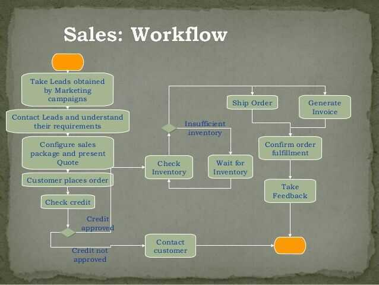
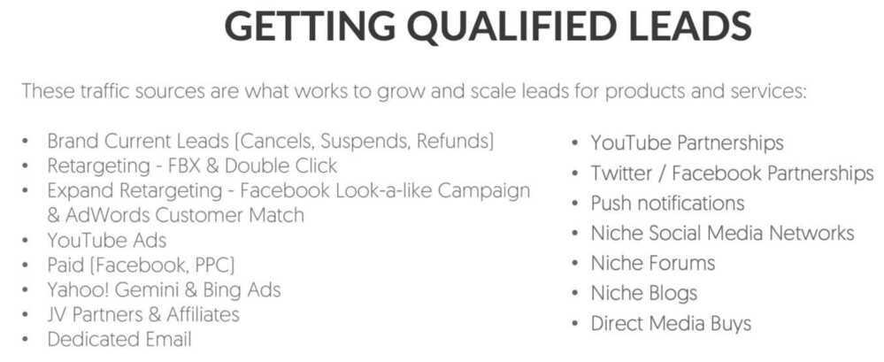
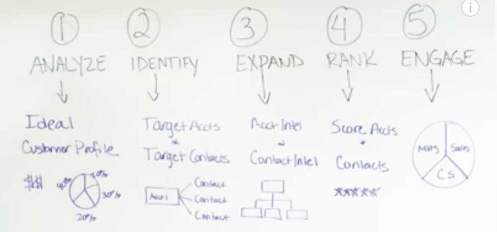

# Marketing

## AI Tools

[Postwise | Write, Schedule & Grow with Twitter AI](https://postwise.ai/)

[Artificial Intelligence Marketing - Albert](https://albert.ai/) - AI Marketing Tool

[Acquisio: AI-Powered PPC Management Tools & Programmatic Buying](https://www.acquisio.com/) - AI to Supercharge and Simplify Campaign Management

## MarTech (Marketing Technology)

Martech (a.k.a., marketing technology, including marketing software and marketing platforms) is technology employed in the service of marketing. Martech is used to create, execute, manage, orchestrate and measure the performance of online and offline content, campaigns and experiences.

It is difficult to imagine marketing that is not technology-powered. So, with no discernible separation between campaigns and the tools used to execute them, concluding that "martech is marketing" isn’t a stretch.

[What is martech and marketing technology?](https://martech.org/what-is-martech/)

## Consumer Immersion Exercise

## ORM - Online Reputation Management

## Charm Pricing

involves pricing just Re 1 less from the bigger whole number. For example Rs. 1999 than Rs. 2000

Good marketing can sell once, but only a good product can sell twice.

In the long run, your performance reverts to the value you provide.

Great Marketing kills a bad product faster

[**https://www.helloroketto.com/saas-marketing**](https://www.helloroketto.com/saas-marketing)

## Customer satisfaction

Jean-Louis Gassée, the former Head of Apple France, wisely stated that when it comes to handling customer compliants, there are two possible options. You can treat the complaint as highly important or you can shrug your shoulders and deem it trivial. Whatever position you choose to take, your customer will choose the other. That means that you'd better that every customer complaint seriously, because if youd don't the customer will.

So, the next time a customer complains, remember to choose the right attitude. If you don't, you're forcing them to up the ante and ultimately burdening yourself with more conflict.

## Traditional Sales Funnel

A sales funnel allows you to view the entire process of acquiring a user in a simple format. This format makes it much easier to spot areas for improvement by detecting "leaks" in the funnel.

Sales funnels allow for a numbers-based approach to improvement. Without them, efforts to improve an app's profitability would be far less focused and therefore less efficient, further reducing profit margins.

https://www.toptal.com/app/profit-from-mobile-funnel

## Halo effect

The halo effect is a term for a consumer's favoritism toward a line of products due to positive experiences with other products by this maker. The halo effect is correlated to brand strength, [brand loyalty](https://www.investopedia.com/terms/b/brand-loyalty.asp), and contributes to brand equity.

The opposite of the halo effect is the horn effect, named for the horns of the devil. When consumers have an unfavorable experience, they correlate that negative experience with everything associated with a brand.

- Companies chase the halo effect because it establishes both brand loyalty and repeat, loyal customers.
- The concept of the "halo effect" can be traced back to 1920 from a paper written by American psychologist Edward L. Thorndike.
- Companies use the halo effect to establish themselves as leaders in their industries.
- The halo effect can be a double-edged sword: if a brand has an extremely positive perception, this can extend into its new products and boost customer retention and loyalty. If not, a poor brand image can also be passed onto new products.
- The opposite of the halo effect is called the horn effect, which is when a company releases a bad product that destroys loyalty and positive market perception.

https://www.investopedia.com/terms/h/halo-effect.asp

https://answerthepublic.com

[Why we make bad decisions | Dan Gilbert](https://www.youtube.com/watch?v=c-4flnuxNV4)

## Email Marketing

[Stripo - FREE Email Template Builder: Drag and Drop Html Email Editor](https://stripo.email/)

I see email being used, by and large, exactly the way I envisioned. In particular, it's not strictly a work tool or strictly a personal thing. Everybody uses it in different ways, but they use it in a way they find works for them. -- Ray Tomlinson (Inventor - Email)

- Abandon Cart Campaign
    - Email 1: 4 hours later
    - Email 2: 16 hours later
    - Email 3: 2 days later

- Flash sale: This is a simpe campaign with a few emails and a discount/promotion with a time-limit which persuades your customers to buy right now AKA Impulse Buying. [This campaign works well during holidays like Christmas, Halloween, Black Friday]
    - Email 1: Day 1
    - Email 2: Day 2
    - Email 3: Day 4
    - Email 4: Day 5

- Customer Nurturing: This is basically a flow to show your new customers that you care about them! It's a chance to educate them more about your brand
    - Email 1: Immediately
    - Email 2: 2 days later
    - Email 3: 4 days later
    - Note: Tell the customer how to use the product in the best way possible

- Win-Back: A meticulously crafted campaign designed to pique the interest of existing leads and customers that haven't visited or purchased in around 120 days. It's a great way to encourage them to come back

- Emails with personalized subject lines generate 50% higher open rates
- Sending three abandoned card emails results in 69% more orders than a single email
- Videos added to your email increase click rates by 300%
- The most popular days to send emails are Tuesdays, Wednesdays & Thursdays
- Since these days are very popular, you may have a better chance at an open rate if you send them on Mondays and Fridays instead.

#### Free goodies to engage with clients

- Creating a Flow Template
- Most Used Flows
- Welcome Flow
- Post Purchase flow
- Cross Sell Sequence
- Value & Engagement Sequence
- UGC sequence
- Customer Surveys
- Incentive Video Reviews
- Win Back Flow
- Creating a flow template
- Repeat Purchase Flow
- Sales Cycle Abandon Flow & Trigger
- Shopping Cart Abandonment Flow
- Abandonment Sequences
- Holidays & Specials
- Social Proof
- How to Create Urgency and Scarcity
- Limited Offers: Countdown Timer
- How to Develop Relationships with LeadNurturing
- Automating your emails
- Email Retargeting
- How to Fix Email Errors
- How Spam Filters React to Your CampaignEmail
- How To Bypass Spam Filter
- Why Your Audience is Not Receiving anyEmails
- A/B Split Testing for Email Marketing
- Viewing the Reports
- Monitoring clicks and Conversions
- Email Marketing Tools You Should Use
- Achieving Maximum Engagement
- Best Times To Send Emails
- Webinars
- Automation triggers
- Cold email
- How Email Marketing Fits into Your OmniChannelStrategy
- How to Use This Course
- SummaryLESSON 2 - Testing & Tweaking
- Contact Profiling: Understanding Your Contacts Want
- 11 Type of Emails To Generate a Response
- Proven Layout & Wireframing
- Email Templates
- How To Optimize Body Content
- Best Practices for Optimizing CTA
- Optimize for Mobile
- How to Write Effective Subject Lines
- Copywriting Hacks for Email Marketing

- Lead Nurturing
    - You can follow-up with your leads for weeks, months and years to come
    - You can give them value & build good will for years to come

- You don't need a fortune to be fortunate -- Neil Patel

## Lesson 1 - Email Optmization

- Contact Profiling: Understanding Your Contacts Want
- 11 Type of Emails To Generate a Response
- Proven Layout & Wireframing
- Email Templates
- How To Optimize Body Content
- Best Practices for Optimizing CTA
- Optimize for Mobile
- How to Write Effective Subject Lines
- Copywriting Hacks for Email Marketing

  https://neilpatel.com/blog/ultimate-guide-to-copywriting/

## Lesson 2 - Testing and Tweaking

- How to Develop Relationships with LeadNurturing
- Automating your emails
- Email Retargeting
- How to Fix Email Errors
- How Spam Filters React to Your CampaignEmail
- How To Bypass Spam Filter
- Why Your Audience is Not Receiving anyEmails
- A/B Split Testing for Email Marketing
- Viewing the Reports
- Monitoring clicks and Conversions
- Google Analytics Email Reports
- Email Marketing Tools You Should Use

## Lesson 3 - Workflows & Sequences

- Creating a Flow Template
- Most Used Flows
- Welcome Flow
- Post Purchase flow
- Cross Sell Sequence
- Value & Engagement Sequence
- UGC sequence
- Customer Surveys
- Incentive Video Reviews
- Win Back Flow
- Creating a flow template
- Repeat Purchase Flow
- Sales Cycle Abandon Flow & Trigger
- Shopping Cart Abandonment Flow
- Abandonment Sequences
- Holidays & Specials
- Social Proof
- How to Create Urgency and Scarcity
- Limited Offers: Countdown Timer

https://sendgrid.com/resource/complete-email-metrics-guide

https://blog.hubspot.com/blog/tabid/6307/bid/30684/the-ultimate-list-of-email-spam-trigger-words.aspx

## Acquiring Leads

- **Identify your target audience**

- Use Exit Intent

- **Conduct market research**
    - Learn about customer's buying habits through direct contact, such as:
        - Surveys
        - Interviews
        - Focus groups
- **Create an irresistible offer**
- **Use personalization to reel them in**
- **Setting up Email Campaigns**
    - Document your campaign's requirements
    - Draft email copy
    - Add copy to template
    - Set up tracking
    - Test your email
    - Use data and make iterations
- **Campaign Requirements**
    - Know the goal of the campaign
    - Utilize the right tone & voice in the copy that represents your brand
    - A clear "from" address & name
    - A segmented email list
    - Compelling subject line

## Workflows and sequences

- **Welcome sequence**
    - You should have a lead nurturing sequence - That warms up your leads with the best offers you company has
    - Once the first 15-day lead nurturing sequence ends, you will have to take them from off the autoresponder list and put them into a brodcast list
- **Autoresponder vs Broadcase**
    - Autoresponder - One the subscriber signs up to a chosen list automatically emails will be delivered to their inbox as per your preset rules [Date, time, e-mails...]
    - Broadcast - can be sent out right now or scheduled the email as per your requirement at any time or list you choose
- **Campaign stacking**
    - You can't build ONE email campaign or workflow to make your email marketing work
    - It just isn't enough to provide value & build a relationship
    - **The secret:** You campaign to stack them back-to-back to get the maximum sales from your contacts
- **Segment Subscribers**
- **Segmentation**
    - Dividing your list into manageable segments of people that have something in common
    - Used as a personalization to deliver more relevant email marketing to subsribers will increase conversions

## Strategies for getting a higher open-rate

- **The Double Opt-In Technique**
    - Write one email and two subject lines. Send the email with subject line one.Then the next day, send the email with subject line two to the people who didn't open subject line one. This has been shown to increase open-rateby30%.
- **Test Send Days & Times**
    - Don't listen to the myths. Every email list is different when it comes to thebest day and time to send your email. In fact many are opened as far as 2 days after they are sent. Test to see what works for you.
- **Name From Company**
    - Make sure that your readers know who is sending them messages. Make your send-from address "Name fromCompany". For example, Neil fromNeil Patel.
- **Optimize Your Preheader**
    - Most major email providers now have a"preheader"-an area next to the subject line displayed in your inbox that gives a preview of the email inside. Use this real estate wisely!
- **Optimize Your Subject Lines**
    - Constantly test subject lines to see which gets you a better open-rate. This is almost always the biggest reasonwhy someone does or does not open an email.
- **Optimize for Mobile Readers**
    - More than 50% of emails are read on a mobile device. Make sure that your email is optimized for mobile reading, so you don't miss out on getting an openfrom a mobile reader!
- **Segment Your Emails For Better Targeting**
    - People want to feel like they'respending their precious time on something that was specially meant for them. Segment your emails as specifically as possible to better give them that thoughtful one-on-one experience with your emails.

## Conversion sequence brainstorm worksheet

1. What can I use as an immediate upsell? (i.e. Email Course, Postcards/Mail, Exclusive Newsletters, Tele-Coaching, Live Events)

2. How can I leverage Facebook Custom Audiences with my list? What will I advertise regularly to stay in front of my clients on Facebook?

3. What is the best way I can leverage retargeting? What offer can I make to those people that said no to my lead magnet, tripwire, etc. to get them coming back? (Hint: You want to segment what you send them based on where they left your sales process. Personal targeting ALWAYS converts better)

4. What other product, service, or experience can I offer to expand upon, compliment, or complete my initial offer?

5. What other outside products, services, or experiences areavailable to offer from complimentary JV or Affiliate Partners?

6. What products or services can I offer with recurring billing? What product, service or experience can I offer that I can bill my customers for ongoing?

7. What different pricing levels can I offer as a billing option?How many levels of access will I offer? What will be included with each level? What price will each level be? And what pain should they fear if they disconnect?

## Digital Marketing

https://neilpatel.com/blog/social-media-shortcuts

- Analytics
    - What was the ROI of the billboard in Times Square?
    - Do people who use feature X have a higher LTV?
    - Do users in segment Y have higher engagement with feature Z?

[Home - Blockchain Ads](https://www.blockchain-ads.com/)

### Sexually Sugestive Ads

- [Is Sex in Advertising Effective?](https://www.businessnewsdaily.com/2649-sex-sells-more.html)
- [Sex in advertising - Wikipedia](https://en.wikipedia.org/wiki/Sex_in_advertising)
- sex sells

## Social Listening Tools

**Social listening is the practice of monitoring social media channels for mentions of your brand, competitor brands, and related keywords.**

Social media listening tools allow you to build a solid understanding of exactly how customers and potential customers think about you by analyzing what they say on social channels. You can also learn what they think about the competition. This is incredible market research readily available in real-time, as long as you know how to access it.

### What’s the difference between social listening and social monitoring?

While **social media listening is a proactive** way to track, analyze, and respond to online conversations, **social media monitoring is more reactive**.

**Social monitoring** looks at specific brand mentions and sends alerts whenever your brand is mentioned online. It is sometimes referred to as **brand monitoring**. It can be useful for **quickly responding to any negative sentiment or complaints**, but it doesn’t give you a big-picture view of what people are saying about your brand or industry.

**Social listening,** on the other hand, gives you **a complete overview of all online conversations related to your brand, products, industry, and competitors.** This holistic approach provides valuable insights that can help you make strategic decisions about your marketing and social media strategy.

In short, if you want to stay on top of the latest trends and **see what people are saying about your brand over time**, you need a social listening strategy.

[What is Social Listening, Why it Matters + 14 Tools to Help](https://blog.hootsuite.com/social-listening-business/)

[13 social listening tools for your brand in 2023 | Sprout Social](https://sproutsocial.com/insights/social-listening-tools/)

[The 13 Best Free Social Media Monitoring Tools for Every Marketing Team](https://blog.hubspot.com/blog/tabid/6307/bid/29437/20-free-social-media-and-brand-monitoring-tools-that-rock.aspx)

### Tools

- [#1 Social Listening Tools | BrandMentions | Upgrade the way you monitor your brand mentions & competitors](https://brandmentions.com/hub/social-listening-tools)
- [Conversational AI platform & social listening tool - SentiOne](https://sentione.com/)
- [Brand24](https://brand24.com/social-listening-software/)

## Marketing Popups

One of the best compliments an interaction designer can get is when a user repeatedly uses and interacts with the platform over an extended period of time. Unfortunately, marketing pop-ups are known to achieve the exact opposite, due to their reputation of irritating users and visitors.

Pop-ups by themselves are not harmful, provided they are implemented correctly. For example, if a pop-up is employed as a way to interact with the end user to confirm if they really intended to delete a certain file or folder, a cautionary pop-up is useful and not irritating.

At the same time, marketing pop-ups are mainly focused on increasing the number of sign-ups, subscribers, etc.

This type of pop-up should be avoided in IxD if there isany other wayto get the project finished without them. If not, there are a few ways of making them less irritating

- Make them simple
- Make the close button very visible
- Reduce the amount of pop-ups
- Allow the user to unsubscribe/opt-out
- Avoid audible notifications
- Make them fast

## C-commerce / Conversational-commerce

B2C2B

Giveaway marketing

## Account Based Marketing (ABM)

Account based marketing (ABM) is a business marketing strategy that concentrates resources on a set of target accounts within a market. It uses personalized campaigns designed to engage each account, basing the marketing message on the specific attributes and needs of the account.

ABM also takes a more holistic view of marketing, beyond just [lead generation](https://www.optimizely.com/optimization-glossary/lead-generation/). Marketing to existing customer accounts to encourage upselling and cross-selling is one of the keys to getting the most value from your largest accounts.

https://blog.hubspot.com/marketing/account-based-marketing-guide

## Acquiring your first 1000 users

1. Go to your users, offline
2. Go to your users, online
3. Invite your friends
4. Create FOMO
5. Leverage influencers
6. Get press
7. Build a community

https://www.lennysnewsletter.com/p/how-the-biggest-consumer-apps-got

## Snake Oil

Snake oilis a term used to describe [deceptive marketing](https://en.wikipedia.org/wiki/False_advertising), [health care fraud](https://en.wikipedia.org/wiki/Health_care_fraud), or a scam. Similarly, "snake oil salesman" is a common expression used to describe someone who sells, promotes, or is a general proponent of some valueless or fraudulent cure, remedy, or solution. The term comes from the "snake oil" that used to be sold as a cure-all elixir for many kinds of physiological problems. Many 19th-century United States and 18th-century European entrepreneurs advertised and sold [mineral oil](https://en.wikipedia.org/wiki/Mineral_oil)(often mixed with various [active](https://en.wikipedia.org/wiki/Active_ingredient) and [inactive](https://en.wikipedia.org/wiki/Inactive_ingredient) household herbs, spices, drugs, and compounds, but containing no snake-derived substances whatsoever) as "snake oil [liniment](https://en.wikipedia.org/wiki/Liniment)", making claims about its efficacy as a [panacea](https://en.wikipedia.org/wiki/Panacea_(medicine)).[Patent medicines](https://en.wikipedia.org/wiki/Patent_medicine) that claimed to be a panacea were extremely common from the 18th century until the 20th, particularly among vendors masking addictive drugs such as [cocaine](https://en.wikipedia.org/wiki/Cocaine), [amphetamine](https://en.wikipedia.org/wiki/Amphetamine), alcohol and [opium](https://en.wikipedia.org/wiki/Opium)-based concoctions or [elixirs](https://en.wikipedia.org/wiki/Elixir), to be sold at [medicine shows](https://en.wikipedia.org/wiki/Medicine_show) as medication or products promoting health.

https://en.wikipedia.org/wiki/Snake_oil

## Interstitial Ads

Interstitial ads are full-screen ads that cover the interface of their host app. They're typically displayed at natural transition points in the flow of an app, such as between activities or during the pause between levels in a game. When an app shows an interstitial ad, the user has the choice to either tap on the ad and continue to its destination or close it and return to the app

https://developers.google.com/admob/android/interstitial

An **interstitial page** is ==a web page that appears before or after a desired content page, often for advertising or regulatory reasons==. Interstitial pages can be interactive pop-ups or full-page ads that float on a webpage or fill a mobile device's screen. They can appear when a user navigates to a page, unhides a tab or window, or clicks the browser's navigation bar.

[20 Years Of Marketing - 7 Most Important Lessons Learned](https://www.youtube.com/watch?v=VS4ECrG_0uM)

1. Start small, but look out for scale, okay? So here's what I mean by that. When we're thinking about scale, typically, I start off small. When I mean small, I'm talking not 5,000, not 10,000, I usually start off less than $1,000, even at our size, and I try to see what works. It doesn't mean I won't ramp up the next day to 10,000 or a 100,000, but I really try to start off small to try to figure out what works. Now, if I'm paying for services or hiring an agency, it's a little bit different because someone's creating a plan for me, and then executing on it. But if I'm doing it myself, I try to start off small because just because a channel or a tactic work for a competitor, it doesn't mean it works for me, so I try to start off small.

2. The second lesson I ended up learning, my biggest skillset and my buddy, Eric, always talks about this, is I execute extremely fast. Speed is everything. So I focused on executing fast and then adapting, and A/B testing, and tweaking, to make it better over time. It's just like a website design. Everyone's like, "Oh, I'm going to release a new website." We don't do that. We just continually A/B test our websites until we come up with a perfect variation. And then you can have someone tweak the designs and make sure it works. But that's the model we use.

3. The third one, learn from your mistakes. In marketing, you're going to make a lot of mistakes. When I first started out my career when I was a 16 year old kid. Keep in mind those, really young. I would be like, "Black Hat SEO, what's this? Let's try, oh cool, I'm ranking at top making money." Now times are changing, I would never recommend anyone to do that. I was a foolish 16 year old kid. I wish I had a time machine. I can go back in time and tell myself, "Don't do that again."

4. The next lesson, hire people who have done it before. This one, I actually didn't learn until roughly a year ago. So the way I usually built my businesses is you build a business, you keep learning from your failures and mistakes, and then you just keep at it. And you just keep going, you execute fast, you know, and hopefully things work out. But what I learned, and this took me a long time to learn. There's other people out there who have been where I am. There's other people out there who have been where I want to be, which is even better.

5. Next one, be consistent. Look, I can't tell you how many times that people would have had a massive business and done well on their marketing, if they were just consistent. If you're consistent, you'll do well. So when you constantly put your brand and associate it with influencers or other trustworthy elements, or other things that you know people are paying attention to, it helps build a brand, and that builds longevity.

6. Last but not least, make it easy for people to buy from you. If you make it hard, no one's going to really buy from you. PayPal, Shopify Pay, these are all solutions that make it really easy. Now, more than 18% of our customers use PayPal, but before PayPal, literally, if we got 100 conversions, we ended up with 118 after PayPal. Now, what portion you pay through PayPal or pay through other sources like credit card, or using Stripe, or Adyen, or anything like that? It varies, but just adding PayPal as a payment option because it's super simple, roughly 18% increase.

## SMS Marketing

https://yourstory.com/2018/03/5-point-guide-sms-marketing

## Cloud Services

https://www.gigsmedia.in

## Channels

### Sending Mails / SMS / Notifications

- MailChimp
- Twilio SendGrid (Twilio)
- mailgun
- Amazon SES
- **sendinblue** / Brevo
- **sendpulse**
- **Onesignal**
- msg91
- Yellowmessenger
- Pinpoint
- https://convertkit.com
- Gmass
- [Pricing | Mailjet](https://www.mailjet.com/pricing/)
- pinpoint
- sendgrid
- [Resend](https://resend.com/home)

### SMS

- msg91
- pinpoint

### Push notifications

- Firebase (FCM)

### IVR

### In-app messaging

- in-app notification (banners)
- native notification
- in-app with deep linking notification
- [https://developers.google.com/business-communications/rcs-business-messaging/guides/learn/what-can-rbm-do](https://developers.google.com/business-communications/rcs-business-messaging/guides/learn/what-can-rbm-do)

### App Inbox / Notification Center

https://docs.clevertap.com/docs/app-inbox
https://docs.leanplum.com/docs/app-inbox-messages

### Others

- Telegram
- Whatsapp
    - YellowMessenger
    - https://netcorecloud.com/blog/new-pricing-model-for-whatsapp-api-1st-february-2022/

### Tools

- [Novu - The open-source notification infrastructure](https://novu.co/)
- [GitHub - knadh/listmonk: High performance, self-hosted, newsletter and mailing list manager with a modern dashboard. Single binary app.](https://github.com/knadh/listmonk)
    - [listmonk - Free and open source self-hosted newsletter, mailing list manager, and transactional mails](https://listmonk.app/)
    - [listmonk](https://demo.listmonk.app/admin/)

## Metrics

On the available statistics reports, you will find that your deliverability is broken down by the following metrics. Each one gives you a different piece of information about how SendGrid or your recipients interact with your email.

- [Blocks](https://sendgrid.com/docs/glossary/blocks/)- The number of emails that were not allowed to be delivered by ISPs.
- [Bounces](https://sendgrid.com/docs/glossary/bounces/)- The number of emails that bounced instead of being delivered.
- [Clicks](https://sendgrid.com/docs/glossary/clicks/)- The number of links that were clicked in your emails.
- [Delivered](https://sendgrid.com/docs/glossary/deliveries/)- The number of emails SendGrid was able to confirm were actually delivered to a recipient.
- Invalid Emails- The number of recipients that you sent emails to, who had malformed email addresses or whose mail provider reported the address as invalid.
- [Opens](https://sendgrid.com/docs/glossary/opens/)- The total number of times your emails were opened by recipients.
- [Requests](https://sendgrid.com/docs/glossary/request/)- The number of emails you requested to send via SendGrid.
- [Spam Reports](https://sendgrid.com/docs/glossary/spam-reports/)- The number of recipients who marked your email as spam.
- [Unique Opens](https://sendgrid.com/docs/glossary/opens/)- The number of unique recipients who opened your emails.
- [Unique Clicks](https://sendgrid.com/docs/glossary/clicks/)- The number of unique recipients who clicked links in your emails.
- Unsubscribes- The number of recipients who unsubscribed from your emails.
- Unsubscribe Drops- The number of emails dropped by SendGrid because the recipient unsubscribed from your emails.

## SMS Metrics

- Delivery Rate - The percentage of texts that are actually delivered from those you sent
- Open Rates - This allows you to know how many texts were open
- Response Rate - If the message required a response how did it go?
- Offers Used - This is also easy to track, check how many users took advantage of the offer
- Click Rate - Find out how many people have accessed your link
- Opt-Out Rate - The percentage of people who unsubscribed after receiving your SMS
- Conversion Rate - The percentage of subscribers who turned into customers by taking the required action

## Tools / Cloud vendors / Agencies

- Digital marketing
    - https://hootsuite.com
    - https://www.radaar.io
    - https://ads.google.com
        - DV360 (Display & Video 360)
- [The Only Complete, Composable, Cloud-Native Digital Experience Platform | Sitecore](https://www.sitecore.com/)
- Content Creation
   	- https://www.peppercontent.io
   	- https://www.peppertype.ai
- https://clevertap.com
- https://developers.google.com/business-communications/rcs-business-messaging
- Google postmaster tools
- https://www.sinch.com
- Agencies

https://www.havas.com

https://initiative.com

- Frontend
    - neuronimbus
- Sales Tools

https://www.pipedrive.com

- Localization
    - Words Lead - Voice Over and Dubbing services
- SAAS
    - Josh Digital

## Others

https://www.lennysnewsletter.com/p/what-is-good-retention-issue-29

https://neilpatel.com/blog/ai-tools-media

[**https://medium.datadriveninvestor.com/how-nestl%C3%A9-conquered-japan-with-the-greatest-tactic-12ed4d3c87eb**](https://medium.datadriveninvestor.com/how-nestl%C3%A9-conquered-japan-with-the-greatest-tactic-12ed4d3c87eb)

[How to get your ideas to spread | Seth Godin](https://www.youtube.com/watch?v=xBIVlM435Zg)

https://www.smartinsights.com/marketing-planning/marketing-models/use-bcg-matrix

## Instagram Followers

## Ad Recall

According to Behavioral Economics, anything that has high frequency builds better familiarity thereby aiding better recall from memory

Clever marketers create this Top Of Mind Awareness (TOMA) by repeatedly using the brand or product name in the ad over a period of time

Ex - Airtel produced a full song dedicated to friendship. This song had "Har ek friend zaroori hota hai" mentioned 7 times

## Digital Out-of-Home (DOOH) Advertising

**Out-of-home (OOH)** advertising is traditional (i.e. non-digital and non-programmatic) outdoor advertising. Also known as out-of-home media or outdoor media, OOH advertising is about messaging to consumers when they are in public places, commuting to work, waiting (e.g. in elevators), and in specific commercial locations.

Typical OOH formats include billboards, on-car ads, bus-stop shelters, etc.

**Digital out-of-home (DOOH)** is basically OOH powered up with AdTech - geofencing, tracking, retargeting, personalizing, attribution and measurement.

[What Is DOOH Advertising and How Does It Work? - Clearcode Blog](https://clearcode.cc/blog/what-is-digital-out-of-home-dooh/)

[Out-of-home advertising - Wikipedia](https://en.m.wikipedia.org/wiki/Out-of-home_advertising)

## Links

[The scince of selling](../book-summaries/the-science-of-selling)

[Sell Like Crazy](book-summaries/sell-like-crazy.md)

[The Marketing Secrets Apple & Tesla Always Use: Rory Sutherland | E165 - YouTube](https://www.youtube.com/watch?v=Hz3RWxJck68)

[How Brands Use Design & Marketing to Control Your Mind - YouTube](https://www.youtube.com/watch?v=p6aF5ma7BiM)

[The Digital Marketing Industry’s Biggest Myths Exposed - YouTube](https://www.youtube.com/watch?v=hIE9ckHT2NE)
