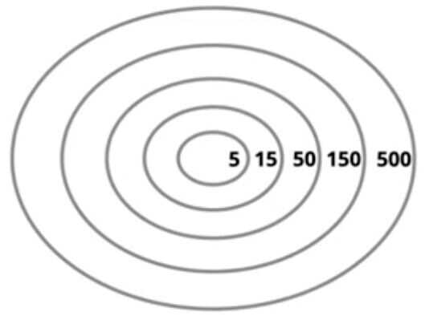

# Mental Models

- [Weekly 1--1s](https://www.quora.com/What-are-some-good-tips-for-1-1s-with-your-employees) - "1--1's can add a whole new level of speed and agility to your company."
- [Forcing Function](https://en.wikipedia.org/wiki/Forcing_function) - "A forcing function is any task, activity or event that forces you to take action and produce a result."
- [Directly Responsible Individual](https://www.quora.com/How-well-does-Apples-Directly-Responsible-Individual-DRI-model-work-in-practice) - A management concept, originally championed by Apple, that good things come if someone is explicitly responsible for something. (related:[diffusion of responsibility](https://en.wikipedia.org/wiki/Diffusion_of_responsibility) - "a sociopsychological phenomenon whereby a person is less likely to take responsibility for action or inaction when others are present.";[bystander effect](https://en.wikipedia.org/wiki/Bystander_effect) - "a social psychological phenomenon that refers to cases in which individuals do not offer any means of help to a victim when other people are present.")
- [Pygmalion Effect](https://en.wikipedia.org/wiki/Pygmalion_effect) - "The phenomenon whereby higher expectations lead to an increase in performance." (related: market pull technology policy - where the government sets future standards beyond what the current market can deliver, and the market pulls that technology into existence.;[Radical Candor](http://firstround.com/review/radical-candor-the-surprising-secret-to-being-a-good-boss/)) , [The Pygmalion Effect: Proving Them Right](https://fs.blog/pygmalion-effect/)
- [Virtual Team](https://en.wikipedia.org/wiki/Virtual_team) - "A group of individuals who work across time, space and organizational boundaries with links strengthened by webs of communication technology." At least in some circumstances, it is possible to have a completely virtual team. The downsides in lack of face-to-face communication can be outweighed by the upsides in sourcing from the entire world.
- [Introversion vs Extraversion](https://en.wikipedia.org/wiki/Extraversion_and_introversion) - "Extraversion tends to be manifested in outgoing, talkative, energetic behavior, whereas introversion is manifested in more reserved and solitary behavior. Virtually all comprehensive models of personality include these concepts in various forms."
- [Growth Mindset vs Fixed Mindset](https://en.wikipedia.org/wiki/Mindset#Fixed_mindset_and_growth_mindset) - "Those with a 'fixed mindset' believe that abilities are mostly innate and interpret failure as the lack of necessary basic abilities, while those with a 'growth mindset' believe that they can acquire any given ability provided they invest effort or study."
- [Mental Liquidity](https://collabfund.com/blog/mental-liquidity/) - It’s the ability to quickly abandon previous beliefs when the world changes or when you come across new information.
- [Hindsight Bias](https://en.wikipedia.org/wiki/Hindsight_bias) - "The inclination, after an event has occurred, to see the event as having been predictable, despite there having been little or no objective basis for predicting it." (related:[Pollyanna principle](https://en.wikipedia.org/wiki/Pollyanna_principle) - "tendency for people to remember pleasant items more accurately than unpleasant ones")
    - Hindsight Wisdom Bias - Common tendency for people to perceive past events as having been more predictable than they were.
- [Organizational Debt](https://steveblank.com/2015/05/19/organizational-debt-is-like-technical-debt-but-worse/) - "All the people/culture compromises made to 'just get it done' in the early stages of a startup."
- (2) Generalist vs Specialist - "A generalist is a person with a wide array of knowledge, the opposite of which is a specialist." (related:[hedgehog vs fox](https://en.wikipedia.org/wiki/The_Hedgehog_and_the_Fox) - "A fox knows many things, but a hedgehog one important thing.")
- [Consequence vs Conviction](http://genius.com/Keith-rabois-lecture-14-how-to-operate-annotated) - "Where there is low consequence and you have very low confidence in your own opinion, you should absolutely delegate. And delegate completely, let people make mistakes and learn. On the other side, obviously where the consequences are dramatic and you have extremely high conviction that you are right, you actually can't let your junior colleague make a mistake."
- [High-context vs Low-context Culture](https://en.wikipedia.org/wiki/High-_and_low-context_cultures) - "In a higher-context culture, many things are left unsaid, letting the culture explain. Words and word choice become very important in higher-context communication, since a few words can communicate a complex message very effectively to an in-group (but less effectively outside that group), while in a low-context culture, the communicator needs to be much more explicit and the value of a single word is less important."
- [Peter Principle](https://en.wikipedia.org/wiki/Peter_principle) - "The selection of a candidate for a position is based on the candidate's performance in their current role, rather than on abilities relevant to the intended role. Thus, employees only stop being promoted once they can no longer perform effectively, and 'managers rise to the level of their incompetence.'"
- [Loyalists vs Mercenaries](http://avc.com/2015/06/loyalists-vs-mercenaries/) - "There are highly loyal teams that can withstand almost anything and remain steadfastly behind their leader. And there are teams that are entirely mercenary and will walk out without thinking twice about it."
- [Dunbar's Number](https://en.wikipedia.org/wiki/Dunbar%27s_number) - "A suggested cognitive limit to the number of people with whom one can maintain stable social relationships..with a commonly used value of 150."

- [Zero Tolerance](https://en.wikipedia.org/wiki/Zero_tolerance) - "Strict punishment for infractions of a stated rule, with the intention of eliminating undesirable conduct."
- [Commandos vs Infantry vs Police](https://blog.codinghorror.com/commandos-infantry-and-police/) - "Three distinct groups of people that define the lifetime of a company: Commandos, Infantry, and Police: Whether invading countries or markets, the first wave of troops to see battle are the commandos...Grouping offshore as the commandos do their work is the second wave of soldiers, the infantry...But there is still a need for a military presence in the territory they leave behind, which they have liberated. These third-wave troops hate change. They aren't troops at all but police."

## WHY, WHAT and HOW Framework

- WHY something is needed - typically a user problem or a business / strategic need (this is the problem and not the solution)
- WHAT to do about that problem - this is the solution. For example, "more people driving hybrid cars is the solution to reduce carbon emissions"
- HOW to implement it - the tactics for putting the solution in place. For example, the specifics of a design, a heuristic / algorithm in coding, an execution plan of policy in government, etc

- To effectively manage less experienced team members, provide a clear explanation of HOW to implement / approach something
- For mid career /experience individuals, provide a clear explanation WHAT needs to be built / implemented
- For the most skilled / experienced, you need only explain WHY a solution is important

## Avoiding Pitfalls

So what happens when we don't get this right? This can occur when you start telling your highest skilled / most experienced HOW to implement something, leaving them feeling micromanaged and overly constrained. Similarly, if you provide an early-stage career team member with WHY something is needed, but not enough information on HOW to implement it, they may be left feeling unsupported with an ambiguous problem.

## A final thought - always explain the WHY

One footnote worth calling out is that while less experienced team members need more guidance on the solution required, there isalwaysvalue in describing the WHY toeveryone(regardless of tenure or experience). By doing this, you're providing the support that will help that person develop autonomy in the future, as well as generate longer-term buy-in.

https://medium.com/@ripsher/managing-through-the-why-what-and-how-a5dd657a49b0

## Deciding

- [Business Case](https://en.wikipedia.org/wiki/Business_case) - "Captures the reasoning for initiating a project or task. It is often presented in a well-structured written document, but may also sometimes come in the form of a short verbal argument or presentation." (related: why this now?)
- [Opportunity Cost](https://en.wikipedia.org/wiki/Opportunity_cost) - "The value of the best alternative forgone where, given limited resources, a choice needs to be made between several mutually exclusive alternatives. Assuming the best choice is made, it is the 'cost' incurred by not enjoying the benefit that would have been had by taking the second best available choice." (related:[cost of capital](https://en.wikipedia.org/wiki/Cost_of_capital))

If you spend too much time working on good things, then you don't have much time left to work on great things.

Understanding opportunity cost means eliminating good uses of time. And that's what makes it hard.

- (1) Intuition - Personal experience coded into your personal neural network, which means your intuition is dangerous outside the bounds of your personal experience. (related:[thinking fast vs thinking slow](https://en.wikipedia.org/wiki/Thinking,_Fast_and_Slow) - "a dichotomy between two modes of thought: 'System 1' is fast, instinctive and emotional; 'System 2' is slower, more deliberative, and more logical.")
- [Local vs Global Optimum](https://en.wikipedia.org/wiki/Local_optimum) - "A local optimum of an optimization problem is a solution that is optimal (either maximal or minimal) within a neighboring set of candidate solutions. This is in contrast to a global optimum, which is the optimal solution among all possible solutions, not just those in a particular neighborhood of values."
- [Decision Trees](https://en.wikipedia.org/wiki/Decision_tree) - "A decision support tool that uses a tree-like graph or model of decisions and their possible consequences, including chance event outcomes, resource costs, and utility." (related:[expected value](https://en.wikipedia.org/wiki/Expected_value))

### The Trinity of Quality

- Quality (How good it is)
- Taste / Target (How good you want it to be)
- Discernment - the ability to judge well (How good you are at knowing the difference) (How well you can perceive quality)

**Problems**

- Same taste different discernment
- Same discernment different taste (creative targets)
- Different taste and different discernment

[The Trinity of Quality - YouTube](https://www.youtube.com/watch?v=TWBEi4ZcLu4)
