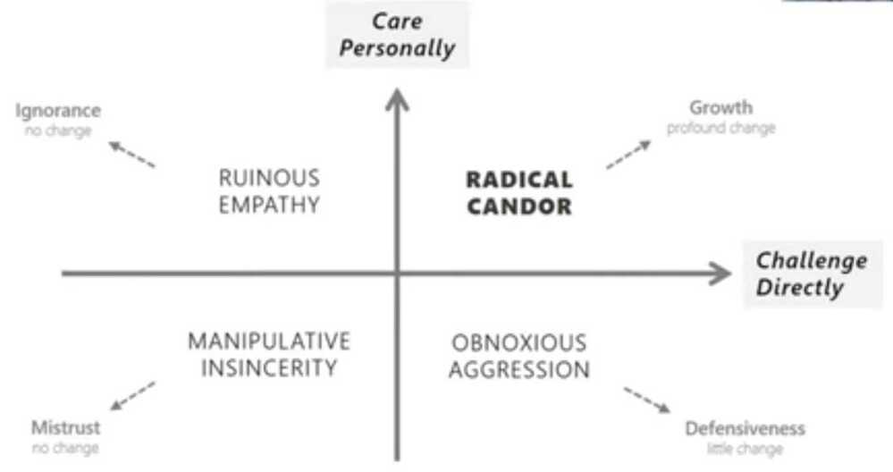

# Mentoring / Teaching / Coaching / Leading / Leader / Leadership

Leadership is the ability to guide, support, and nurture others. Leaders are adept at finding ways for others to be at their best.

A leader doesn't have to be told to step up; they just do it when it's necessary. It's automatic.

Bullying is not leadership.

Leadership is not equal to management

[Seth Godin -- Leadership vs. Management - What it means to make a difference](https://www.youtube.com/watch?v=qzoIAJYPQwo)

- results orientation
- strategic orientation
- collaboration and influence
- team leadership
- developing organizational capabilities
- change leadership
- market understanding

## Radical Candor

The best way to encourage radical candor is to be open to it youself - demonstrate the behavior you want to encourage in others

- Cynicism - We have a problem, but they don't want to solve it
- Pessimism - We have a problem, but we can't solve it
- Optimism - We have a problem, and we can solve it
- Responsibility - We have a problem. Can I help solve it?
- Initiative - We have a problem. Here's how I'm solving it

## Principles - <https://www.amazon.jobs/en/principles>

- [What is mentoring?](https://blog-pragmaticengineer-com.cdn.ampproject.org/v/s/blog.pragmaticengineer.com/developers-mentoring-other-developers/amp/?amp_js_v=0.1#what-is-mentoring)

Mentorship is a learning relationship between an experienced person and someone who wants to grow.

- [Onboarding: a specific type of mentoring](https://blog-pragmaticengineer-com.cdn.ampproject.org/v/s/blog.pragmaticengineer.com/developers-mentoring-other-developers/amp/?amp_js_v=0.1#onboarding-a-specific-type-of-mentoring)
- [Informal mentorship: it's happening everywhere](https://blog-pragmaticengineer-com.cdn.ampproject.org/v/s/blog.pragmaticengineer.com/developers-mentoring-other-developers/amp/?amp_js_v=0.1#informal-mentorship-it-s-happening-everywhere)
- [Formal mentorship: more effort, more focus, more growth](https://blog-pragmaticengineer-com.cdn.ampproject.org/v/s/blog.pragmaticengineer.com/developers-mentoring-other-developers/amp/?amp_js_v=0.1#formal-mentorship-more-effort-more-focus-more-growth)
- [Kicking off mentoring: the introductory meeting](https://blog-pragmaticengineer-com.cdn.ampproject.org/v/s/blog.pragmaticengineer.com/developers-mentoring-other-developers/amp/?amp_js_v=0.1#kicking-off-mentoring-the-introductory-meeting)
- [When you are a mentee](https://blog-pragmaticengineer-com.cdn.ampproject.org/v/s/blog.pragmaticengineer.com/developers-mentoring-other-developers/amp/?amp_js_v=0.1#when-you-are-a-mentee)
- [When you are a mentor](https://blog-pragmaticengineer-com.cdn.ampproject.org/v/s/blog.pragmaticengineer.com/developers-mentoring-other-developers/amp/?amp_js_v=0.1#when-you-are-a-mentor)
- [Being a supportive and efficient mentor](https://blog-pragmaticengineer-com.cdn.ampproject.org/v/s/blog.pragmaticengineer.com/developers-mentoring-other-developers/amp/?amp_js_v=0.1#being-a-supportive-and-efficient-mentor)
- [Mentorship across the organization](https://blog-pragmaticengineer-com.cdn.ampproject.org/v/s/blog.pragmaticengineer.com/developers-mentoring-other-developers/amp/?amp_js_v=0.1#mentorship-across-the-organization)
- [Remote mentorship](https://blog-pragmaticengineer-com.cdn.ampproject.org/v/s/blog.pragmaticengineer.com/developers-mentoring-other-developers/amp/?amp_js_v=0.1#remote-mentorship)
- [The best engineers are great mentors](https://blog-pragmaticengineer-com.cdn.ampproject.org/v/s/blog.pragmaticengineer.com/developers-mentoring-other-developers/amp/?amp_js_v=0.1#the-best-engineers-are-great-mentors)
- [Closing quotes from mentors who are engineers](https://blog-pragmaticengineer-com.cdn.ampproject.org/v/s/blog.pragmaticengineer.com/developers-mentoring-other-developers/amp/?amp_js_v=0.1#closing-quotes-from-mentors-who-are-engineers)

<https://blog.pragmaticengineer.com/developers-mentoring-other-developers>

To inspire better conversations with your manager, direct reports, and team next year, here are the most asked meeting questions from Soapbox communities in 2020:

1. What are the biggest time wasters for you each week?
2. How can I better support you?
3. How can we improve the way our team works together?
4. What was a win that you had last week?
5. On a scale of 1-10, how happy are you at work?
6. What skills would you like to develop right now?
7. What does an ideal, productive workday look like to you? Walk me through it.
8. What's your outlook on this week?
9. What's one thing we can do to improve the performance of the team?
10. What's our biggest challenge as a team?
11. Are you happy in your role? What could make it better for you?
12. Are there any aspects of our culture you wish you could change?
13. What projects would you like to work on or be more involved in?
14. What, if anything, feels harder than it should in your day-to-day work?
15. Is your job what you expected when you accepted it? If not, where has it differed?

## Carrot vs Stick

CarrotandStickApproach of Motivation. ... Thecarrotis a reward for moving while thestickis the punishment for not moving and hence making him move forcefully. Thus, an individual is givencarroti.e. reward when he performs efficiently and is jabbed with astick oris given a punishment in case of non-performance.

## Leaders

Good business leaders create a vision, articulate the vision, passionately own the vision, and relentlessly drive it to completion. -- Jack Welch

- Vision
- Courage
- Integrity
- Humilty
- Strategic Planning
- Focus
- Cooperation
- Strong Communicators
- Lead by example

<https://deepstash.com/article/3226/7-leadership-qualities-and-characteristics-of-good-leaders--brian-tracy>

- No Heroes
- Live as a team and die as a team
- Everyone has a voice
- Software is a team sport

## Types of Leadership

1. Transformational leadership
2. Situational leadership
3. Authoritarian leadership
4. Bureaucratic leadership

    As the cousin of the autocratic style, bureaucratic leadership runs on rules, policy, and maintaining the status quo. The standard procedure always wins out. Proponents of this style will listen to employees, and may even acknowledge their good ideas, but if those ideas don't fit within the established system, they'll never get the green light.

5. Democratic leadership

    The democratic approach to leadership relies on every team member providing input to help the team move towards the best decisions. The leader may still ultimately make the call, but it will likely be in sync with the conversations that have been happening across the team.

6. Coaching leadership

    Coach-style leaders look at their team members and see oodles of potential that can be unleashed and tapped into to help the company grow. As such, coaching leadership relies on your ability to connect your team's capabilities to the right strategic opportunities. Chances are, you enjoy working with a wide variety of people and often make a massive positive impact.

7. Visionary leadership

    Also known as "transformational leadership," this is the style most often revered in organizations that prioritize growth. Because you're constantly challenging employees to not just meet, but exceed their goals, this leadership style requires dynamic communication skills to win people over to your vision of what's possible -- both for themselves and for the company.

8. Servant leadership

    The founding principles of servant leadership include nine behaviors:

      1. Serve first
      2. Add value to others
      3. Build trust
      4. Listen to understand
      5. Think about your thinking
      6. Increase your influence
      7. Demonstrate courage
      8. Live your values
      9. Live your transformation

      In other words, you're the type of leader who is focused on elevating their team members first, knowing that their success reflects well on you and that your own reward will follow. And, chances are, morale on your team is consistently high.

9. Laissez-faire leadership

    This ultra-hands-off style of leadership essentially transfers all authority to employees. You're always there to hook them up with whatever resources they need, but then you let them run with it while you attend to other matters. This means your team members can take more ownership of their roles in creative ways, which can be sooooooo empowering.

<https://www.atlassian.com/blog/quiz/find-your-leadership-style-examples>

## Executive Presence

- Appearance
- Communication skills
- Gravitas

## Kaizen

- Kaizen is a philosophy that productivity can be improved gradually and by involving all employees.
- The small changes can involve quality control, just-in-time delivery, standardized work, the use of efficient equipment, and the elimination of waste.
- Changes can come from any employee anytime and don't have to happen slowly, where kaizen merely recognizes that small changes now can have big future impacts.

<https://www.investopedia.com/terms/k/kaizen.asp>

## A brief guide to leadership

- Always know the answer to, "What are we optimizing for?"
- Recruit. Recruit. Recruit.
- Never ask someone to do something you aren't willing to do yourself.
- Give away the credit. Take the blame.

Things that keep talented people from fulfilling their potential

- Trying to please everyone
- Imitating the desires of others
- Chasing status without questioning why
- Playing superhero and trying to do it all alone
- Dividing your attention between too many projects

It's almost always better to learn from peers who are 2 years ahead of you than mentors who are 20 years ahead of you.

Life evolves and most insights get outdated.

- Reporting gap
- Human gap
- Process gap
- Training gap

## Coaching

Trillion dollar coach - Bill Campbell

1. If you are blessed be a blessing to as many people as you can
2. Radical candor
3. Coach only those who are coachable
4. Psychological safety is the most important thing for a great team
5. Ruthless truth and trust among team players

## Teaching

[How Schools Can Nurture Every Student's Genius | Trish Millines Dziko | TED](https://www.youtube.com/watch?v=SUDMIA23_5s)

## Interview Questions

### Can you tell me about a time when you demonstrated leadership capabilities on the job?

While I was working for my last employer, I was given a special project to oversee. It was my responsibility to ensure it was a success, including coordinating the work of other team members. To keep things on target, I scheduled a strategy meeting to divvy up duties and create a timeline. While also working through my tasks, I reached out regularly to monitor the team's progress, offering guidance and support as necessary to ensure everyone stayed motivated and that deadlines would be met. Ultimately, the project was a success, finishing on time and with all deliverables meeting or exceeding expectations."

### Which supporting skills do you think are most important when it comes to leadership?

First, I think that communication skills are crucial. I regularly use active listening when communicating with others, ensuring I fully understand their perspective. Additionally, since I've regularly worked with stakeholders who don't have the same level of specialty expertise, I've found that the ability to take complex ideas and simplify them is paramount for success. However, communication alone isn't enough. **Accountability** is also vital, as it allows me to lead by example. Similarly, critical thinking is a core component for strategic planning, and served me well when I lead a project with my past employer, which was completed on time and ultimately exceeded expectations.

### When there is a disagreement on your team, how do you handle it?

When there's a disagreement, my first step is to understand the perspective of each person involved. I use active listening skills, giving each party my full attention. I'll summarize my understanding of the situation, asking probing questions to gain additional clarity as required. At that point, my goal is to facilitate conversations that lead to resolutions. Using a calm and respectful approach, I'll work with the involved parties to find a reasonable compromise, brainstorming, and discussing ideas until a suitable option is found. The process ensures everyone can learn more about the other's perspective and that the resolution is a collaborative venture.

1. Tell me about the hardest decision you've ever made as a leader. How did you decide which course of action was best?
2. What steps do you take to make sure that projects are completed on time, on budget, and to the proper standard?
3. How would you describe your leadership style? How would your colleagues describe it?
4. Can you tell me about a time where you faced a leadership challenge? What did you do to overcome it?
5. If a team member is under performing, what steps do you take to improve their performance?
6. Have you ever taken on a leadership role voluntarily? If so, can you tell me about it?
7. Tell me about your approach to delegation.
8. Can you describe a time when you lead by example?
9. Have you ever served in a coach or mentor role? How were you able to help the other person achieve success?
10. How do you monitor a team's performance?
11. If a team is struggling to stay motivated, what steps would you take to boost engagement?
12. When a member of your team presents you with an idea, how do you respond?
13. Which of your past managers was your favorite leader, and why?
14. Are there any leaders that inspire you?
15. How do you respond to constructive criticism?
16. What approach do you use when you need to deliver constructive criticism?
17. What steps do you take to measure your personal performance at work?
18. During your first days in the job, are there any changes that you try to implement immediately?
19. When starting with a new team, how do you evaluate the current state of their capabilities?
20. What do you think is most important in creating a positive culture?
21. How do you determine who gets access to professional development or training?
22. If your project became unexpectedly shorthanded, what would you do to ensure it stayed on target?

## STAR Method

<https://theinterviewguys.com/star-method>

## Situation

Think of a situation similar to what the interviewer is asking you about that had a successful outcome. It doesn't necessarily have to be work related as long as it's relevant. Remember to include the **who, what, where, whenandhow.**

## Task

Describe the task you were responsible for in that situation. **Keep it specific but concise**. Make sure to highlight **any specific challenges you faced.**

## Action

This is the part where you **describe exactly what you did**. How did you complete the task you were assigned? Remember to focus on what you did and highlight traits (qualities) that a hiring manager will find desirable (initiative, [teamwork](https://theinterviewguys.com/teamwork-interview-questions/), leadership, dedication, etc.)

Result:

This is where you get to be introspective. Share what the **outcome of the situation was** and how you specifically **contributed to that outcome.** What did you accomplish? What did you learn? What were the results of your actions?

<https://theinterviewguys.com/tailoring-method>

Trust - [The advice that changed my life!](https://www.youtube.com/watch?v=ggVrFEzCfZI&ab_channel=warikoo)

[Designing Leadership | Clearleft CEO | Andy Budd](https://www.youtube.com/watch?v=j6a9kMvN2Kk)

[How Great Leaders Take On Uncertainty | Anjali Sud and Stephanie Mehta | TED](https://www.youtube.com/watch?v=UGdLvGbpehQ)

- Umbrella - to shield team against all the shit feature requests
- Speak the language of business

## Tools

<https://seekwise.org>

## Others

- Give employees stretch goals (that are hard to accomplish but doable) that will give them boost for completing tasks, and then celebrate the achievement.
- Ask everyone after standup, one personal thing that everyone has to answer
  - One embarassing thing about you
  - What you will do if you have all the money
  - Place to visit

## Links

- [Leaders Eat Last](../book-summaries/leaders-eat-last)

[The Habit That Could Improve Your Career | Paul Catchlove | TED](https://www.youtube.com/watch?v=NcKLNP8x_QA) - Reflection
