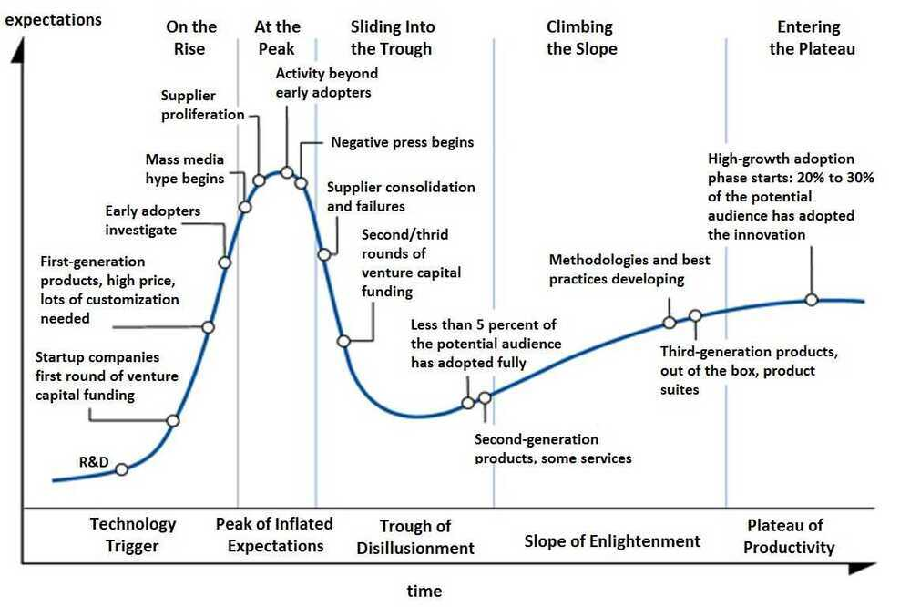
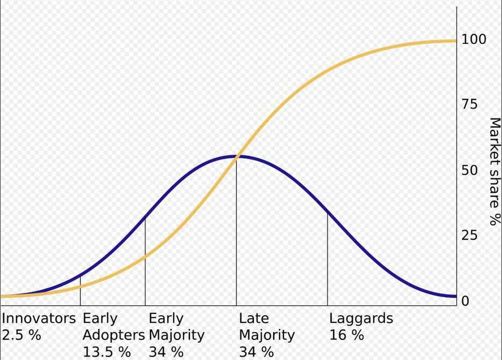

# Others

## SWOT Analysis

SWOT analysis (or**SWOT matrix) is a strategic planning technique used to help a person or organization identify the *Strengths*,*Weaknesses*,*Opportunities*, and *Threats*related to [business](https://en.wikipedia.org/wiki/Business) competition or project planning. It is intended to specify the objectives of the business venture or project and identify the internal and external factors that are favorable and unfavorable to achieving those objectives. Users of a SWOT analysis often ask and answer questions to generate meaningful information for each category to make the tool useful and identify their competitive advantage

Strengths and Weakness are frequently internally-related, while Opportunities and Threats commonly focus on environmental placement.

- ***S** trengths*: characteristics of the business or project that give it an advantage over others.
- ***W** eaknesses*: characteristics of the business that place the business or project at a disadvantage relative to others.
- ***O** pportunities*: elements in the environment that the business or project could exploit to its advantage.
- ***T** hreats*: elements in the environment that could cause trouble for the business or project.

The degree to which the internal environment of the firm matches with the external environment is expressed by the concept of [strategic fit](https://en.wikipedia.org/wiki/Strategic_fit). Identification of SWOTs is important because they can inform later steps in planning to achieve the objective. First, decision-makers should consider whether the objective is attainable, given the SWOTs. If the objective is *not*attainable, they must select a different objective and repeat the process.

https://en.wikipedia.org/wiki/SWOT_analysis

## PEST Analysis (political, economic, social and technological)

PEST Analysis is a management method whereby an organization can assess major external factors that influence its operation in order to become more competitive in the market. As described by the acronym, those four areas are central to this model.

## Using Lanes to grow Teams

https://medium.com/teads-engineering/growing-a-feature-team-using-lanes-2e50d5521006

## churn rate

is the percentage of subscribers to a service who discontinue their subscriptions to the service within a given time period. For a company to expand its clientele, its growth rate, as measured by the number of new customers, must exceed its churn rate.

## SE Radio Episode 352 - Johanathan Nightingale on Scaling Engineering Management

## Law of Diminishing Returns

Used to refer to a point at which the level of profits or benefits gained is less than the amount of money or energy invested

## Failure Premortem

Imagine the most important goal or project you are working on right now. Now fast forward six months andassume the project or goal has failed.

Tell the story of how it happened. What went wrong? What mistakes did you make? How did it fail? In other words, think of your main goal and ask yourself, "What could cause this to go horribly wrong?"

This strategy is sometimes called the "**kill the company**" exercise in organizations because the goal is to spell out the exact ways the company could fail. Just like a Premeditation of Evils, the idea is to identify challenges and points of failure so you can develop a plan to prevent them ahead of time.

## Gartner Hype Cycle

## Gartner Magic Quadrant

**Magic Quadrant** (MQ) is a series of [market research](https://en.wikipedia.org/wiki/Market_research "Market research") reports published by [IT consulting firm](https://en.wikipedia.org/wiki/Information_technology_consulting "Information technology consulting") [Gartner](https://en.wikipedia.org/wiki/Gartner "Gartner") that rely on proprietary [qualitative](https://en.wikipedia.org/wiki/Qualitative_research "Qualitative research") [data analysis](https://en.wikipedia.org/wiki/Data_analysis "Data analysis") methods to demonstrate market trends, such as direction, maturity and participants. Their analyses are conducted for several specific technology industries and are updated every 1–2 years: once an updated report has been published, its predecessor is "retired".

### Rating

Gartner rates vendors upon two criteria: completeness of [vision](https://en.wikipedia.org/wiki/Vision_statement "Vision statement") and ability to execute

**Completeness of vision** – Reflects the vendor's innovation, and whether the vendor drives or follows the market.

**Ability to execute** – Summarizes factors such as the vendor's financial viability, market responsiveness, product development, sales channels and customer base.

The two component scores lead to a vendor position in one of four quadrants:

#### Leaders

Vendors in the "Leaders" quadrant have the highest composite scores for their *completeness of vision* and *ability to execute*. A vendor in the Leaders quadrant has the market share, credibility, and marketing & sales capabilities needed to drive the acceptance of new technologies. These vendors demonstrate a clear understanding of market needs, they are innovators and thought leaders, and they have well-articulated plans that customers and prospects can use when designing their infrastructures and strategies. In addition, they have a presence in the five major geographical regions, consistent financial performance, and broad platform support.

#### Challengers

A vendor in the "Challengers" quadrant participates in the market, and executes well enough to be a serious threat to vendors in the Leaders quadrant. They have strong products, as well as sufficiently credible market position and resources to sustain continued growth. Financial viability is not an issue for vendors in the Challengers quadrant, but they lack the size and influence of vendors in the Leaders quadrant.

#### Visionaries

A vendor in the "Visionaries" quadrant delivers innovative products that address operationally or financially important end-user problems at a broad scale, but has not yet demonstrated the ability to capture market share or sustainable profitability. Visionary vendors are frequently privately held companies and acquisition targets for larger, established companies. The likelihood of acquisition often reduces the risks associated with installing their systems.

#### Niche Players

Vendors in the "Niche Players" quadrant are often narrowly focused on specific market or vertical segments. This quadrant may also include vendors that are adapting their existing products to enter the market under consideration, or larger vendors having difficulty developing and executing on their vision.

Gartner Critical Capabilities complement Magic Quadrant analysis to offer deeper insight into the products and services offered by multiple vendors by a comparative analysis that scores competing products or services against a set of critical differentiators identified by Gartner.

[Magic Quadrant - Wikipedia](https://en.wikipedia.org/wiki/Magic_Quadrant)

## Diffusion of Innovation

Diffusion of innovations is a [theory](https://en.wikipedia.org/wiki/Theory) that seeks to explain how, why, and at what rate new [ideas](https://en.wikipedia.org/wiki/Idea) and [technology](https://en.wikipedia.org/wiki/Technology) spread.[Everett Rogers](https://en.wikipedia.org/wiki/Everett_Rogers), a professor of [communication studies](https://en.wikipedia.org/wiki/Communication_studies), popularized the theory in his bookDiffusion of Innovations; the book was first published in 1962, and is now in its fifth edition (2003).Rogers argues that diffusion is the process by which an [innovation](https://en.wikipedia.org/wiki/Innovation) is communicated over time among the participants in a social system. The origins of the diffusion of innovations theory are varied and span multiple disciplines.

The diffusion of innovations according to Rogers. With successive groups of consumers adopting the new technology (shown in blue), its [market share](https://en.wikipedia.org/wiki/Market_share)(yellow) will eventually reach the saturation level. The blue curve is broken into sections of adopters.

https://en.wikipedia.org/wiki/Diffusion_of_innovations

[The Biggest Myth About Innovation - YouTube](https://www.youtube.com/watch?v=thtKslF8zE4)

## Work First Mindset

A "work first" mindset means that you plan your day around your work. Your work literally comes first.

## Force Majeure

Force Majeure is a common clause in contract law. It allows a party to limit their liability due to unforeseeable, extraordinary events. Maybe a hurricane hit the stadium, cancelling a game. Force Majeure. An earthquake brings down a building. Stuff like that.

## Human Resource Management

https://www.keka.com
