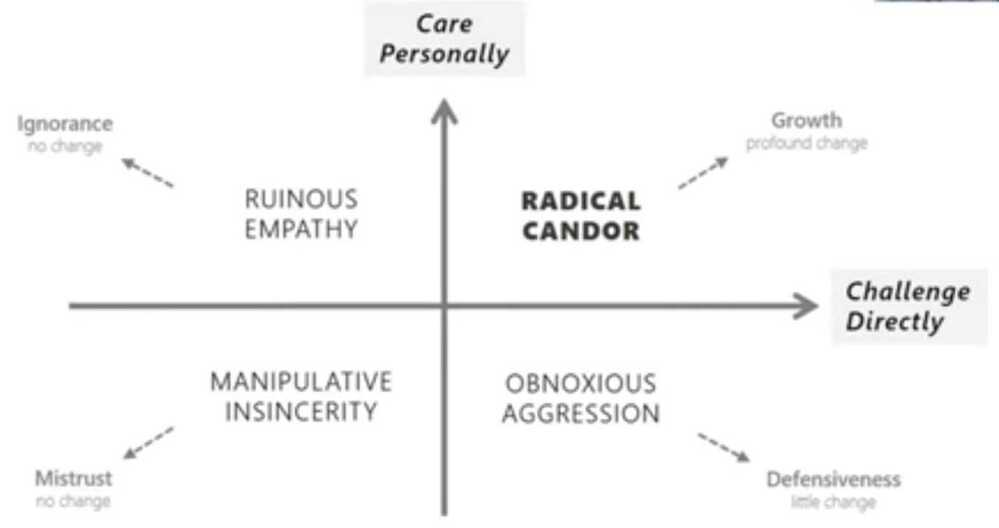

# Mentoring / Leading

Leadership is the ability to guide, support, and nurture others. Leaders are adept at finding ways for others to be at their best.

A leader doesn't have to be told to step up; they just do it when it's necessary. It's automatic.

Bullying is not leadership.

Leadership is not equal to management

[Seth Godin -- Leadership vs. Management - What it means to make a difference](https://www.youtube.com/watch?v=qzoIAJYPQwo)

- results orientation
- strategic orientation
- collaboration and influence
- team leadership
- developing organizational capabilities
- change leadership
- market understanding

## Radical Candor

The best way to encourage radical candor is to be open to it youself - demonstrate the behavior you want to encourage in others

- Cynicism - We have a problem, but they don't want to solve it
- Pessimism - We have a problem, but we can't solve it
- Optimism - We have a problem, and we can solve it
- Responsibility - We have a problem. Can I help solve it?
- Initiative - We have a problem. Here's how I'm solving it

## Principles - https://www.amazon.jobs/en/principles

- [What is mentoring?](https://blog-pragmaticengineer-com.cdn.ampproject.org/v/s/blog.pragmaticengineer.com/developers-mentoring-other-developers/amp/?amp_js_v=0.1#what-is-mentoring)

Mentorship is a learning relationship between an experienced person and someone who wants to grow.

- [Onboarding: a specific type of mentoring](https://blog-pragmaticengineer-com.cdn.ampproject.org/v/s/blog.pragmaticengineer.com/developers-mentoring-other-developers/amp/?amp_js_v=0.1#onboarding-a-specific-type-of-mentoring)
- [Informal mentorship: it's happening everywhere](https://blog-pragmaticengineer-com.cdn.ampproject.org/v/s/blog.pragmaticengineer.com/developers-mentoring-other-developers/amp/?amp_js_v=0.1#informal-mentorship-it-s-happening-everywhere)
- [Formal mentorship: more effort, more focus, more growth](https://blog-pragmaticengineer-com.cdn.ampproject.org/v/s/blog.pragmaticengineer.com/developers-mentoring-other-developers/amp/?amp_js_v=0.1#formal-mentorship-more-effort-more-focus-more-growth)
- [Kicking off mentoring: the introductory meeting](https://blog-pragmaticengineer-com.cdn.ampproject.org/v/s/blog.pragmaticengineer.com/developers-mentoring-other-developers/amp/?amp_js_v=0.1#kicking-off-mentoring-the-introductory-meeting)
- [When you are a mentee](https://blog-pragmaticengineer-com.cdn.ampproject.org/v/s/blog.pragmaticengineer.com/developers-mentoring-other-developers/amp/?amp_js_v=0.1#when-you-are-a-mentee)
- [When you are a mentor](https://blog-pragmaticengineer-com.cdn.ampproject.org/v/s/blog.pragmaticengineer.com/developers-mentoring-other-developers/amp/?amp_js_v=0.1#when-you-are-a-mentor)
- [Being a supportive and efficient mentor](https://blog-pragmaticengineer-com.cdn.ampproject.org/v/s/blog.pragmaticengineer.com/developers-mentoring-other-developers/amp/?amp_js_v=0.1#being-a-supportive-and-efficient-mentor)
- [Mentorship across the organization](https://blog-pragmaticengineer-com.cdn.ampproject.org/v/s/blog.pragmaticengineer.com/developers-mentoring-other-developers/amp/?amp_js_v=0.1#mentorship-across-the-organization)
- [Remote mentorship](https://blog-pragmaticengineer-com.cdn.ampproject.org/v/s/blog.pragmaticengineer.com/developers-mentoring-other-developers/amp/?amp_js_v=0.1#remote-mentorship)
- [The best engineers are great mentors](https://blog-pragmaticengineer-com.cdn.ampproject.org/v/s/blog.pragmaticengineer.com/developers-mentoring-other-developers/amp/?amp_js_v=0.1#the-best-engineers-are-great-mentors)
- [Closing quotes from mentors who are engineers](https://blog-pragmaticengineer-com.cdn.ampproject.org/v/s/blog.pragmaticengineer.com/developers-mentoring-other-developers/amp/?amp_js_v=0.1#closing-quotes-from-mentors-who-are-engineers)

https://blog.pragmaticengineer.com/developers-mentoring-other-developers

To inspire better conversations with your manager, direct reports, and team next year, here are the most asked meeting questions from Soapbox communities in 2020:

1. What are the biggest time wasters for you each week?
2. How can I better support you?
3. How can we improve the way our team works together?
4. What was a win that you had last week?
5. On a scale of 1-10, how happy are you at work?
6. What skills would you like to develop right now?
7. What does an ideal, productive workday look like to you? Walk me through it.
8. What's your outlook on this week?
9. What's one thing we can do to improve the performance of the team?
10. What's our biggest challenge as a team?
11. Are you happy in your role? What could make it better for you?
12. Are there any aspects of our culture you wish you could change?
13. What projects would you like to work on or be more involved in?
14. What, if anything, feels harder than it should in your day-to-day work?
15. Is your job what you expected when you accepted it? If not, where has it differed?

## Carrot vs Stick

Carrot and Stick Approach of Motivation. ... The carrot is a reward for moving while the stick is the punishment for not moving and hence making him move forcefully. Thus, an individual is given carrot i.e. reward when he performs efficiently and is jabbed with a stick or is given a punishment in case of non-performance.

## Leaders

Good business leaders create a vision, articulate the vision, passionately own the vision, and relentlessly drive it to completion. -- Jack Welch

- Vision
- Courage
- Integrity
- Humilty
- Strategic Planning
- Focus
- Cooperation
- Strong Communicators
- Lead by example

https://deepstash.com/article/3226/7-leadership-qualities-and-characteristics-of-good-leaders--brian-tracy

- No Heroes
- Live as a team and die as a team
- Everyone has a voice
- Software is a team sport

### 9 Traits of Exceptional Leaders

1. Respect - They always respect their people
2. Authenticity - They can't faked authenticity.
3. Communication - They are great communicators
4. Humility - Staying humble enables them to stay connected to their team.
5. Accountability - They hold themselves accountable and expect the same of their people.
6. Lead by Example - They model the behavior they expect.
7. Empathy - Without empathy, they can't build a team or nurture a new generation of leaders.
8. Visionary - They are driven and inspired by what the future can become.
9. Care - They show genuine care for their team.

## Executive Presence

- Appearance
- Communication skills
- Gravitas

## Kaizen

- Kaizen is a philosophy that productivity can be improved gradually and by involving all employees.
- The small changes can involve quality control, just-in-time delivery, standardized work, the use of efficient equipment, and the elimination of waste.
- Changes can come from any employee anytime and don't have to happen slowly, where kaizen merely recognizes that small changes now can have big future impacts.

https://www.investopedia.com/terms/k/kaizen.asp

## A brief guide to leadership

- Always know the answer to, "What are we optimizing for?"
- Recruit. Recruit. Recruit.
- Never ask someone to do something you aren't willing to do yourself.
- Give away the credit. Take the blame.

Things that keep talented people from fulfilling their potential

- Trying to please everyone
- Imitating the desires of others
- Chasing status without questioning why
- Playing superhero and trying to do it all alone
- Dividing your attention between too many projects

It's almost always better to learn from peers who are 2 years ahead of you than mentors who are 20 years ahead of you.

Life evolves and most insights get outdated.

- Reporting gap
- Human gap
- Process gap
- Training gap

## Coaching

Trillion dollar coach - Bill Campbell

1. If you are blessed be a blessing to as many people as you can
2. Radical candor
3. Coach only those who are coachable
4. Psychological safety is the most important thing for a great team
5. Ruthless truth and trust among team players

## Teaching

[How Schools Can Nurture Every Student's Genius | Trish Millines Dziko | TED](https://www.youtube.com/watch?v=SUDMIA23_5s)

"He who has a why to live for can bear almost any how." -- Friedrich Nietzsche

Teachers need to internalise this. Your job is to spark curiosity in your students.

1. Assume the student has very little knowledge about the topic
2. Assume they will watch the video just once
3. Assume the attention span of the student is less than two minutes. Hook them with a joke or example
4. Tell them how this impacts them. The student doesn't care about information, they care about knowledge!

Golden Rule: When explaining a topic, choose the right level of abstraction. Once a student understands the high level concept, they dig into the details themselves.

## STAR Method

https://theinterviewguys.com/star-method

## Situation

Think of a situation similar to what the interviewer is asking you about that had a successful outcome. It doesn't necessarily have to be work related as long as it's relevant. Remember to include the **who, what, where, whenandhow.**

## Task

Describe the task you were responsible for in that situation. **Keep it specific but concise**. Make sure to highlight **any specific challenges you faced.**

## Action

This is the part where you **describe exactly what you did**. How did you complete the task you were assigned? Remember to focus on what you did and highlight traits (qualities) that a hiring manager will find desirable (initiative, [teamwork](https://theinterviewguys.com/teamwork-interview-questions/), leadership, dedication, etc.)

Result:

This is where you get to be introspective. Share what the **outcome of the situation was** and how you specifically **contributed to that outcome.** What did you accomplish? What did you learn? What were the results of your actions?

https://theinterviewguys.com/tailoring-method

Trust - [The advice that changed my life!](https://www.youtube.com/watch?v=ggVrFEzCfZI&ab_channel=warikoo)

[Designing Leadership | Clearleft CEO | Andy Budd](https://www.youtube.com/watch?v=j6a9kMvN2Kk)

[How Great Leaders Take On Uncertainty | Anjali Sud and Stephanie Mehta | TED](https://www.youtube.com/watch?v=UGdLvGbpehQ)

- Umbrella - to shield team against all the shit feature requests
- Speak the language of business

## Tools

https://seekwise.org

## Others

- Give employees stretch goals (that are hard to accomplish but doable) that will give them boost for completing tasks, and then celebrate the achievement.
- Ask everyone after standup, one personal thing that everyone has to answer
    - One embarassing thing about you
    - What you will do if you have all the money
    - Place to visit

## Links

- [Leaders Eat Last](book-summaries/leaders-eat-last.md)

- [The Habit That Could Improve Your Career | Paul Catchlove | TED](https://www.youtube.com/watch?v=NcKLNP8x_QA) - Reflection
- [Why Great Leaders Must Unlearn to Succeed in Today's Exponential World • Barry O’Reilly • YOW! 2018 - YouTube](https://www.youtube.com/watch?v=Y962m1Ede7E&ab_channel=GOTOConferences)
