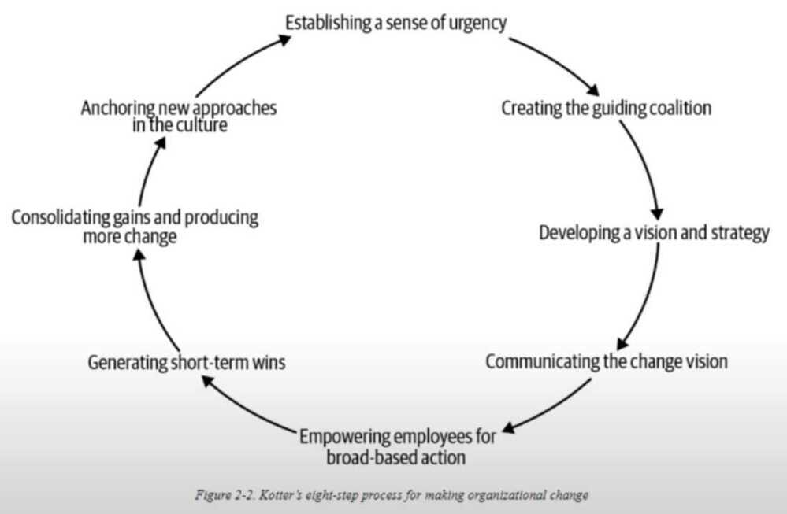
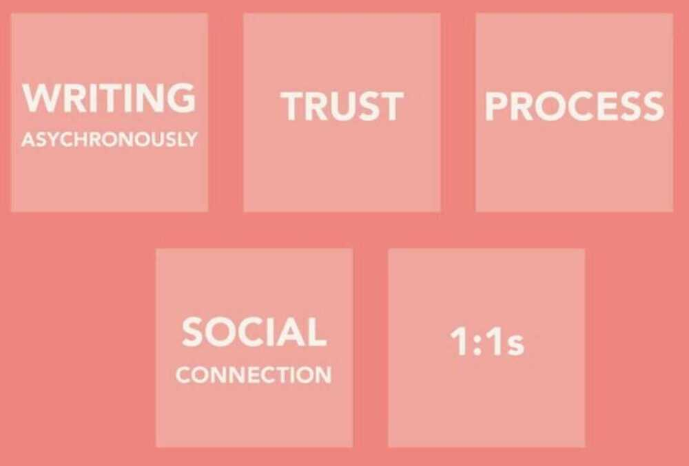
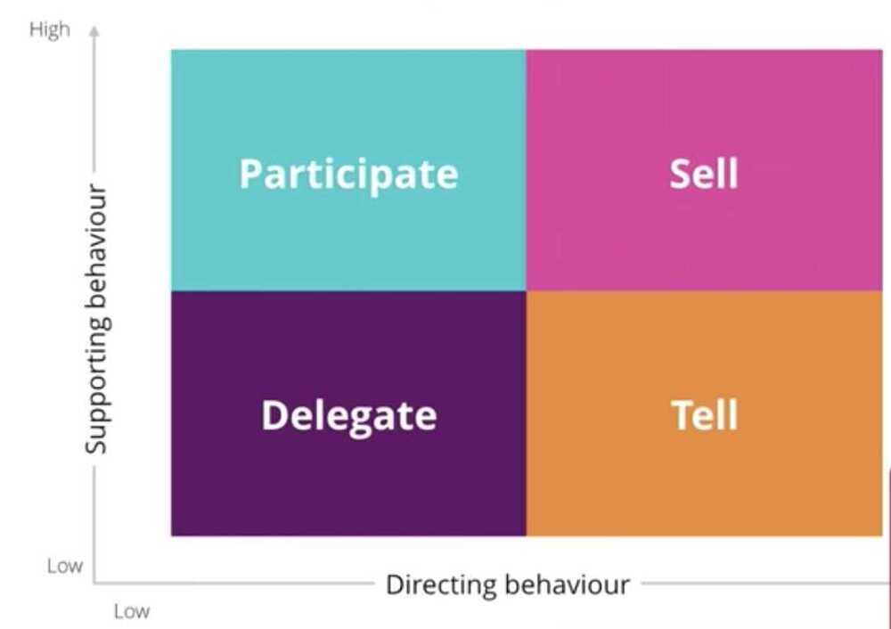
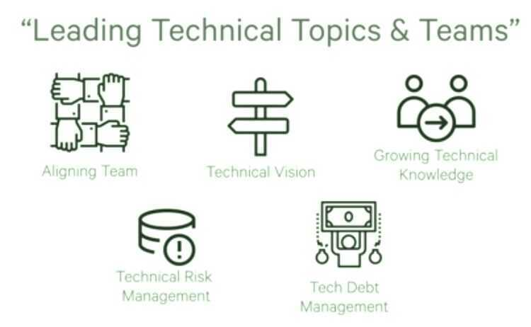
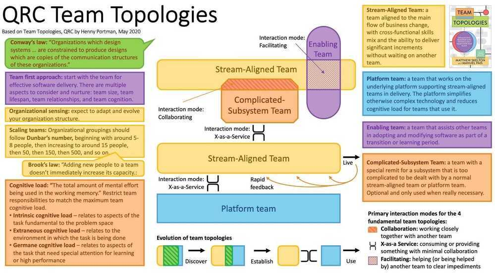

# People / Team Management

I am available anytime, I can mentor, Any help you need you can always come to me. -- Deepak

Praise for effort and not outcome

Most important quality in a high quality team - **Respect and Trust**.

To not sound arrogant you should tell things with smile with sir, madam

If you want a problem solved make it someone's project. If you want it managed make it someone's job.

Most people are terrible managers

Start your team with generalists and scale it by specialists.

Let’s dream big, plan diligently, and execute relentlessly

Would I rather be feared or loved? Both I want people to be afraid of how much they love me.

Fool me once, shame on you. Fool me twice, shame on me. Fool me three times, shame on both of us.

Train people well enough so they can leave. Treat them well enough, so they don't want to.

## What When How

- **What** are you going to do
- **When** are you going to do it
- **How** are you going to do it

[The puzzle of motivation | Dan Pink](https://www.youtube.com/watch?v=rrkrvAUbU9Y)

- As long as the task involved only mechanical skill, bonuses worked as they would be expected: the higher the pay, the better the performance.
- But once the task called for "even rudimentary cognitive skill," a larger reward "led to poorer performance."
- Higher incentives led to worse performances
- Financial incentives, can result in a negative impact on overall performance
- New approach - intrinsic motivation
    - Autonomy
        - Traditional management is great if you want compliance, but if you want engagement self-direction works better
        - 20 percent time
    - Mastery
    - Purpose

## Psychological Safety

1. **Make** it an explicit priority
2. **Facilitate** everyone speaking up
3. **Establish** norms for how failure is handled
4. **Create** space for new ideas (even wild ones)
5. **Embrace** productive conflict

https://hbr.org/2017/08/high-performing-teams-need-psychological-safety-heres-how-to-create-it

1. Approach conflict as a collaborator, not an adversary
2. Speak human to human
3. Anticipate reactions and plan countermoves
4. Replace blame with curiosity
5. Ask for feedback on delivery
6. Measure psychological safety

## The Fearless Organization by Amy C. Edmondson

Creating **psychological safety** in the workplace for learning, innovation, and growth

- A fearless workplace starts with reframing failure and redefining the boss's role
- Those who are not the boss are seen as valued contributors, as people with crucial knowledge and insight
- When leaders are curious and admit that they don't know everything, people are encouraged to speak up
- When people take risks and speak up, it's important for leaders to respond productively
- You don't have to be a leader to help create a fearless work environment
    - I need help
    - I don't know
    - I made a mistake
    - What challenges are you facing?
    - What can I do to help you?

Let your team know

- Over-communication is helpful - The more everyone proactively shares progress + concerns, the better.
- Empathize empathy - Not sure what someone meant by their note? Assume positive intent. Feeling bothered by the way someone communicated their request? Kindly share the feedback of what you observed + how you'd like things to be different next time.

[Work Principles](https://deepstash.com/idea/58882/work-principles)

- **Value knowing the truth.** You have nothing to fear from knowing it
- Cultivate **meaningful work and meaningful relationships**
- Foster **a culture that allows mistakes** and encourages learning from them
- **Weight your decision making** in a realistic way
- Recognize how to get beyond disagreement
- Remember that **WHO is more important than WHAT**
- **Hire right,** because the costs for hiring wrong are huge
- Constantly **train, test, evaluate, and sort people**
- **Identify and don't tolerate problems**
- **Diagnose problems to get at their root causes**
- Design improvements to your machine to get around your problems
- **Do what you set out to do**
- Use tools and protocols to shape how work is done
- **Don't overlook governance.**

Mentors - Does the firm prioritize mentorship? Do employees feel like they have advocates within the firm? Do the mentees eventually become the mentors?

Trust - Do people at the firm trust those around and above them? If younger employees look left and right in a meeting, do they admire these people? Do they aspire to be in their bosses' shoes in the future?

Strategy - Do the "higher ups" value their employees' opinions? Do they encourage open discussions or do they "steer" the conversation? Do they value differing opinions or just say they do?

Recruiting - What types of qualities does the firm prioritize when hiring? How much emphasis is placed on character versus sheer intellectual horsepower? Where do they recruit from?

Accountability - How has the firm handled disruptive colleagues? Are the most talented colleagues given exceptions or are they held to the same standard? How are good team players acknowledged and rewarded?

https://blog.trello.com/hold-team-accountable-without-micromanaging

The fundamental principle of the situational leadership model is that there is **no single "best" style of leadership**. Effective leadership is task-relevant, and the most successful leaders are those who adapt their leadership style to the performance readiness (ability and willingness) of the individual or group they are attempting to lead or influence. Effective leadership varies, not only with the person or group that is being influenced, but it also depends on the task, job, or function that needs to be accomplished.

https://en.wikipedia.org/wiki/Situational_leadership_theory

- Depends on
    - Skill
    - Motivation
    - Urgency

- Three are many ways to lead
    - Coach
    - Shepherd
    - Shaman
    - Champion
- Saying no

1. Awareness
2. Training
3. Coaching
4. Practice (deliberate)

## Leadership skills to invest in

- Empathy
- Self-Awareness
- Motivation
- Conflict Resolution
- Communication
- Coaching
- Feedback
- Influencing
- Delegation

https://blog.trello.com/flexibility-secret-of-great-leaders-everywhere

## Strengths Finder

- Woo
- Strategic
- Achiever
- Intellection

Move from Maker to Multiplier mode

[You're The Tech Lead! Now What?](https://www.youtube.com/watch?v=muls9BogsVQ)

## KPI - Key Performance Indicators

## KPA - Key Performance Areas

## KRA - Key Result Areas

1. Complexity / Innovation- Task Based
2. Code Quality
3. Communication with project owner
4. Responsibility and Teamwork.

- **Taking ownership for his deliverables end to end**
- Scoping
- Managing Stakeholders
- Designing
- Coding
- Documentation (And meeting notes)
- Deploying
- Debugging
- Monitoring
- Alerting
- **Finding problems proactively**
- **Participating in knowledge sharing (Tech sessions)**
- **Understanding the specifications** for the "thing" you are about to implement.
- **Estimating time** required to implement something.
- **Communications skills** and clearness in your reporting and communication.
- **Knowledge in the programming languages** you use.
- **Knowledge in the libraries** you use.
- **Knowledge in the tool-sets** you use.
- **Analytical thinking** and experience (practical when you design the architecture of the "thing" prior to coding it).
- **Technological understanding** (ability to see your new "thing" in a wider perspective, for example how a small library fit into a large project or product).
- **Creativity**(finding better ways to achieve your projects goals).
- **Planning**
- **Coding** (testable code, clean reusable code, maintainable code, readable code, bug-free code, beautiful code).
- **Correctness** (few bugs, few iterations with refactoring).
- **Application performance** (the application does what it's supposed to do without wasting CPU, memory or other resources).
- **Learning** (your ability to learn about and use new technologies, protocols, libraries, or even languages as needed).
- **Durability** (to stay on track no matter what, even when you feel dead bored, or in way over your head).

## Effectiveness

- Actual delivery time vs Estimated delivery time
- One time successful delivery vs Total delivery
- Overall accomplish time - issue created time to issue resolved time

## Quality

- Avg code review score
- Re-do work counts
- Bug Reports - Total vs Critical

## Productivity

- Number of critical issues solved
- Count of positive team reviews
- Any public doc created
- Innovative ideas shared and worked

https://lastviking.eu/key_result_areas_for_developers.html

Logically segment the business into micro-subdomains, so that each can be supported by a small **empowered autonomous team**.

## Tips

- Create shared calendar for leaves/wfh
- Calendly for scheduling interviews
- Employee of the month award
- Incentive structuring (Always have a yearly bonus for retention, and should be in an staggered manner)
- Courses?
- Quarterly review
- Talk to people in party, motivate them to scale up and take ownership, give esops, give them vision, give them bigger goals, get them motivated instead of talking about other things
- Intrinsic motivated people, who are themselves motivated and everyone should get out of their way, extrinsic when people are motivated by external pressure or force or incentives

## Performance reviews (Engineering reviews)

https://blog.pragmaticengineer.com/performance-reviews-for-software-engineers

https://docs.google.com/spreadsheets/d/1tyt8juaRrbHJGglg8z0WS_tYfdMgKS9AHc1l3jpcg6k/edit?usp=sharing

https://about.gitlab.com/blog/2020/08/27/measuring-engineering-productivity-at-gitlab

## Bus Factor

A project's bus factor (or truck factor) is a number equal to the number of team members who, if run over by a bus, would put the project in jeopardy. The smallest bus factor is 1. Larger numbers are preferable. Essentially, a low bus factor represents a single point of failure within the team.

https://deviq.com/bus-factor

Escalation matrix

## One Minute Manager

### [**Managing people**](https://klinger.io/posts/managing-people-%F0%9F%A4%AF)

- As a manager, everything is your fault
    - There is no point being angry at your team -- ever
    - You are in charge of processes and people
        - And you got more information than they do, always
    - You either created the processes where this outcome happened
        - or you hired (or did not fire) the wrong people
    - Ultimately everything is your fault
- You manage processes; you lead people
- Processes are expectations made explicit
- Decisions vs Opinions
- Ownership
- Avoid back and forth
- Trust
- Trust through transparency
- Trust is not binary
- Don't confuse autonomy and abandonment
- Decision Layering
- Avoid drive-by management
- Feedbacking people
- Firing should never be a surprise
- Never delay firing
- Explicit > Implicit
- Best practices: Start by making true what's real
- Expect to refactor your company every few months
- Burnout
- Chaos is felt less by the people creating it
- Expect more from managers that report from you

## Feedbacks

**What would you say is my biggest strength?**

This is a question that I love asking my manager and peers because I experience imposter syndrome a lot more than I'd like to admit. Asking this question tackles two things: getting feedback from those around me and squashing feelings of imposter syndrome as they creep up.

## Word Cloud

- Integrity
- Fairness
- Transparency
- Move up / out
- Fail fast, Fail often
- Take ownership
- Execute well, Execute quickly
- Process Orientation
- Customer centricity
- Innovate
- Obligation to Dissent
- Focus on product
- Attention to detail
- Communicate well & Clearly

## Deadlines

https://irrationallabs.com/blog/papers-were-reading-week-17

## Learning and Development Officer (CLO - Chief Learning Officer)

https://360learning.com/blog/6-key-skills-chief-learning-officer

https://360learning.com/blog/lifelong-learning

## TEAM MANAGEMENT (Collaboration, Motivation, Solving Problems, Conflict Resolution, Likeability)

| **S No** | **Self Remarks**    | **Self Rating** |
|----------|---------------------|-----------------|
| 1        | Collaboration       | Rating - 3/5    |
| 2        | Motivation          | Rating - 4/5    |
| 3        | Solving Problems    | Rating - 4/5    |
| 4        | Conflict Resolution | Rating - 3/5    |
| 5        | Likeability         | Rating - 3/5    |

## QRC Team Topologies

## Managing Managers

### Do

- Treat your direct reports in the same way you want them to treat their team members.
- Look for opportunities to observe them in action.
- Spend time getting to know their team members.

### Don't

- Dictate exactly how they should manage. Instead, give them advice and let them find their own authentic style.
- Criticize them in front of their team. You should be looking for opportunities to bolster their credibility.
- Wait until the annual review cycle to ask for input. Regularly seek feedback on how you're doing as their manager.

https://hbr.org/2016/08/how-to-manage-managers

https://www.shrm.org/resourcesandtools/hr-topics/people-managers/pages/managing-managers.aspx

https://www.managementcenter.org/resources/tips-managing-managers

1. Cultivate and affirm ownership
2. Understand their management and leadership style
3. Always be modeling
4. See them in action
5. See the work in action, too
6. Build relationships with your managers' teams

https://www.entrepreneur.com/article/378072

1. Help them go from manager to leader
2. Give managers a budget
3. Empower and encourage managers to take care of their top performersin terms of needs, pay and recognition
4. Respect their position as manager and allow them to task their teams and set deliverables
5. Ensure they know how you want to be kept informed
6. Create trust so managers can come to you for help when they need a sounding board
7. Make sure they can tell the difference between a people issue and simply being misaligned

## Negative Connotation

I am so sad man, you didn't reply to me. I tried reaching out to you.

### Rebuttal

I have been observing interactions between you & my team.

My understanding is that you agreed to do a project, deliverables were clear & they were not met. Even the first milestone was not achieved by you, no question of it being close to agreed timelines.

The code you committed did not work in simple dev tests, so the question of it being of any use to us is absurd.

What is the escalation about? My suggestion is we close the topic here, we have no interest in using anything that you have written, simply because it is not usable at all so its totally worthless.

If you wish to take this forward & threaten my team in any way then we will be forced to defend with all tools available to us.

I hope your intention is not to threaten or escalate this matter & it is an error in my interpretation. If so please excuse me.

Please note that we can't take threats of legal action lightly so hopefully you see sense in this and retract that claim.

### Others

- Anger
- Fear
- Greed
- Jealousy
- Uncertainty

### Motivating people at work

https://ideas.ted.com/3-things-that-keep-people-feeling-motivated-at-work

- Self-determination theory essentially argued that people are motivated when they can determine for themselves what to work on and how to work on it.
- Indeed they posit that incentives can drive down motivation --"because incentives take away a sense of power to determine the work for oneself."

#### The first motivational driver is **autonomy**

Autonomy refers to how much people feel in control of their own life and able to make their own choices. In the context of work, autonomy means people feel they have a say in what they work on and how they work on it. They don't feel micromanaged; they feel empowered by their managers to pursue objectives and deadlines on their terms.

...One easy way to judge whether you are leading from a place of autonomy versus control is to pay attention to your feedback or coaching conversations with the team. Specifically, do this: Pay attention to how many times you're giving them advice vs. asking them questions. If you're often giving advice or telling people how to do something, you could be diminishing their sense of autonomy. But if you are asking questions designed to guide them to finding their own solutions, then you are leaving them in control.

#### The second motivational driver is **competence**

Competence refers to our desires to seek control but also to experience mastery. Competence speaks to our natural human desire to be learners, to be growing and feeling like we're making progress. It could be progress in our career, progress towards a set of objectives or working for a team or a company that is making progress. Anything that helps individuals feel they are moving toward mastery leverages competence as a motivation.

...make sure that even when you are giving people constructive feedback, you are pairing it with a lot of positive feedback and praise as well. That way it reminds them of the progress they've already made - and show them you're trying to help them make even more progress.

#### The third and final motivational driver is **relatedness**

Relatedness refers to our will to connect with others, interact and care for other people. In terms of research, we've only just begun to grasp just how important relatedness to others truly is. But we know that humans are much more motivated to take actions when they're seen as pro-social - that is, when they're seen as being able to help other people.

...if you can ensure the members of your team know who exactly is being helped by their efforts, you can almost guarantee they'll be willing to work hard to help those people.

## There are two types of managers

"One who manages with fear, the other with motivation."

"In fact, 95% of people use fear management - tell people they're doing things wrong, demotivate them, show they didn't live up to expectations."

"Both styles work well."

"But they also forget one important thing."

"At the end of the day, people garner hatred for a person that manages with fear. When there's no respect, no connection, even though the business might do well in the short run, things will start falling apart slowly."

"What nobody taught us, is the other path."

"It's difficult because it comes with the possibility of people becoming lax and satisfied."

"But the manager who makes himself/herself vulnerable - who guides, nurtures, supports, respects -- they're the people whom others look up to."

"No organization in the world is built on a product. It's built on people."

[Team Topologies – Comic Agilé](https://www.comicagile.net/comic/team-topologies/)

[Insights on How Team Topologies Drive Organizational Success • Manuel Pais • GOTO 2024 - YouTube](https://youtu.be/HKS5sKsIkkc)

## Links

- [The Strengths, Weaknesses and Blind Spots of Managers](https://www.gallup.com/workplace/645299/strengths-weaknesses-blind-spots-managers.aspx)
