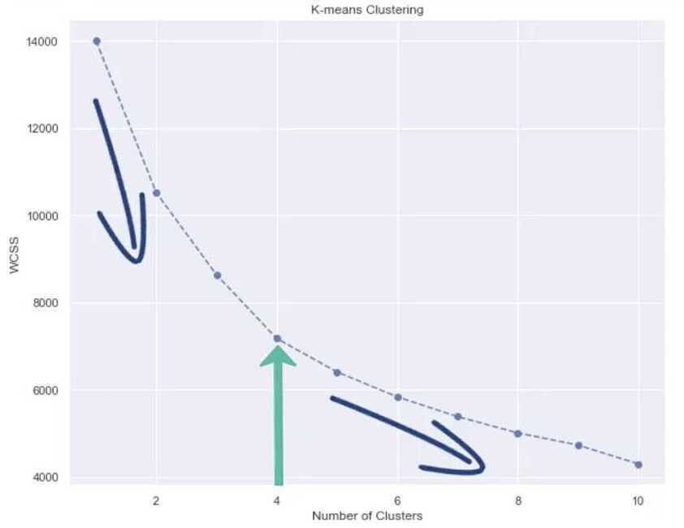
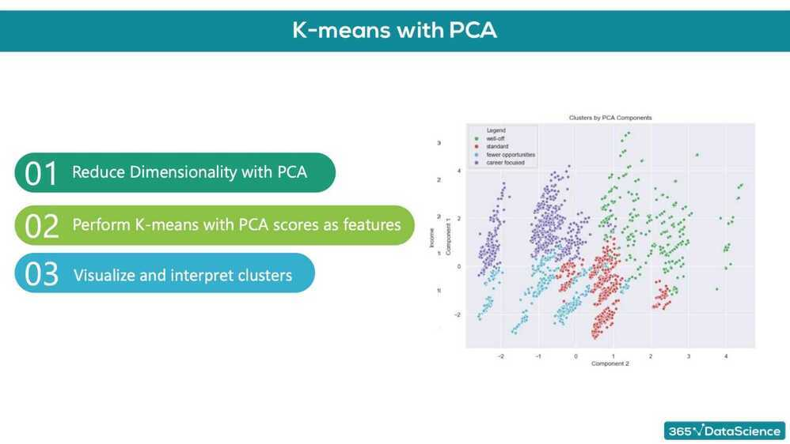

# Clustering

## Types of Clustering

- **Hierarchical**
- **Flat**
- Flat clustering are way faster than hierarchical

## Hierarchical Clustering

- Ex - Taxonomy of Animal kingdom
- Types of Hierarchical clustering
    - Divisive (Top down)
    - Agglomerative (Bottom up) (easier to solve mathematically)
    - Should reach same results
- How do we measure the distances between observations?
    - Euclidean distance
    - Manhattan distance
    - Maximum distance


- Segmentation between clusters
    - Ward method (|A-B|^2)/n~scale~

```python
# Hierarchical clustering with the Sci Py library. We'll use the dendrogram and linkage modules.
from scipy.cluster.hierarchy import dendrogram, linkage

# Perform Hierarchical Clustering. The results are returned as a linkage matrix.
hier_clust = linkage(segmentation_std, method = 'ward')

# We plot the results from the Hierarchical Clustering using a Dendrogram.
# We truncate the dendrogram for better readability. The level p shows only the last p merged clusters
# We also omit showing the labels for each point.
plt.figure(figsize = (12,9))
plt.title('Hierarchical Clustering Dendrogram')
plt.xlabel('Observations')
plt.ylabel('Distance')
dendrogram(hier_clust,
            truncate_mode = 'level',
            p = 5,
            show_leaf_counts = False,
            no_labels = True)
plt.show()
```

## Finding a cluster

- We need to find a horizontal line on the dendogram on which to cut
- Rule of thumb: We find the longest vertical line unintercepted by a horizontal line from the dendrogram. This is where we should make the cut

## K-means Clustering

- Most commonly used method in clustering because of its simplicity
- K-means is perfect for segmentation data

1. Choose the number of clusters we want to identify. K in K-means means number of clusters
2. Specify cluster seeds

   - Based on Euclidean squared distance add points to one of the cluster

3. Calculate the centroid (geometrical center)
4. Repeat until the centroids stop changing

Problems

- The squared Euclidean distance is quite sensitive to outliers (solved by k-median clustering)
- Choose number of clusters before hand
- K-means enforces spherical clusters

[How to Scale K-Means Clustering with just ClickHouse SQL](https://clickhouse.com/blog/kmeans-clustering-with-clickhouse)

## Within Cluster Sum of Squares (WCSS) is used to determine best clustering solution


Choosing number of clusters - Elbow method





