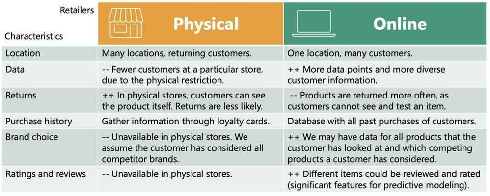

# Intro

[What is Product Analytics? Your Ultimate Guide | FullStory](https://www.fullstory.com/product-analytics/)

## Fundamental marketing theory

- STP - Segmentation, Targeting, Positioning
- Marketing mix
- Price elasticity
- Neural networks

## Customer Analytics

The first part of the course focuses on how to perform customer segmentation, using a hands-on approach. It involves the application of hierarchical and flat clustering techniques for dividing customers into groups. It also features applying the PCA to reduce the dimensionality of the problem, as well as combining PCA and K-means for an even more professional customer segmentation

## Purchase Analytics

The second part of the course explores both the descriptive and predictive analysis of the purchase behavior of customers, including models for purchase incidence, branch choice, and purchase quantity. Not only that, but it also covers the application of state-of-the-art deep learning techniques to make predictions using real-world data

## STP Framework

STP is a fundamental marketing framework. It can be applied to all areas of business and marketing activities

- Segmentation
- Targeting
- Positioning

## Segmentation

- The process of dividing a population of customers into groups that share similar characteristics
- Observations within the same group would have comparable purchasing behavior
- Observations within the same group would respond similarly to different marketing activities

- Divide customers into segments based on age, income, gender
- Consumer data
    - Demographic
    - Geographic
    - Psychographic
    - Behavioral
        - Purchase frequency
        - Time of purchase
        - Purchase quantity
        - Product ratings

## Targeting

- The process of evaluating potential profits from each segment and deciding which segments to focus on
- Selecting ways to promote your products. You can target one segment on TV and another online
- Examining customers' perception. (Involves psychology and usually budget constraints)

- Consideration factors
    - Segment size
    - Expected growth
    - Competitors' offerings

## Positioning

- What product characteristics do the customers from a certain segment need?
- Shows how a product should be **presented** to the customers and through what **channel**
- In fact, this process is so important, that it has a framework of its own called: **Marketing Mix**

## Marketing Mix

Develop the **best** product or service and offer it at the **right price** through the **right channels**

- Purchase probability
- Brand choice probability
- Purchase quantity

## 4 Ps of Marketing

- **Product** - Product features; Branding; Packaging
- **Price** - Product cost; Long term price changes
- **Promotion** - Price reduction, display and feature
- **Place** - Distribution: intensive, selective, exclusive

## Physical and Online Retailers



## Price elasticity

Price elasticity is: the percentage change in an economic outcome of interest with respect to one percent change in a respective price

It is expected that: units sold from a brand would increase if the unit price of the brand decreases and would increase if the unit price of a competitor brand increases


- Price elasticity of purchase probability
- Price elasticity of brand choice probability
- Price elasticity of purchase quantity

## Pearson Correlation

- Linear dependency between variables

 `df_segmentation.corr()`

- Ranges from -1 to 1

## Standardization

For standardizing features. We'll use the StandardScaler module

```python
# For standardizing features. We'll use the StandardScaler module.
from sklearn.preprocessing import StandardScaler

# Standardizing data, so that all features have equal weight. This is important for modelling.
# Otherwise, in our case Income would be considered much more important than Education for Instance.
# We do not know if this is the case, so we would not like to introduce it to our model.
# This is what is also refered to as bias.
scaler = StandardScaler()
segmentation_std = scaler.fit_transform(df_segmentation)
```
