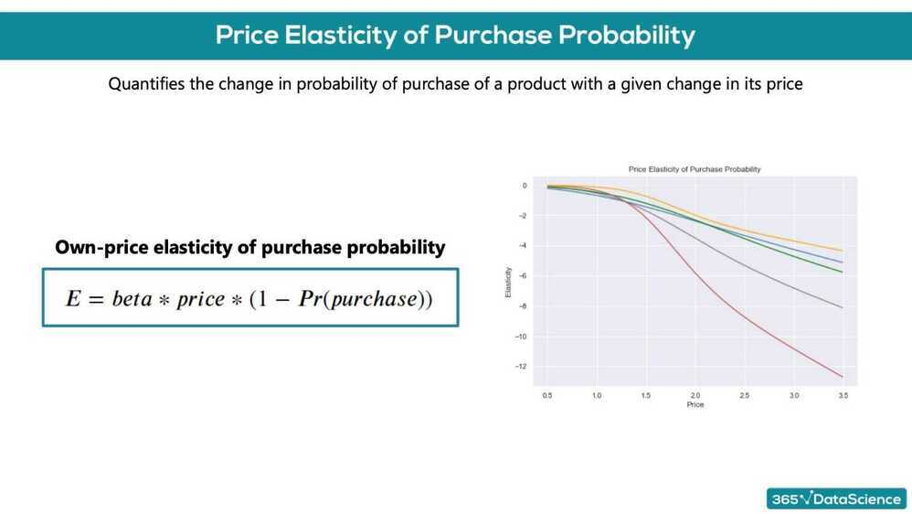
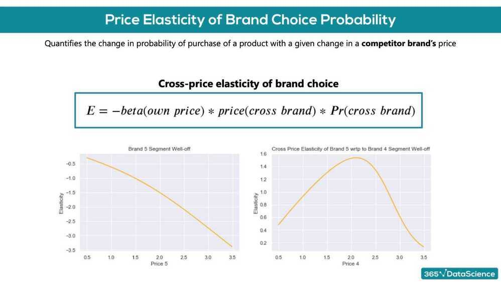
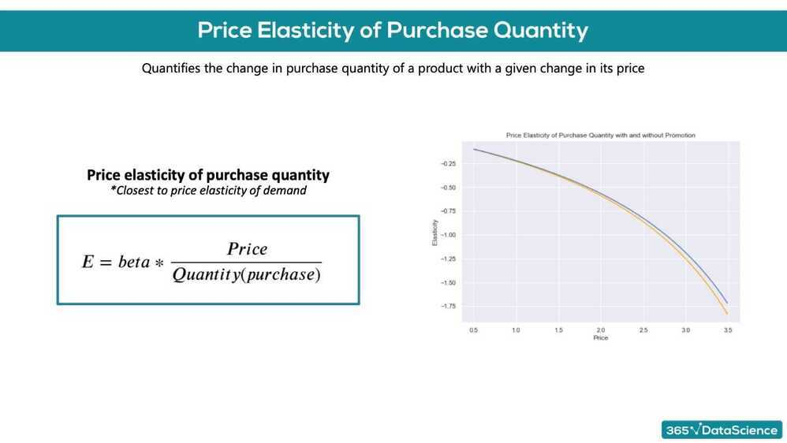
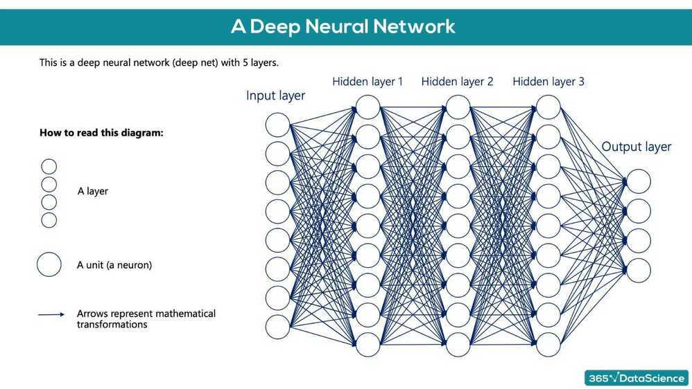
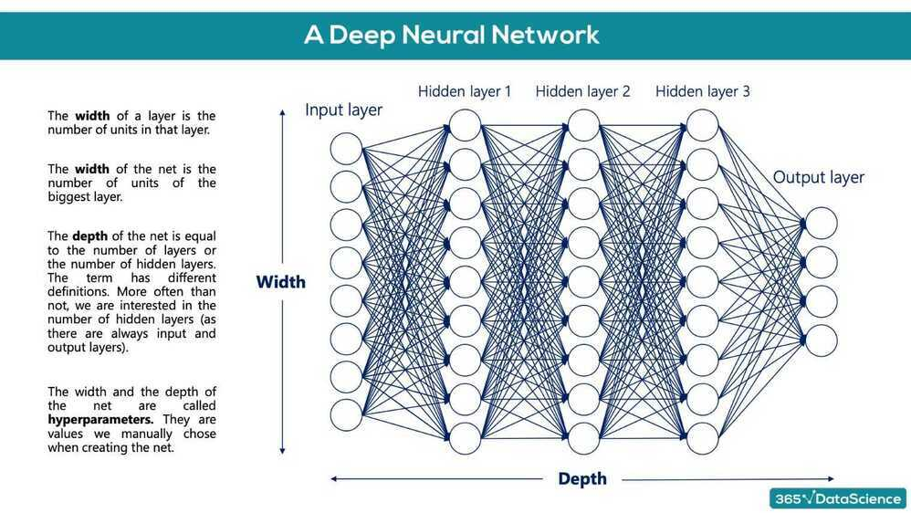

# Purchase Analytics

### Price elasticity of purchase probability

% change in purchase probability in response to a 1% change in price

We have a product, which costs $2.40-. We have obtained the price elasticity of purchase probability to be -0.79. The customer at this price point is: inelastic

We have a product, which costs $3.50. We have obtained the price elasticity of purchase probability to be -2.1. The customer at this point is: elastic

We have a product, which costs $2.00. Using a logistic regression model, we have obtained the coefficient for price to be -2.3. In addition, we have estimated the purchase probability at this price point to be 0.3. Using the price elasticity formula from the lecture, what is the price elasticity? -3.22

A company has a product with a price of 2.3 dollars on the market. They have estimated that the price elasticity of purchase probability at this price point is -0.9. If you are an adviser for the marketing team of the company what would you recommend: The company should increase the price of the product, without fear of losing too many customers.

The purchase probability of a client at a price point is 0.7, while their price elasticity: -1.56. If we raise the price of the product by 1%, the new probability of purchase of the client will be: 68.44%

The purchase probability of a client at $2.56 is 0.7, while their price elasticity: -1.22. If we lower the price of the product by $0.02, the new probability of purchase of the client will be: 70.95%

## Multinomial Logistic Regression - For a multiclass scenario

## Deep Learning

### Training the deep learning model

- Keras was built into the core TensorFlow, so most TensorFlow 2.0 methods are not referenced as 'TensorFlow', but rather Keras methods
- **tf.keras.Sequential(layers)** function that is laying down the model (used to 'stack layers')
- **tf.keras.layers.Dense(output layer size, activation function)** takes the inputs provided from the last layer, calculates their dot product with the weights and adds the bias. Also applies an activation function.
- Activation functions
    - relu
    - sigmoid
    - tanh
    - softmax
- **model.compile(optimizer, loss)** configures the model for training
    - Optimizers
        - Adaptive Moment Estimation (ADAM)
    - loss
        - sparse_categorical_crossentropy
            - applies one-hot encoding to the targets
- **tf.keras.callbacks.EarlyStopping(patience)** ensures that the model stops traning after the validation loss has started increasing. When patience=0, it will stop after the first validation increase. patience = 2
- **fit()**
- **evaluate()** returns the loss value and metrics values for the model in 'test mode'
- **predict()**
- **argmax -** Arguments of the maxima
