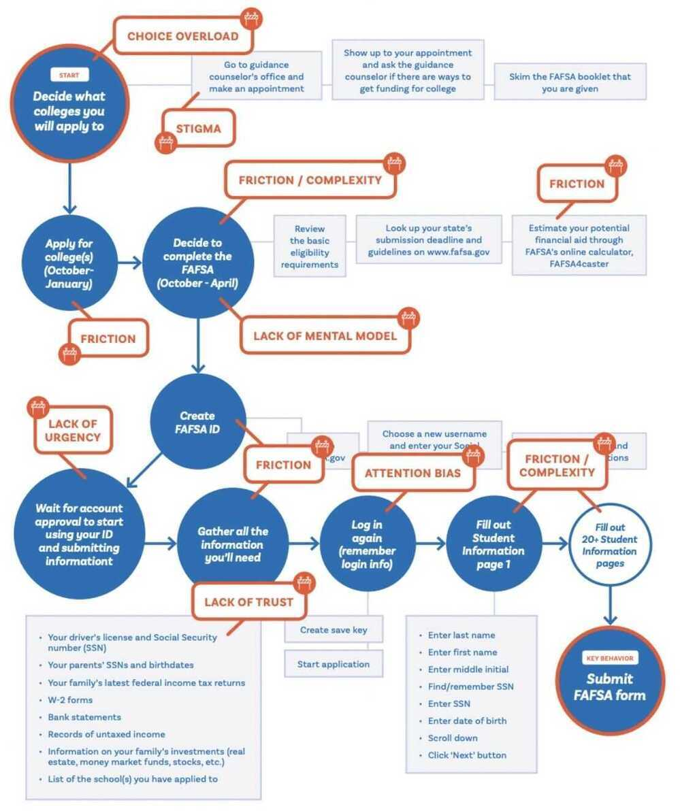
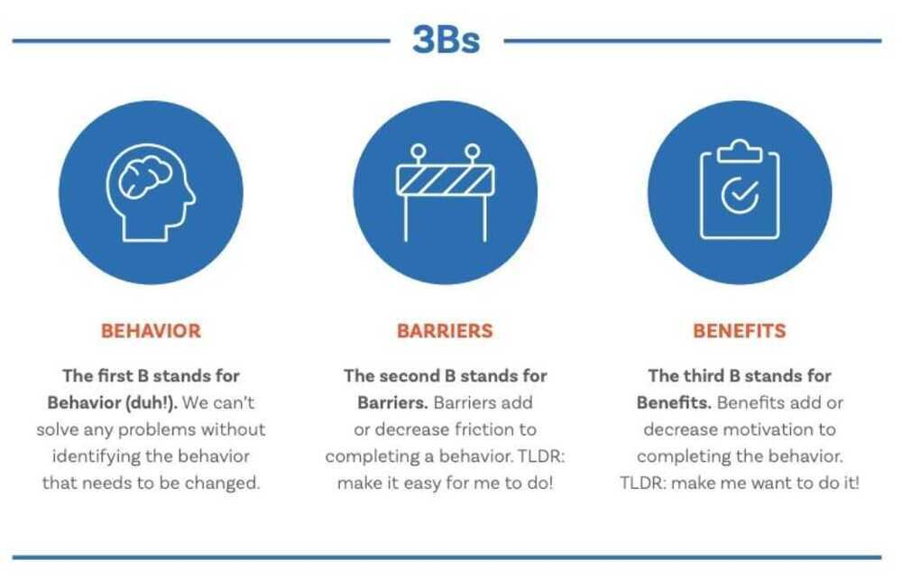

# Behavioral Design / Economics

https://www.lennysnewsletter.com/p/how-to-use-behavioral-science-to

https://en.wikipedia.org/wiki/Behavioral_economics

### Increase the immediate benefit to taking any action:forced choice and present bias

#### Forced Choice

Asked people to "accept" or "decline" the new feature. By asking people if they wanted to decline (which is definitive and final), there was now a cost to not accepting it - you might not get a second chance. Suddenly, "accept" looks much better in comparison. When we allow people to skip something or say "maybe later," there's very little cost to them.

#### Present bias

The immediate benefit to the user of taking the action should be higher than the cost of the action. This is because we tend toward ["present bias](https://papers.ssrn.com/sol3/papers.cfm?abstract_id=3909663)." In the prior example, we increased the benefit of saying "yes," by making "no" relatively more costly (definitive and final). Now we increased the benefit of saying "yes" by focusing people on a short-term goal: completing setup. People (you, your users, your customers) all want to complete things. By making people feel closer to completing something, we delivered a bigger immediate benefit.

https://irrationallabs.com/blog/its-not-always-about-making-things-easier-when-to-make-your-sign-up-flow-harder

### Make people feel like they already own it:the endowment effect

Switching email phrasing from "Join the program" to "Claim your welcome kit." drove a 120% increase in registration

Experiment with designing products that allow the user to more quickly feel psychological ownership (a form of endowment). Your product is already theirs, and by not taking action, they may lose the opportunity to benefit from it.

### Lean into existing behavior, and then make it easier: friction

Lean into what people are already doing, and then make it easier for them

### Get commitments on day one:mental models

Day 1 is the day your users have the most momentum they will ever have. Catching them at this moment with the right features and mental model will drive higher opt-in rates and engagement than at any other time in the user's lifecycle.

## 5 actionable behavioral design strategies

### 1. A literature review

### 2. Pick a key behavior

### 3. Behavioral map

### 4. Identify the psychologies at play

Humans tend to follow the path of least resistance and respond to immediate incentives

### 5. Conduct theory-based experiments

https://irrationallabs.com/learn

https://irrationallabs.com/content/uploads/2020/09/3B-Framework.pdf

https://en.wikipedia.org/wiki/Behavioural_design

## Amplying benefits

[Pubg's Genius Strategy: How to Design Addictive Products to make 2.8 Billion Dollars?](https://www.youtube.com/watch?v=_5cXtYpYmdQ)

## Hooked Model

Hooked: How to Build Habit-Forming Products by Nir Eyal

### Trigger

- Classical triggers
    - Boredom - Instagram
    - Hunger - Zomato
    - Need to go out - Ola/Uber
- External triggers
    - Notifications

### Action

Variable reward system

- Adrenaline rush
- When a creature is rewarded in a random unpredictable pattern, that creature get addicted to carry out that action again and again
- Increase and decrease difficulty, difficult to win 10 games in a row
- Infinite loop phenomenon
    - Bottomless bowl
        - 73% more than normal bowl subjects
        - If there isn't a visual cue to indicate the quantity of consumption and experience is left unhindered and by default it will lead to excessive consumption and most importantly, inspite of excessive consumption, the subject will still be unsatisfied, leading to more consumption
    - Shower
        - No idea how much water you are consuming
        - Lose track of time
        - Left with slight urge to shower more
- Bottomless scroll

### Investment

- In-app purchases
- Delete facebook
    - Might contact your friends later, but never
    - Perceived value of facebook has increased because of the connections

Hooked Workbook - to understand customers

https://www.nirandfar.com/download/hooked-workbook.pdf

## Habituation

- People don't like change, and don't want to switch because of smaller increments
- Habituation of interface of Android, so don't want to switch to iOS and vice versa
- Habituation of a tool/coding language, so don't want to switch to another tool/language
- Retainer - Product, that makes impossible to switch a product, ex - imessage in iOS, which you will not get in Android

## Influence

### 1. Likeability

People like talking to people they think they would like. The tip here is to identify the social identity of your audience and capitalilze it

Examples of social identity:

- Favorite shows, sports, celebs
- Causes they believe in
- Jobs they are into
- Talking about kids, if they've

### 2. Authority

Anything that is endorsed by credible experts is perceived as valuable

- Xiaomi, Dettol, Sensodyne, Lifebuoy ads
- Analyst ratings to stocks
- Celeb investments in startups

### 3. Reciprocity

When you give somone something first, they will likely reciprocate

- Free trials
- Occassion delighters: bday, joining date, even exit
- Favor outside the primary thing: sharing recipes with a colleague

### 4. Scarcity

Anything that is scarce is perceived to be more valuable

- Number of items left
- 4 days 24 mins left for sale
- 10 employes get to go to Las Vegas

### 5. Social Proof

Anything that other folks similar to you do or endorse is perceived as valuable

- No. of users who bought this product
- No. of reviews, ratings
- No. of customers as brand ambassadors

### 6. Commitment + Consistency

When you get someone agree to do something, they will be likely to do it again

- Will you be willing to conserve environment? Chances are people will say yes and once they yes they will likely conform to it
- Do you agree to help in situations of emergency?
