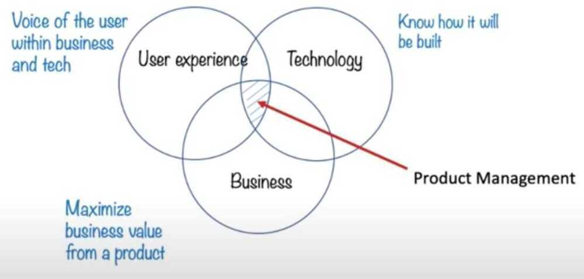
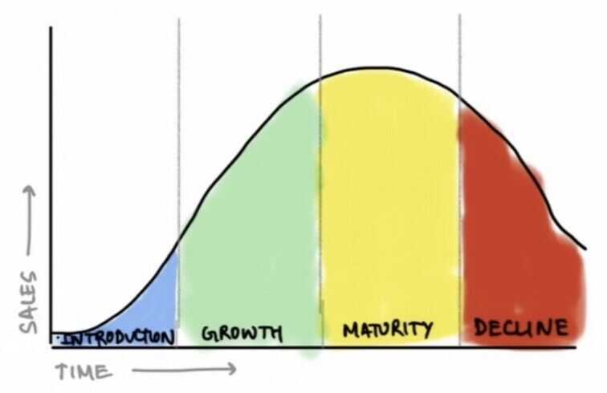

# Intro

Only the best is good enough -- lego group

At the end of the day, everything is a **toaster,** i.e. no matter how wonderful your product, if it is successful then others will copy it and sooner rather than later your product will be as easy to make as a toaster. -- Prof Bruce Greenwald

Most people don't even know what they want until they see it. So sometimes you have to give people what they need, not what they're asking for -- Steve Jobs

## PM Triangle

[Project Contraints](management/project-management/project-contraints.md)

Asking (or forcing?) your team to stay late to hit those deadlines only accomplishes two things: it burns them out quicker, and it fosters resentment towards you. You can maybe do this once or twice each year, but neither of these are feasible if you're looking to cultivate a healthy and lasting relationship with your engineering teams.

So, the question becomes what do you do? Well as a product manager it's your job to figure these problems out, and sometimes you'll unfortunately need to have difficult conversations with certain stakeholders.

Regardless, there's only 3 ways to sustainably hit seemingly impossible deadlines:

- Reduce Scope
- Get More Resources
- Get More Time

### Reduce Scope

One of the three ways to hit impossible deadlines is to reduce scope. This means to remove features or functionality from your product to hit the deadline. This is usually the most demoralizing option, yet also the most realistic option.

The stakeholders this solution impacts the most are sales, account managers, direct product reports, and your customers.

To effectively reduce scope you need to do the following things in this order:

- List out all features and label them either: Must Haves, Should Haves, or Nice To Haves.
- Immediately get your engineering team to focus on Must Haves first, then Should Haves, then Nice To Haves.
- List out the cost of each feature and the status of completion for each feature.
- Create a plan documenting which features you'll hit with your team, what you need to de-scope, and how you'll communicate this to stakeholders.
- Communicate with your 1-up and 2-up (Director of Product and VP of Product, for example) this particular plan and get their input on priority. Take their edits into consideration. Here, it's important to be as upfront as possible. They're likely going to try to scope in more, but if you're not going to hit the deadlines don't fold here and promise something you know your team won't be able to accomplish.
- Loop in all people immediately affected. If you're building a B2B SaaS product, this likely means your account managers and sales. If you're building a consumer app, it likely means your communication, support and marketing teams.
- If you're building a B2B product, you'll need to formulate a communication strategy with your sales and account management teams to effectively communicate the news to potential and existing customers.
- Communicate to your team the revised scope.
- Execute to hit your revised scope.

### Get More Resources

The next strategy is to get more engineering resources. Unless your deadline is months away, hiring new engineers is usually not realistic. So where do you get the additional resource(s)? You'll need to pull from a different team by negotiating with their product manager and your direct reports. Here, you risk hurting your relationship with other product teams, and should only be used if you can create a reasonable strategy and if the features you're building are objectively more valuable to the company.

Here you'll want to focus on aligning each stakeholder on the organizaton's core goal. Other teams will feel slighted, but reminding them you're all working together towards this common goal can help.

The stakeholders it affects most are other product teams, your engineering team, and your direct reports.

To effectively negotiate for more resources, you should do the following in order:

- List out all features and label them either: Must Haves, Should Haves, or Nice To Haves.
- List out the cost of each feature and the status of completion for each feature.
- Calculate the value of building your feature to your core product and organizational metrics (for example, top-line revenue, MAU, growth, etc.).
- List out all other product teams, their engineering resources, and the value of their features to the organization.
- Create a plan that outlines how many more resources you'll need and which teams are most likely to contribute based on value.
- Communicate with your 1-up and 2-up your plan, outlining why you'll need more resources and which features are at risk. Work on finalizing any resource plans together.
- Directly reach out to the product team you're looking to borrow resources from and explain the situational need for more resources. Here, make sure to focus on how appreciative you are, rather than simply outlining that your features are more valuable - no one wants to hear that even if it's true.
- If you are granted more resources, now is time to onboard them. Do this with an intro meeting with your engineering team lead. Explain the situation and start pushing certain responsibilites over to the new developer.
- Execute to hit your revised scope.
- Show appreciation to the other team that you've borrowed resources from. They did you a huge favor and they deserve to be acknowledged. You can do this by expressing a heartfelt thank you, publically acknowleding them to other teams, or repay them in the future by lending resources when they need it more than you.

### Get More Time

This is the most obvious strategy, yet oftentimes the least realistic. We've promised certain features by a certain date and now you can't meet the specified date, so you ask for an extension. This is another undesirable scenario. It's important for this to consider code freezes, company-wide release policies, and potential affected customers.

The stakeholders this solution affects the most are sales, account managers, QA, marketing, and your customers.

To effectively push deadlines, you should do the following:

- List out all features and label them either: Must Haves, Should Haves, or Nice To Haves.
- List out the cost of each feature and the status of completion for each feature.
- Create a plan with three different milestones: one to hit all Must Haves, one to hit all Must Haves and Should Haves, and one to hit everything.
- Set a meeting with your direct reports and outline your proposed milestones. Here, you'll spend time negotiating and reprioritizing certain features by certain dates. Since you've costed out all features, you'll know what's realistic. Do not overpromise - you've already missed one deadline and you do not want to miss another.
- Communicate your new scope based on your revised deadline to your team immediately. Explain how you're unlikely to hit the deadline and so you've negotiated for more time.
- Execute to hit your revised scope.

### What does it all mean?

If you're running into this issue often, it likely means you're not effectively tracking how much work your team can accomplish, you're not accounting for enough edge cases in your product spec, or you're unable to effectively manage your stakeholders' expectations. The best strategy is always to be preventative rather than reactionary.

Regardless, by following these strategies, you accomplish four critical goals in a bad situation:

- You take responsibility early, creating trust and respect with all parties
- You communicate unified expectations to everyone involved, limiting potential backlash
- You create a collaborative situation with all stakeholders, limiting blame and internal fighting
- You build trust and respect with your engineering team, limiting resentment and burnout

This is the best-case scenario out of a worst-case scenario.

## Frameworks

https://www.scaledagileframework.com

https://basecamp.com/shapeup

## What is Product Management

## The Product Lifecycle

- Concept, Introduction, Growth, Maturity, Decline, Withdrawal

## 1% Problem

- Is the problem something that less than 1% of your users face?
- Is your solution going to inconvenience the remaining 99%?

The tricky part is to figure outwhich1% problems to solve and which ones to ignore. You might decide that the wrong cab problem, even though it's a 1% problem, is worth solving. And so every rider must announce a four-digit pin to the driver to start a trip. To solve a 1% problem, you decide to inconvenience the 99%.

https://blackboxofpm.com/product-management-mental-models-for-everyone-31e7828cb50b

## Abbreviations

- TAM - Total Addressable or Accessible Market
- TSM - Total Servicable Market
- Remonetisation plan - hook and bait the customers
- BRD - Business Requirement Document
- PRD - Product Requirement Document
- FRD - Functional Requirement Document
- COCA - Cost of customer acquisation
- CAC - Customer Acquisition Cost - https://neilpatel.com/blog/customer-acquisition-cost

## User Stories / User Story

In [software development](https://en.wikipedia.org/wiki/Software_development) and [product management](https://en.wikipedia.org/wiki/Product_management), auser storyis an informal, natural language description of features of a software system. They are written from the perspective of an [end user](https://en.wikipedia.org/wiki/User_(computing)#End-user) or [user of a system](https://en.wikipedia.org/wiki/User_(system)), and may be recorded on index cards, [Post-it notes](https://en.wikipedia.org/wiki/Post-it_note), or digitally in project management software.Depending on the project, user stories may be written by different stakeholders like client, user, manager, or development team.

User stories are a type of [boundary object](https://en.wikipedia.org/wiki/Boundary_object). They facilitate [sensemaking](https://en.wikipedia.org/wiki/Sensemaking) and communication; and may help software teams document their understanding of the system and its context.

https://en.wikipedia.org/wiki/User_story

## Checklist

https://getting-started-in-product.mailerpage.com/posts/s7e5o0-product-management-checklists-how

## Design X for Y (X = Product, Y = Customer)

What do these questions test

1. Setting objectives
2. Customer empathy
3. Prioritization
4. Creative thinking

## CIRCLES Method

Is a framework to help solve design questions in PM interviews

1. **C - Comprehend Situation -** What? Who? Why? How?

    - ask clarifying questions
    - understand the situation

2. **I - Identify Customer -** Personas
3. **R - Report customer needs**
4. **C - Cut through prioritization -** ROI Estimate?
5. **L - List Solutions**
6. **E - Evaluate trade-offs -** thoughtful, analytical, objective
7. **S - Summarize recommendation -** What, recap, why others

After getting the answer to RCA, keep on going to all other points, just to confirm for multiple factors in play

- What are you trying to do?

Articulate your objectives using absolutely no jargon

- How is it done today, and what are the limits of current practice?
- What is new in your approach and why do you think it will be successful?
- Who cares? If you are successful, what difference will it make?
- What are the risks?
- How much will it cost?
- How long will it take?
- What are the mid-term and final exams to check for success?

## 7 common ways to differentiate a product

1. Be the cheapest
2. Be the highest quality
3. Be the most convenient
4. Be the safest
5. Sell a proprietary product
6. Sell something that makes people feel great buying
7. Focus on a niche underserved market

https://www.lennysnewsletter.com/p/how-to-differentiate

## Organizational skills

- Time management
- Communication
- Setting goals
- Delegation
- Working under pressure
- Self-motivation
- Analytical thinking
- Attention to detail
- Decision-making
- Strategic planning

## Success Metrics

[PM School - Defining Success Metrics for a product | Solving Metrics Questions in PM interviews](https://www.youtube.com/watch?v=WBG0Ggmhu2M)

- Clarify - Goals vs Metrics, Functionality, Mission/Vision
- PLC (Product Life Cycle) Stage - Pick the stage of the company / product

- Product / Customer Goal - Decide on the key customer goal
- Funnel metrics
    - Identify key actions to encourage
        - Ex: Netflix (focusing on Acquisition/Adoption)
    - Define metrics for a time frame
    - Categorize metrics if needed
- Prioritize
    - **1 North Star Metric (NSM)**
        - broad indicator of success, not complex or difficult to understand
        - Should be actionable
    - 4-5 L1 supporting metrics
- Critique your metrics

## Product Sense

Product sense is the skill of consistently being able to craft products (or make changes to existing products) that have the intended impact on their users.

Product sense relies on

1. Empathy to discover meaningful user needs
2. Creativity to come up with solutions that effectively address those needs

## Building empathy

1. Observe people interacting with products
2. Deconstruct everyday products

## Improving creativity

1. Learn from great product thinkers
2. Be curious about changes in technology and your domain

https://www.lennysnewsletter.com/p/product-sense

## Others

https://www.freecodecamp.org/news/why-understanding-software-requirements-matter-to-you-as-a-software-engineer

https://rohankatyal.com/How-I-prepared-for-Facebook-PM-execution-metrics-interviews-24a8aff4830645389d4895bbe33ac801

[What It Takes To Become A Great Product Manager](https://www.youtube.com/watch?v=SrAraT1q94c&ab_channel=CodingTech)

https://www.lennysnewsletter.com/p/a-product-managers-guide-to-web3

## Resources

https://www.lennysnewsletter.com

https://noidea.dog/glue

[Inside The Product](https://www.youtube.com/c/InsideTheProduct)
