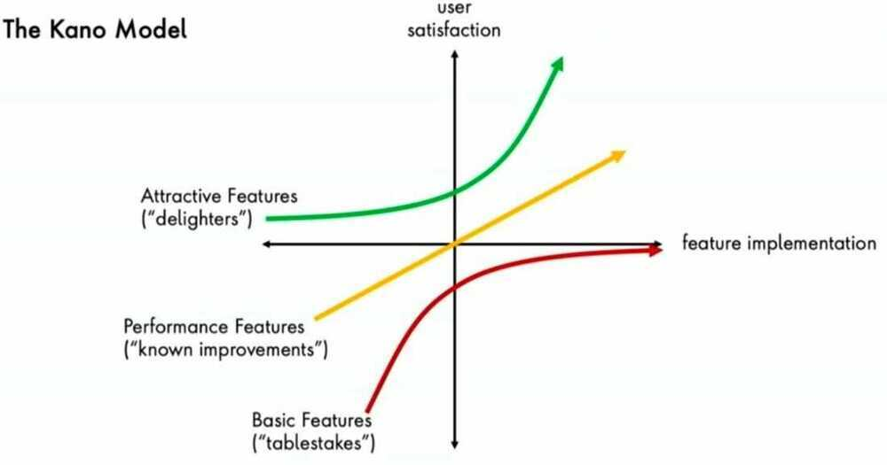

# Kano Model

### Must-be Quality

Simply stated, these are the requirements that the customers expect and are taken for granted. When done well, customers are just neutral, but when done poorly, customers are very dissatisfied. Kano originally called these "Must-be's" because they are the requirements that must be included and are the price of entry into a market.

Examples: In a hotel, providing a clean room is a basic necessity. In a call center, greeting customers is a basic necessity.

### One-dimensional Quality

These attributes result in satisfaction when fulfilled and dissatisfaction when not fulfilled. These are attributes that are spoken and the ones in which companies compete. An example of this would be a milk package that is said to have ten percent more milk for the same price will result in customer satisfaction, but if it only contains six percent then the customer will feel misled and it will lead to dissatisfaction.

Examples: Time taken to resolve a customer's issue in a call center. Waiting service at a hotel.

### Attractive Quality (User Delights)

These attributes provide satisfaction when achieved fully, but do not cause dissatisfaction when not fulfilled. These are attributes that are not normally expected, for example, a thermometer on a package of milk showing the temperature of the milk. Since these types of attributes of quality unexpectedly delight customers, they are often unspoken.

Examples: In a callcenter, providing special offers and compensations to customers or the proactive escalation and instant resolution of their issue is an attractive feature. In a hotel, providing free food is an attractive feature.

Examples: if you ask Google assistant for a reminder for tomorrow morning at 1 am, it sets it at same day morning 8:00 am and not tomorrow i.e. the next day morning

### Indifferent Quality

These attributes refer to aspects that are neither good nor bad, and they do not result in either customer satisfaction or customer dissatisfaction. For example, thickness of the wax coating on a milk carton. This might be key to the design and manufacturing of the carton, but consumers are not even aware of the distinction. It is interesting to identify these attributes in the product in order to suppress them and therefore diminish production costs.

Examples: In a callcenter, highly polite speaking and very prompt responses might not be necessary to satisfy customers and might not be appreciated by them. The same applies to hotels.

### Reverse Quality

These attributes refer to a high degree of achievement resulting in dissatisfaction and to the fact that not all customers are alike. For example, some customers prefer high-tech products, while others prefer the basic model of a product and will be dissatisfied if a product has too many extra features.

Examples: In a callcenter, using a lot of jargon, using excessive pleasantries, or using excessive scripts while talking to customers might be off-putting for them. In a hotel, producing elaborate photographs of the facilities that set high expectations which are then not satisfied upon visiting can dissatisfy the customers.

https://en.wikipedia.org/wiki/Kano_model
