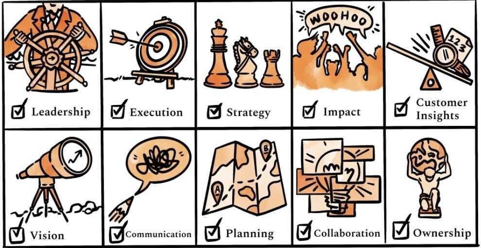

# Product Manager PM Role

## Role

Your job as a PM is to deliver business impact by marshaling the resources of your team to identify and solve the most impactful customer problems.

There are three parts to this, each essential:

1. Deliver business impact

 Fundamentally, you are responsible for delivering business impact. If your team drives positive impact - hitting important goals, reducing costs, shipping an important project, etc. - you're doing your job.

2. Marshaling the resources of your team

 Your job isn't to do the building yourself but instead to increase the leverage of your cross-functional teammates - designers, engineers, data scientists, researchers - to deliver impact. To paraphrase [Andy Grove](https://email.mg2.substack.com/c/eJwlkM1yhSAMhZ9Glg4_irhg0U37CF0yaKKXuQgWsLe-ffGaYXIIIXMm32wLrjGdeo-5kCuZcu6oA76yx1IwkSNjMg606AXrGSWgO2CqV8RlsyTEzTqvSzqQ7Mfk3WyLi-EaYFR1PXnohUs79KOdl4HhICdmbU_VskhOuarX29Ye4DDMqGPwp9mtA-L1o5Q9N-Kj4Z_1YGhf7ul2BGfbmNb6dNVVPgIkfJmvFH-x4eI7ueLCamwAU9DOj1oQp6sfqyGZ5IKKlrcAUo5qGUfFJLAe2k71599P9k1Ht5W3-ZhysfOzneNGkgbE3T5zjCDZWL-s1-rvXt3cVN2O4MppMNjJI9xQyo32jcmsGDBV5GBs0UyKgQ6j4rSj8oZQqXUdrZw7Qao5xDoVtMcQzn-dRI-e), a product manager's output = the output of their team.

3. Identify and solve the most impactful customer problems

 Business impact comes from solving customer problems. Thus, it's your job to lead your team to correctly identify, prioritize, and solve the mostimpactfulcustomer problems.

PMs are the ultimate business lever.

1. **Shape the product:** Harness insights from customers, stakeholders, and data to prioritize and build a product that will have the most impact on the business.

2. **Ship the product:** Ship high-quality product on time and free of surprises.

3. **Synchronize the people:** Align all stakeholders around one vision, strategy, goal, roadmap, and timeline to avoid wasted time and effort.

The most important PM attributes

[https://medium.com/productmanagement101/spotify-squad-framework-part-i-8f74bcfcd761](https://medium.com/productmanagement101/spotify-squad-framework-part-i-8f74bcfcd761)

- High alignment, High Autonomy
  - We need to cross the river (Management) , figure it out how (Squads)
  - Alignment enables autonomy
- If you need to know exactly who is making decisions, you are in the wrong place
- If everything is under control you are going too slow

[Spotify Engineering Culture (by Henrik Kniberg)](https://www.youtube.com/watch?v=4GK1NDTWbkY)

Playlist - [Spotify Squads/Tribes/Guilds](https://www.youtube.com/playlist?list=PLcb4e6GmmJKTxdVwg44TLPx7WkE2UQ6XB)

<https://www.jeremiahlee.com/posts/failed-squad-goals>

There is no one size fits all

There is no perfect PEPSI there are only perfect PEPSIs

## What PM has to do

- Think like a CEO
- Execute like a COO
- Story-tell like a CMO
- Deliver like a CFO

## Characteristics / Req of PMs

- Communication ninja (Internal / External)
- Execution Expert (Ship it)
- Stakeholder Management (Ducks in a row)
- Metrics Analysis (How are we doing?)
- Customer Empathy (Be the User)
- Research / Context (Know the User)
- Marketing / Biz counterpart (Impact the revenue)
- Team Champion (Face of the team)
- Vision / Passion / Own (mini-CEO?)

## PM Types

- Project Managers
- Program Managers
- Product Managers
- Technical Product Managers (TPMs)
- Product Marketing Managers
- Specializations
  - UX
  - Tech
  - Customer Experience (CX) / Ops
  - Based on vertical
  - Data Platforms
  - B2B vs B2C vs B2B2C

## Helpful things

- Have an eye to detail
- Blog
- Network with PMs - understand real life PM stuff
- Read / Consume a lot
- See if you genuinely might fit

## Product Manager Career

<https://hackernoon.com/how-to-plan-your-career-change-and-become-a-product-manager-my-tips-and-tricks-for-success-fnv231pc>

Career Ladder - <https://docs.google.com/spreadsheets/d/1F1Y3YtjsvAJUZMqS-rK0LGQGg7eHYubq9KqedPwLCDE/edit#gid=1755575210>

### Become a product manager if you are fulfilled by

- Solving people's problems (both your users' and your team's)
- Driving business growth
- Working closely with a variety of people
- Developing a strategy
- Getting shit done
- Leading a team (through influence, not authority)
- Communicating often and broadly
- Making decisions
- Creating amazing experiences for people
- Being organized, detail oriented, and prepared

### Do not become a product manager if you are primarily fulfilled by

- Appreciation
- Having your way
- Being left alone
- Always being right
- Designing or building things yourself
- Everyone liking you
- Flow states
- Avoiding meetings
- Avoiding email
- Avoiding people

<https://www.lennysnewsletter.com/p/how-to-get-into-product-management>
