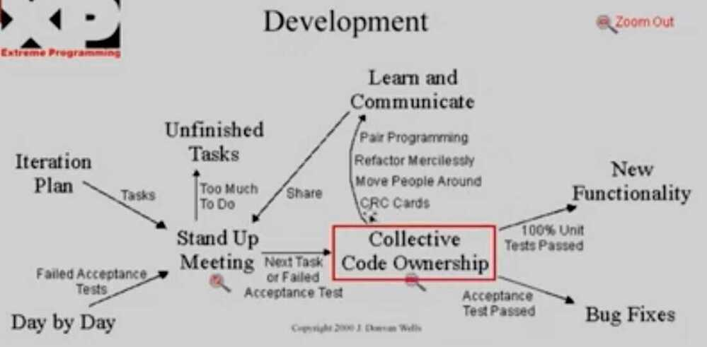
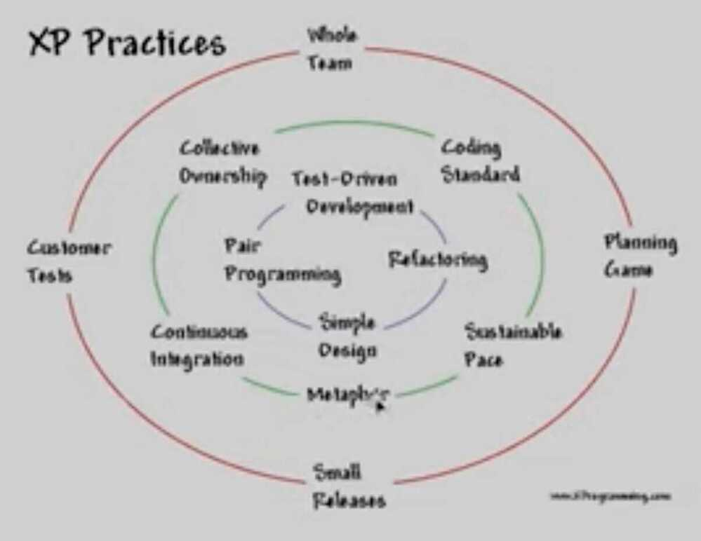

# Agile

https://www.atlassian.com/agile

You cannot predict what happen in next 10 years, but if you are agile enough you can change accordingly

Agile is an iterative approach to project management and software development that helps teams deliver value to their customers faster and with fewer headaches. Instead of betting everything on a "big bang" launch, an agile team delivers work in small, but consumable, increments. Requirements, plans, and results are evaluated continuously so teams have a natural mechanism for responding to change quickly.

## Agile Development (Iterative)

- One cannot anticipate every detail of a complex problem.
- Start simple (with something that works), then improve it.
- Identify emerging patterns and continuously adapt the structure of your code. (Refactoring, for which you want Unit tests)

Agility gives the enterprise the ability to out-innovate its competition. And, as technology both raises the bar for competition and lowers barriers to innovation, those enterprises that fail to out-innovate will themselves be out-innovated into oblivion.

## Why choose agile?

Teams choose agile so they can respond to changes in the marketplace or feedback from customers quickly without derailing a year's worth of plans. "Just enough" planning and shipping in small, frequent increments lets your team gather feedback on each change and integrate it into future plans at minimal cost.

## Agile yesterday, today, and tomorrow

The publication of the Agile Manifesto in 2001 marks the birth of agile as a methodology. Since then, many agile frameworks have emerged such as **Scrum, Kanban, Lean, Crystal Clear, and Extreme Programming (XP).** Each embodies the core principles of frequent iteration, continuous learning, and high quality in its own way. **[Scrum](https://www.atlassian.com/agile/scrum) and XP are favored by software development teams, while [Kanban](https://www.atlassian.com/agile/kanban) is a darling among service-oriented teams like IT or human resources.**

Today, many agile teams combine practices from a few different frameworks, spiced up with practices unique to the team. Some call this heresy. We call it practical. It's not about "Agile" -- it's about agility.

The agile teams of tomorrow will value their own effectiveness over adherence to doctrine. Openness, trust, and autonomy are emerging as the cultural currency for companies who want to attract the best people and get the most out of them. Such companies are already proving that practices can vary across teams, as long as they're guided by the right principles.

Although many of our teams organize their work in sprints, estimate in story points, and prioritize their backlogs, we're not die-hard practitioners of Scrum. Or Kanban. Or any other trademarked methodology. Instead, we give each team the autonomy to cherry-pick the practices that will make them most effective. And we encourage you to take a similar approach.

For example, if you're on a queue-oriented team like IT, Kanban provides a solid foundation for your agile practice. But nothing should stop you from sprinkling in a few Scrum practices like demo sessions with stakeholders or regular retrospectives.

The key to doing agile right is [embracing a mindset of continuous improvement](https://www.atlassian.com/blog/agile/how-to-stay-agile-and-keep-improving). Experiment with different practices and have open, honest discussions about them with your team. Keep the ones that work, and throw out the ones that don't.

## Topics

- **Agile manifesto**
- **Scrum**

### Agile project management

- [Overview](https://www.atlassian.com/agile/project-management)
- [Program](https://www.atlassian.com/agile/project-management/program)
- [Workflow](https://www.atlassian.com/agile/project-management/workflow)
- [Epics, stories, themes](https://www.atlassian.com/agile/project-management/epics-stories-themes)
- [Epics](https://www.atlassian.com/agile/project-management/epics)
- [User Stories](https://www.atlassian.com/agile/project-management/user-stories)
- [Estimation](https://www.atlassian.com/agile/project-management/estimation)
- [Metrics](https://www.atlassian.com/agile/project-management/metrics)
- [Gantt Chart](https://www.atlassian.com/agile/project-management/gantt-chart)

### Product management

- [Overview](https://www.atlassian.com/agile/product-management)
- [Product Roadmaps](https://www.atlassian.com/agile/product-management/product-roadmaps)
- [Product Manager](https://www.atlassian.com/agile/product-management/product-manager)
- [Tips for new product managers](https://www.atlassian.com/agile/product-management/tips-for-new-product-manager)
- [Roadmaps](https://www.atlassian.com/agile/product-management/roadmaps)
- [Tips for presenting product roadmaps](https://www.atlassian.com/agile/product-management/tips-for-presenting-product-roadmaps)
- [Requirements](https://www.atlassian.com/agile/product-management/requirements)
- [How to prioritize features using NPS](https://www.atlassian.com/agile/product-management/how-to-prioritize-features-using-net-promoter-scores)
- [Product analytics](https://www.atlassian.com/agile/product-management/product-analytics)

### Agile at scale

- [Overview](https://www.atlassian.com/agile/agile-at-scale)
- [Managing an agile portfolio](https://www.atlassian.com/agile/agile-at-scale/managing-an-agile-portfolio)
- [Lean portfolio management](https://www.atlassian.com/agile/agile-at-scale/lean-portfolio-management)
- [Okrs](https://www.atlassian.com/agile/agile-at-scale/okr)
- [Long-term agile planning](https://www.atlassian.com/agile/agile-at-scale/long-term-agile-planning)
- [What is SAFe?](https://www.atlassian.com/agile/agile-at-scale/what-is-safe)
- [Spotify model](https://www.atlassian.com/agile/agile-at-scale/spotify)
- [Organizational agility with Scrum@Scale](https://www.atlassian.com/agile/agile-at-scale/scrum-at-scale)
- [Scaling agile with Rosetta Stone](https://www.atlassian.com/agile/agile-at-scale/scaling-agile-with-portfolio-for-jira)
- [Beyond the basics whitepaper](https://www.atlassian.com/agile/agile-at-scale/beyond-the-basics-whitepaper)
- [Agile iron triangle](https://www.atlassian.com/agile/agile-at-scale/agile-iron-triangle)
- [The Large-Scale Scrum (LeSS) framework](https://www.atlassian.com/agile/agile-at-scale/less)

### Software development

- [Overview](https://www.atlassian.com/agile/software-development)
- [Developer](https://www.atlassian.com/agile/software-development/developer)
- [Dev managers vs scrum masters](https://www.atlassian.com/agile/software-development/dev-managers-vs-scrum-masters)
- [Git](https://www.atlassian.com/agile/software-development/git)
- [Branching](https://www.atlassian.com/agile/software-development/branching)
- [Git branching video](https://www.atlassian.com/agile/software-development/git-branching-video)
- [Code reviews](https://www.atlassian.com/agile/software-development/code-reviews)
- [Release](https://www.atlassian.com/agile/software-development/release)
- [Stress free release](https://www.atlassian.com/agile/software-development/stress-free-release)
- [Qa at speed](https://www.atlassian.com/agile/software-development/qa-at-speed)
- [Technical debt](https://www.atlassian.com/agile/software-development/technical-debt)
- [Testing](https://www.atlassian.com/agile/software-development/testing)
- [Incident response](https://www.atlassian.com/agile/software-development/incident-response)
- [Continuous integration](https://www.atlassian.com/agile/software-development/continuous-integration)

### Design

- Overview
- Product design process customer interview
- Collaborative design in agile teams video

### The agile advantage

- Overview
- Connecting business strategy to development reality
- Agile is a competitive advantage
- Going agile
- **DevOps**
- **Agile teams**

## Agile Manifesto

- Individuals and interactions over processes and tools
- Working software over comprehensive documentation
- Customer collaborationover contract negotiation
- Responding to changeover following a plan

## 12 Principles of the Agile Manifesto

1. Our highest priority is to satisfy the customer through early and continuous delivery of valuable software.
2. Welcome changing requirements, even late in development. Agile processes harness change for the customer's competitive advantage.
3. Deliver working software frequently, from a couple of weeks to a couple of months, with a preference to the shorter timescale.
4. Business people and developers must work together daily throughout the project.
5. Build projects around motivated individuals. Give them the environment and support they need, and trust them to get the job done.
6. The most efficient and effective method of conveying information to and within a development team is face-to-face conversation.
7. Working software is the primary measure of progress.
8. Agile processes promote sustainable development. The sponsors, developers, and users should be able to maintain a constant pace indefinitely.
9. Continuous attention to technical excellence and good design enhances agility.
10. Simplicity--the art of maximizing the amount of work not done--is essential.
11. The best architectures, requirements, and designs emerge from self-organizing teams.
12. At regular intervals, the team reflects on how to become more effective, then tunes and adjusts its behavior accordingly.

## Steps in Agile Project Management

### Project planning

Project planning is a step that ensures everyone understands the end goal and value of that project. Here, the scope is developed, and the work is estimated by breaking it into sprints or iterations

### Roadmap creation

A roadmap is a list of all the features that the final product shoudl have. It acts as a plan of action on how a project will evolve. Hence, the roadmap is an integral part of the plan as these features are built during each sprint

### Release planning

A plan is made for all feature releases and this plan is revisited at the beginning of each sprint. Agile project methodology uses shorter development cycles or sprints, with features released at the end of each cycle

### Sprint planning

Sprint planning ensures that each team member has an assigned task before the sprint begins. The stakeholders, need to plan what is to accomplished in that sprint and that the workload is evenly shared amongst the team

### Daily meetings

Daily meetings help the team in accomplishing their daily tasks in an efficient manner. During these meetings, each team member tells what they have accomplished the previous day and what is their task for today

### Sprint review and retrospective

Sprint review and retrospective helps the team to inspect itself and plan to make changes to improve the forth coming sprints. Sprint retrospective takes place after the sprint review, and before the next Sprint planning

## Agile Project Management Frameworks

### Kanban

Kanban framework is used to implement agile software development and requires real-time communication. Work items are represented on a Kanban board, allowing team members to see the state of each work at any time

Kanban is a method for managing the creation of products with an emphasis on continual delivery while not overburdening the development team.

#### Kanban is based on 3 basic principles

- **Visualize what you do today (workflow):** seeing all the items in context of each other can be very informative
- **Limit the amount of work in progress (WIP):** this helps balance the flow-based approach so teams don't start and commit to too much work at once
- **Enhance flow:** when something is finished, the next highest thing from the backlog is pulled into play

#### Swimlanes

Kanban Tool’s swimlanes are a fantastic way to manage several similar projects on one board, bringing an overview of them all to one place, while still leaving you the ability to concentrate on just one at a time, through [collapsing](https://kanbantool.com/support/kanban-board#how-to-collapse-a-column-or-a-swimlane-on-my-kanbanboard) the others.

[What are swimlanes and how to use them? | Kanban Tool Support](https://kanbantool.com/support/kanban-board/what-are-swimlanes)

#### Links

- [Overview](https://www.atlassian.com/agile/kanban)
- [Cards](https://www.atlassian.com/agile/kanban/cards)
- [Boards](https://www.atlassian.com/agile/kanban/boards)
- [WIP limits](https://www.atlassian.com/agile/kanban/wip-limits)
- [Kanban vs Scrum](https://www.atlassian.com/agile/kanban/kanban-vs-scrum)
- [Kanplan](https://www.atlassian.com/agile/kanban/kanplan)
- [Kanban Methodology | Glossary | Digital.ai](https://resources.collab.net/agile-101/what-is-kanban)

### Scrum Framework

Scrum framework helps in dealing with complex problems and making it possible to deliver high-quality products at the same time. It helps in managing complex, advanced work with a little emphasis on software development

### Hybrid framework

Hybrid framework is a combination of Agile methods with non-Agile methods. Hybrid can handle requirement changes, and it can deliver product in stages. In hybrid, planning is done using a waterfall approach, while the agile approach handles execution and delivery

### Lean framework

The lean framework works on the concept of maximizing customer value with fewer resources and zero waste. Hence, lean focuses on the flow of products and services instead of focusing on separate technologies. Companies can act upon with changing customer needs and requirements

## Extreme Programming

[Scrum and XP from the Trenches - 2nd Edition](https://www.infoq.com/minibooks/scrum-xp-from-the-trenches-2/)

[Putting the XP in Scrum - Roy Osherove - GOTO 2021](https://www.youtube.com/watch?v=JtvSp3BPG8I&ab_channel=GOTOConferences)

### Twelve XP Practices

1. Planning game
2. Short releases
3. Simple design
4. Testing + TDD
5. Refactoring
6. Pair programming
7. Collective ownership
8. Continuous integration
9. On-site customer
10. Sustainable pace
11. Metaphor
12. Coding standards
