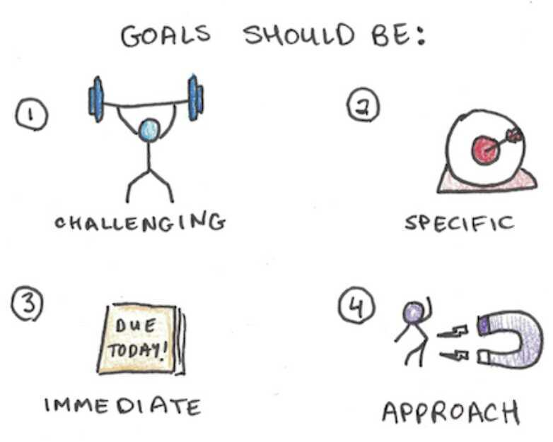

# Goals Setting

### SMART Goals

#### Specific

- Who? What? Where? Why? Which?
- Goals need to be high-definition. They must be detailed, clear and unambiguous.

#### Measurable / ~~Meaningful~~

- Metrics and milestones. How much? What percentage?
- Setting clear checkpoints with deadlines

#### Achievable

- Do you have skills and tools to accomplish this objective?
- Goals should be realistic

#### Relevant

- Does it fit with overall organizational objectives? And How?
- Major goals should be cohesive, leading specifically towards the life you're aiming for

#### Time Bound

- Intermediate and final deadline
- Be ambitious with your deadlines - you might be surprised at how hard you're able to work with a little time pressure applied

[YOUR BEST YEAR EVER by Michael Hyatt | Core Message](https://youtu.be/4e462eZ2VfI)

[TRACTION by Gino Wickman | Core Message - YouTube](https://www.youtube.com/watch?v=21X-4j-rxLI)

1. Rocks for 90 days goal
2. Issues
3. Action plan

### CSI-Approach

Challenging, Specific, Immediate and Approach Goals

Once you've gotten SMART, commit to your goals by writting them down. This gives you accountability, and also makes it more likely that you'll achieve your aims - 42 percent more likely.

Ideally, goals should be a mix of short and long-term goals. Short-term goals can be the wins that keep you on track. Long-term goals are the big life-changers

Knowledge worker - Series of non routine tasks that involve social intelligence, complex critical thinking and creative problem solving

### Set two goals: an 80-20 and a 50-50

80-20 goals are the ones you have an 80 percent chance of achieving. These goals are attainable, and hitting them will motivate the team. However, they will not help the team stretch and perform at a higher level. Therefore, it's also important to set 50-50 goals, which you have only a 50 percent chance of achieving. While these goals are more challenging, they are also far more satisfying to reach. Whatever you do, don't "sandbag" by setting only goals you can easily achieve. Failing to set the bar high can lead to complacency on the team and a decline in the product. If you find you always reach or exceed your 80-20 or especially your 50-50 goals, it's likely you have set your sights too low.

### Planning

There are five main reasons why you should plan your days, months, and years

1. **More clarity -** When I don't know what to do, I procrastinate, waste my time, and feel bad
2. **Saves time -** When I think about what I want to do in advance, I'm more effective
3. **Boosts creativity -** Planning helps me come up with more creative things to do in my life. It also helps me come up with creative solutions to my challenges
4. **Momentum -** Planning helps me keep moving forward, so I hardly ever [get stuck](https://dariusforoux.com/improving-your-productivity/)
5. **Better thinking -** Theprocessof planning forces you to think hard about what you want to do, and how you're going to do it. That will improve your thinking skills

Create a 5-year, 1-year, monthly, and daily plan - in that order

https://dariusforoux.com/the-life-plan

Before you ask, "What should I do today?"

Ask yourself, "What should I remove today?"

Create the space you need to succeed.

### Extreme productivity

To get yourself thinking more long-term, begin organizing your work. Split up tasks into **aims, objectives and targets** so that you can begin to prioritize. A good strategy is to divide tasks according to how long they take to accomplish.

For instance, career aims take five years or more. These are things like expanding your business network or landing an executive-level promotion.

Objectives take between three and 24 months. For example, if you work for a shoe company, an objective might be to re-brand a sneaker line.

And finally, targets are anything that will take three months or less, such as writing progress reports or finishing part of a major project. Objectives and targets are both essential. After all, if you don't focus on these baseline endeavors, you'll never reach your larger career aims.

But it's also important to prioritize aims, objectives and targets that both youandyour employer are on board with. You should first focus on the things that both you and your boss want to achieve; once that's done, you can address the tasks that concern only you.

### Quotes

People who jump from project to project are always dividing their effort, and producing high quality work becomes difficult without intense effort.

Meanwhile, your average work day can be leisurely, yet also productive, if you return to the same project each day.

Do one thing well and watch it compound.

Life is easier when you know what you want - but most people don't take the time to figure out what they want.

It's not that we are completely lost, but our efforts are often slightly misdirected. People will work for years and ultimately achieve a lifestyle that isn't quite what they were hoping for - often, simply, because they never clearly defined what they wanted.

An hour of thinking can save you a decade of work.

Never do yesterday that should be done tomorrow

If at last you do succeed, never try again

I started dividing my to-do list into 1) things I have to do, 2) things I want to do, and 3) things other people want me to do. Life changing! I often don't get to #3 and I finally realized... this is what it means to have boundaries.

How can I accomplish my goals as fast as possible at a high quality?

When determining the size or complexity of a new habit ask yourself, "What can I stick to - even on my worst day?"

Start there. Master the art of showing up. Then advance.

### Blinkist - 7 Strategies for Wealth & Happiness by Jim Rohn

1. Setting clear goals will help you discipline yourself and create structure
2. Self-led learning is the key to wealth and personal development
3. Eliminate barriers to your personal development and increase your value
4. By changing your attitude towards taxes and adopting the 70/30 rule, you'll become both happier and wealthier
5. Allocate your time wisely through careful planning
6. Be sure to spend your time with the right people
7. Learn how to be satisfied reagardless of the size of your bank account
