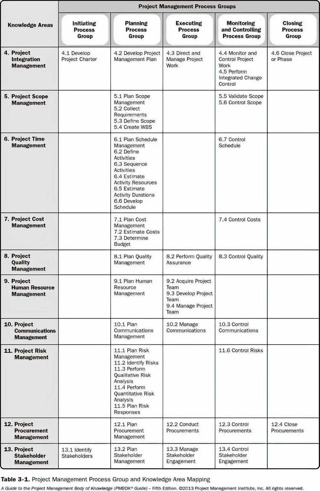

# PM101

[Project Management 101 Training | Introduction to Project Management | Project Management Basics](https://www.youtube.com/watch?v=HDXkITHLZSI)

## Agenda

1. What is a Project?
2. Where do projects come from?
3. Project Contraints
4. How do you define project success?
5. What is Project Management?
6. Programs and Portfolios
7. Project Manager
8. Organizational Structure
9. Project Management Office (PMO)
10. Project Stakeholders
11. Project Management Life Cycle and its types
12. Project Management Processes

- Initiating Process Group
- Planning Process Group
- Executing Process Group
- Monitoring and Controlling Process Group
- Closing Process Group

## What is a Project

- A project is **temporary**
- It has a definite start and end date
- Thereby having a defined scope and resources
- Creates a product, service and resources
- Includes a defined schedule, score and resources
- A project is also **unique**
- It is not a routine everyday operational work with repetitive output
- It is a specific set of activities designed to accomplish a well-defined unique objective
- The method of **progressive elaboration** is used when planning and executing projects
- **Techniques to manage project**
    - **Process based -** focus on deliverables
    - **Principle based -** focus on outcomes

## Where do projects come from

- New Technology
- Competitive Forces
- Material Issues
- Political Changes
- Market Demand
- Economic Changes
- Customer Request
- Stakeholder Demands
- Legal Requirements
- Business Process Improvements
- Strategic Opportunity
- Business Need
- Social Need
- Environmental Considerations

## Practice

- **Project**
    - Putting together a team of research analysts to come up with a design and prototype of a water proof phone within 6 months
    - Setting up a mobile phone factory
- **Operation**
    - Manufacturing thousands of those water proof phones using the design blueprint
    - Assembling thousands of mobile phones everyday

## How do you define Project success?

1. Schedule
    - Continually evaluate your progress as you go
    - Work out the schedule slippages in a timely manner

2. Cost
    - Evaluate, Look forward and reforecast to compare with the original budget

3. Quality
    - Quality should be reviewed timely or at the end of each project phase
    - Quality standards should be well defined and accessible
        - Web page will load in 350ms

4. Stakeholders Satisfaction
    - Even qualitative checks during the course of the project is worth it instead of somehow working through the project and completing it with only the Project Manager being happy

5. Alignment to Business Case
    - Cost, Schedule, Quality are just one part of the puzzle, did your project meet the original beneifts it set out for?
    - Do the problems that led to the project being conceived still exist? Are you working on something nobody wants?

## What is Project Management

- Project management is the application of knowledge, skills, methods, experience, tools and techniques on project activities to meet the project objectives
- Business leaders understand that project management is a function within the organization and hire individuals that are specifically trained in this discipline (**Project Managers**) to handle organization's project management needs

## Programs and Portfolios

### Programs

- Programs are commonly defined as a group of related projects that provide certain benefits when managed together
- Managing the development of all ecommerce projects together can be a program
- Equation

Program = Subprograms + Projects and subprojects

### Portfolios

- Portfolios are not just a group of programs but can also include projects that do not align with any program
- Managing all types of website development related projects and programs can be a portfolio while managing all mobile apps related projects and programs can be another portfolio
- Equation

Portfolio = sub-portfolios + programs and subprograms + Projects and subprojects

## Project Manager

The project manager is the person assigned by the performing organization to lead the team that is responsible for achieving the project objectives.

## Functional Manager

The functional manager focuses on providing management oversight for a functional or business unit

## Operations Manager

Operations managers are responsible for ensuring that business operations are efficient

## PMI Talent Traingle

## Organizational Structure

- Determination of the appropriate organizational structure type is a result of the study of tradeoffs between two key variables
    - Organizational structure types available for use
    - How to optimize them for a given organization
- There is no one-size-fits-all structure for any given organization. The final structure is unique due to the numerous variables to be considered
- There are many types of organization structure, some major ones are,
    - Functional Organization
    - Matrix Organization
    - Projectized Organization
    - Composite Organization (AKA Hybrid)

## Functional Organization

- Project resources work in silos reporting to respective Functional Manager
- Functional Manager has all the authority
- Project Manager is an expeditor

## Matrix Organization

- **Weak**
    - PM has certain authority and is a Coordinator
    - PM has higher authority
    - Resources report to both
- **Balanced**
    - PM and FM share same level of authority
    - Resources report to both
- **Strong**
    - PM has higher authority
    - Resources report to both
    - Project delivery is most important

## Projectized Organization

- Project Manager has the highest authority
- Teams are organized around projects
- Resources have "no home" after project completion

## Composite or Hybrid Organization

- Composite or Hybrid Organization Structure is basically a combination of all three organization structures we just went over i.e. Functional, Matrix and Projectized
- How does this work?
    - Within an organization there could be certain projects that are being managed following the Balanced Matrix Organization Structure while others could be following the Projectized Organization Structure
    - A new project may popup where it is beneficial for the team to follow the Functional Organization Structure
    - So within the same organization we can see all structures being used and this is by definition a Composite Organization
    - Almost all modern organizations follow the composite organization structure

## Project Management Office (PMO)

- A PMO is a group or department that define and maintains standards for project management within the organization
- The PMO strives to standardize and introduce **economies of repetition** in the execution of projects

## Types of PMO

- **Supportive**
    - This type of PMO will basically provide templates that PM and the PM team can use to manage the project
    - Ex - PM reaches out to the PMO for a template of Change Log
    - Ex - PMO shares the organization's knowledge base and lessons learned for the PM to use
- **Controlling**
    - In addition to what supportive PMOs do, controlling PMOs can audit a project to ensure the processes prescribed by them are being followed
    - Ex - PMO meets the Project Manager every once in a while to go over the project documents to ensure compliance
    - Ex - PMO audits the project status at regular intervals to ensure reporting integrity
    - Ex - Before the project can move from Design to Coding, the PMO ensures that all the prescribed Design processes were followed
- **Directive**
    - Directive PMOs actually assign Project Managers to projects and PMs might be reporting directly to the PMO
    - Ex - Before the project can move from Design to Coding, the PMO ensures that all the prescribed Design processes were followed

## Project Stakeholders

- Anyone who will be affected by the outcome of the project is a stakeholder
- Project Manager identifies all stakeholders and manages their expectations
- Remember that there can be **negative stakeholders**, they are negatively impacted by the outcome of your project

## 3 things to remember about Stakeholders

- Not all stakeholders have the same power or impact
- Not all stakeholders will always be satisfied
- They don't have to be!

## Types

- Predictive Life Cycle (Waterfall)
- Iterative and Incremental Life Cycle
- Adaptive Life Cycle (Agile)

## Predictive Life Cycle / Waterfall Model / Fully Plan Driven Life Cycle

- The project takes a phase by phase approach whereby the work on each phase is completed before moving onto the next phase
- For instance, all requirements must be signed off before development can begin
- In the end, the outcome is the final product

## Iterative and Incremental Life Cycle

- The project team can start working on a single set of requirements once they are signed off instead of waiting for entire requirements to be freezed
- The outcome is partial product that 'increments' as we move further

## Adaptive Life Cycle / Change Driven / Agile

- Just like the Waterfall model, the project will take the phase by phase approach but multiple times
- Each iteration will generate a deliverable or a set of deliverables
- The outcome could be an instance of the end product which can be improved in further iterations

## Project Management Processes

## Project Management Life Cycle

- Each project essentially has four phases - **Initiation, Planning, Execution and Closure**
- **Monitoring and Controlling** is one activity that is common to all the phases

- **5 Process Groups**
    - **Initiating**
        - Perform project assessment
        - Identify key deliverables
        - Perform stakeholder analysis
        - Identify high level risks
        - Develop project charter
        - Obtain project charter approval
        - Conduct benefit analysis
        - Inform stakeholders of the approved project charter
    - **Planning**
        - Review and assess detailed project requirements
        - Develop scope management plan
        - Develop cost management plan
        - Develop the project schedule
        - Develop resource management plan
        - Develop communications management plan
        - Develop procurement management plan
        - Develop the quality management plan
        - Develop the change management plan
        - Plan for risk management
        - Present the project management plan to the revelant stakeholders
        - Conduct kick-off meeting
        - Develop the stakeholder management plan
    - **Executing**
        - Acquire and manage project resources
        - Manage task execution
        - Implement the quality management plan
        - Implement approved changes and corrective actions
        - Implement approved actions
        - Manage the flow of information
        - Maintain stakeholder relationships
    - **Monitoring and Controlling**
        - Measure project performance
        - Manage changes to the project
        - Verify that project deliverables conform to the quality standards
        - Monitor and assess risk
        - Review the issue log
        - Capture, analyze and manage lessons learned
        - Monitor procurement activities
    - **Closing**
        - Obtain final acceptance of the project deliverables
        - Transfer the ownership of deliverables
        - Obtain financial, legal and administrative closure
        - Prepare and share final project report
        - Collate lessons learned
        - Archive project documents
        - Obtain feedback from relevant stakeholders
- **10 Knowledge Areas**
    - Integration
    - Scope
    - Schedule
    - Cost
    - Quality
    - Resource
    - Communications
    - Risk
    - Procurement
    - Stakeholder

## PGKA Mapping (Process Group - Knowledge Area)

## Integration Management

The process and activities to identify, define, combine, unify, and coordinate the various processes and project management activities within the project management process groups.

- Develop project charter
- Develop project management plan
- Direct and manage project work
- Manage project knowledge
- Monitor and control project work
- Perform integrated change control
- Close project or phase

## Scope Management

Project scope sets our what is included in the project and, equally important, what is not included.

Clearly communicating the scope to all stakeholders ensures there is no debate over this at a later stage

- Plan scope management
- Collect requirements
- Define scope
- Create WBS
- Validate scope
- Control scope

## Schedule Management

Project schedule management is the process of taking the work breakdown packages and applying timescales to these to determine the time it will take to complete the project. Each piece of work or task required to complete the project requires a start date, an end date and a duration

- Plan schedule management
- Define activities
- Sequence activities
- Estimate activity durations
- Develop schedules
- Control schedules

## Cost Management

The project cost management process involves applying estimates on all costs involved in the project. This will also include plans for how costs will be managed and controlled throughout the project

- Plan cost management
- Estimate costs
- Determine budget
- Control costs

## Quality Management

The success of a project will depend greatly on the quality of the goods or services produced and handed over on completion. These need to meet the quality expected by the stakeholders at the outset

- Plan quality management
- Manage quality
- Control procurement

## Resource Management

Project resource management is the process of ensuring there is a team in place to carry out the activities required to carry out the project activities.

- Plan RM
- Estimate activity resources
- Acquire resources
- Develop team
- Manage team
- Control resources

## Communications Management

All projects have a group of stakeholders who need to be kept us to date on the progress of the project. Project Communication Management is the process of making sure that happends either verbally, written or formal or informal

- Plan communication
- Manage communications
- Monitor communications

## Risk Management

Managing risk in a project is essential to ensure potential scenarios of issues have been identified, thought through, mitigated and planned for to make sure if they do occur there is minimal impact on the project.

- Plan risk management
- Identify risks
- Perform qualitative risk analysis
- Perform quantitative risk analysis
- Plan risk responses
- Implment risk responses
- Monitor risks

## Procurement Management

Project procurement management is the process of how purchasing of external resources (including material) will be managed throughout the project

- Plan procurement
- Conduct procurement
- Control procurement

## Stakeholder Management

This process involves identifying people, groups and organizations who will be impacted by the delivery of the project. This goes further to ensure, that once identified, stakeholders remain engaged in the project throughout its life cycle

- Identify stakeholders
- Plan stakeholder engagement
- Manage stakeholder engagement
- Monitor stakeholder engagement

## Work Breakdown Structure (WBS)

[What is Work Breakdown? - HelpDocs & User Setup | LinearB](https://linearb.helpdocs.io/article/tpxx3m8cwb-work-breakdown)
