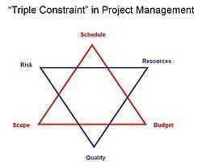

# Project Contraints

Triple Constraint Triangle (Iron Triangle of Project Management)

Note that these contraints are interrelated, so a strain on one of the core contraints will affect one or more of the other constraints

1. The [quality](https://en.wikipedia.org/wiki/Quality_(business)) of work is constrained by the project's budget, deadlines and scope (features).
2. The [project manager](https://en.wikipedia.org/wiki/Project_manager) can trade between constraints.
3. Changes in one constraint necessitate changes in others to compensate or quality will suffer.

- For example, a project can be completed faster by increasing budget or cutting scope. Similarly, increasing scope may require equivalent increases in budget and schedule. Cutting budget without adjusting schedule or scope will lead to lower quality.
- **"Good, fast, cheap. Choose two."** and similar statements are often used to encapsulate the triangle's constraints concisely.

### The Project Management Star by PMBOK

## TCS - Time / Scope / Cost, choose two

### STR Model

The STR model is a mathematical model which views the "triangle model" as a graphic abstraction of the relationship:

### Scope = Time × Resources

Scope refers to complexity (which can also mean quality). Resources includes humans (workers), financial, and physical. Note that these values are not considered unbounded. For instance, if one baker can make a loaf of bread in an hour in an oven, that doesn't mean ten bakers could make ten loaves in one hour in the same oven (Due to the oven capacity).

https://en.wikipedia.org/wiki/Project_management_triangle

## Project management triangle topic

### Time

For analytical purposes, the time required to produce a [deliverable](https://en.wikipedia.org/wiki/Deliverable) is [estimated](https://en.wikipedia.org/wiki/Estimation_(project_management)) using several techniques. One method is to identify tasks needed to produce the deliverables documented in a [work breakdown structure](https://en.wikipedia.org/wiki/Work_breakdown_structure) or WBS. The work effort for each task is estimated and those estimates are rolled up into the final deliverable estimate.

The tasks are also prioritized, [dependencies](https://en.wikipedia.org/wiki/Dependency_(project_management)) between tasks are identified, and this information is documented in a project schedule. The dependencies between the tasks can affect the length of the overall project (dependency constrained), as can the availability of resources (resource constrained). Time is different from all other resources and cost categories.

Using actual cost of previous, similar projects as the basis for estimating the cost of current project.

According to the [Project Management Body of Knowledge](https://en.wikipedia.org/wiki/Project_Management_Body_of_Knowledge)(PMBOK) the Project Time Management processes include:

1. Plan Schedule Management
2. Define Activities
3. Sequence Activities
4. Estimate Activity Resources
5. Estimate Activity [Durations](https://en.wikipedia.org/wiki/Duration_(project_management))
6. Develop Schedule
7. Control Schedule

#### Define Activities

1. Inputs: Management Plan, Scope Baseline, Enterprise environmental factors, Organizational process assets
2. Tools: Decomposition, Rolling Wave Planning, Expert Judgment
3. Outputs: Activity list, Activity attributes, [Milestone](https://en.wikipedia.org/wiki/Milestone_(project_management)) list

#### Activity sequencing

1. Inputs: Project [Scope Statement](https://en.wikipedia.org/wiki/Scope_Statement), Activity List, Activity Attributes, Milestones List, Approved change requests
2. Tools: [Precedence Diagramming Method](https://en.wikipedia.org/wiki/Precedence_Diagramming_Method)(PDM), [Arrow Diagramming Method](https://en.wikipedia.org/wiki/Arrow_Diagramming_Method)(ADM), Schedule Network templates, dependency degeneration, applying leads and lags
3. Outputs: Project Schedule Network diagrams, Activity List Updates, Activity Attributes updates, Request Changes

#### Activity resource estimating

1. Inputs: Enterprise Environmental factoring, Organizational process assets, Activity list, Activity attributes, Resources Availability, Project Management Plan
2. Tools: Expert Judgment Collections, Alternative Analysis, Publishing estimating data, Project management software implementation, Bottom up estimating
3. Outputs: Activity resource requirements, Activity attributes, Resource breakdown structure, resource calendars, request change updates.

#### Activity duration estimating

1. Inputs: Enterprise environmental factors, organization process assets, Project scope statement, activity list, activity attributes, activity resource requirements, resource calendars, project management plan, risk register, activity cost estimates
2. Tools: Expert judgment collection, [analogous estimating](https://en.wikipedia.org/w/index.php?title=Analogous_estimating&action=edit&redlink=1), [parametric estimating](https://en.wikipedia.org/wiki/Parametric_estimating), Bottom up Estimation, Two-Point estimation, [Three-point estimation](https://en.wikipedia.org/wiki/Three-point_estimation), reserve analysis
3. Outputs: Activity duration estimates, activity attribute updates and estimates

#### Schedule development

1. Inputs: Organizational process assets, Project scope Statement, Activity list, Activity attributes, project Schedule Network diagrams, Activity resource requirements, Resource calendars, Activity duration estimates, project management plan, risk register
2. Tools: Schedule Network Analysis, Critical path method, schedule compression, what if scenario analysis, resources leveling, critical chain method, project management software, applying calendars, adjusting leads and lags, schedule model
3. Outputs: Project schedule, Schedule model data, schedule baseline, resource requirements update, activity attributes, project calendar updates, request changes, project management plan updates, schedule management plan updates

#### Schedule control

1. Inputs: Schedule management plan, schedule baseline, performance reports, approved change requests
2. Tools: Progressive elaboration reporting, schedule change control system, performance measurement, project management software, variance, analysis, schedule comparison bar charts
3. Outputs: Schedule model data updates, schedule baseline. performance measurement, requested changes, recommended corrective actions, organizational process assets, activity list updates, activity attribute updates, project management plan updates

Due to the complex nature of the 'Time' process group the project management credentialPMI Scheduling Professional(PMI-SP) was created.

### Cost

To develop an approximation of a project cost depends on several variables including: resources, work packages such as labor rates and mitigating or controlling influencing factors that create cost variances. Tools used in cost are, [risk management](https://en.wikipedia.org/wiki/Risk_management), [cost contingency](https://en.wikipedia.org/wiki/Cost_contingency), [cost escalation](https://en.wikipedia.org/wiki/Cost_escalation), and indirect costs . But beyond this basic accounting approach to fixed and variable costs, the economic cost that must be considered includes worker skill and productivity which is calculated using various project cost estimate tools. This is important when companies hire temporary or contract employees or outsource work.

#### Cost Process Areas

- Cost Estimating is an approximation of the cost of all resources needed to complete activities.
- Cost budgeting aggregating the estimated costs of resources, work packages and activities to establish a cost baseline.
- Cost Control -- factors that create cost fluctuation and variance can be influenced and controlled using various cost management tools.

#### Project Management Cost Estimating Tools

- Analogous Estimating: Using the cost of similar project to determine the cost of the current project
- Determining Resource Cost rates: The cost of goods and labor by unit gathered through estimates or estimation.
- Bottom Up estimating: Using the lowest level of work package detail and summarizing the cost associated with it. Then rolling it up to a higher level aimed and calculating the entire cost of the project.
- Parametric Estimating: Measuring the statistical relationship between historical data and other variable or flow.
- Vendor Bid Analysis: taking the average of several bids given by vendors for the project.
- Reserve Analysis: Aggregate the cost of each activity on the network path then add a contingency or reserve to the end result of the analysis by a factor determined by the project manager.
- Cost of Quality Analysis: Estimating the cost at the highest quality for each activity.

[Project management software](https://en.wikipedia.org/wiki/Project_management_software) can be used to calculate the cost variances for a project.

### Scope

Requirements specified to achieve the end result. The overall definition of what the project is supposed to accomplish, and a specific description of what the end result should be or accomplish. A major component of scope is the [quality](https://en.wikipedia.org/wiki/Quality_(business)) of the final product. The amount of time put into individual tasks determines the overall quality of the project. Some tasks may require a given amount of time to complete adequately, but given more time could be completed exceptionally. Over the course of a large project, quality can have a significant impact on time and cost (or vice versa).

Together, these three constraints have given rise to the phrase "On Time, On Spec, On Budget." In this case, the term "scope" is substituted with "spec(ification)."

https://en.wikipedia.org/wiki/Project_management_triangle
