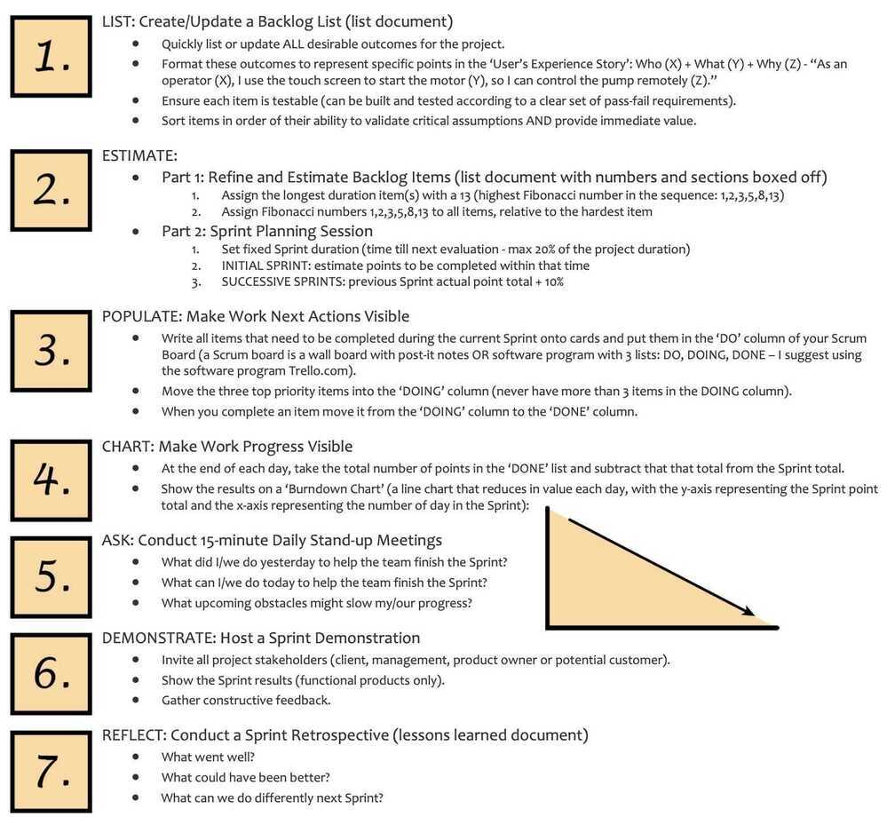
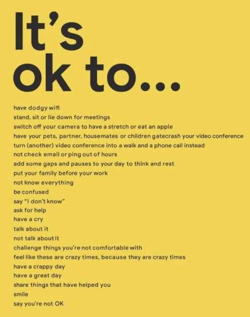

# Scrum / Meetings

- Video Calls
- Don't add all in video call (to save bandwidth)
- Do group calls

Discussions are always better than arguments, because an argument is to find out who is right, and a discussion is to find out what is right.

Scrum: The Art of Doing Twice the Work in Half the Time by J. J. Sutherland

[SCRUM: Twice the Work, Half the Time](https://www.youtube.com/watch?v=RaaBrPCo_Mw&ab_channel=ProductivityGame)

- Planning Fallacy
- Sunk Cost & Status Quo Bias

**Plans are worthless, Planning is everything**

## Meetings

- Pre-meeting notes - prepare for the meeting along with agenda
- Post-meeting
    - Send the final notes of what to do, when to do, who will do that
    - Share the next calendar invite for the next followup
- No presentation reading in meetings (share presentation before the meeting, or after)

## Meeting Agenda (goal-oriented)

1. What are you trying to achieve?
2. Why is it important?
3. Who do you need onboard to hit your target?
4. How much time will it take?

## Tools

- Hugo
- Soapboxhq
- Taskade
- Meetly
- https://witful.com

## Skip-level meetings

A skip-level meeting is a one-on-one meeting where upper managers meet directly with employees, bypassing the employee's direct manager, essentially "skipping" a level of management to connect directly with employees.

The goal of a skip-level meeting is twofold:

- For employeesto gain insight into company goals, objectives, and strategies.
- For senior leadersto create a shared space for employees to discuss career progression, professional goals and give feedback.

https://soapboxhq.com/blog/meetings/skip-level-meeting-questions

## Meetings

### Get everyone in on the action

Proactively give less dominant participants the floor by calling on them individually.On remote calls, regularly check if remote participants are able to follow the conversation and contribute.

### Interrupt interruptions

Lead by example and call out when you see someone being inadvertently silenced in a discussion. Encourage others to do the same. Come equipped with phrases like, "Hang on a sec, Fatima -- I want to make sure I understand Aniket's point before we add on to it."

If anyone is a repeat offender, take them aside for a moment after the meeting and point it out to them. Assume they're totally oblivious to their behaviors -- peoplerarelyact this way on purpose.

### Give credit where credit's due

When someone makes a good point, acknowledge their contribution and give public attribution to their ideas. Don't let hijackers get away with appropriation, and highlight when value has been added.

### Use the power of the pen

If one person is dominating, ask them to be the scribe. This intrinsically tasks them with listening and creates a space for others.

### Write and share

Give everyone time to process the question, jot down thoughts on paper, and share what they've come up with. This gives less vocal participants time to gather their thoughts and ensures they'll be heard.

### Clean up as you go

At the end of each agenda topic, pause to agree on next steps and establish specific commitments with clear deadlines. Assign Directly Responsible Individuals (DRI) and rotate the DRI role to ensure the loudest person doesn't receive all of the action items.

### Follow-ups

Circulate a follow-up note that captures the key takeaways, action items, and DRIs.This way everyone is in the loop and on the same page (consider that remote participants may not have been able to hear everything perfectly).

Proactively solicit ideas that might've come to mind after the meeting. To produce their best work, introverts need time alone to process new information. For example, send out a message along the lines of:"Anyone have a new insight about this situation since we met? If so, I'd love to hear it."

Keep tabs on action items.Assign someone to check in at appropriate intervals after the meeting to ensurethe commitments are being kept, or re-evaluated if something unexpected came up.

https://www.atlassian.com/team-playbook/plays/inclusive-meetings

- [Overview](https://www.atlassian.com/agile/scrum)
- [Sprints](https://www.atlassian.com/agile/scrum/sprints)

### Artifacts

- Product Backlog
    - Running todo list consisting of all the things that need to be done
- Sprint Backlog
- Increment (definition of done)

### [Sprint planning](https://www.atlassian.com/agile/scrum/sprint-planning)

- Moving items from product backlog to sprint backlog
- Keep in mind to only take task that can be completed in that sprint time (2 weeks)
- The sprint goal is an objective that can be met by implementing stories from the backlog
- Velocity = The amount of work typically completed in a sprint
- **Goals**
    - Focus Execution
    - Minimize surprises
    - Higher quality code
- **Todo**
    - Backlog grooming (A meeting before the meeting)
    - Sprint planning meeting (Prioritization)
        - Retrospective recap (action item from last retrospective)
        - Product and market updates
        - Planning conversation
    - Creating action items
- [Ceremonies](https://www.atlassian.com/agile/scrum/ceremonies)
    - Sprint planning
    - Daily scrum or standup
    - Sprint review
    - Sprint retrospective
- [Backlogs](https://www.atlassian.com/agile/scrum/backlogs)
- [Sprint reviews](https://www.atlassian.com/agile/scrum/sprint-reviews)
    - What's done and not done
    - Demo the work
    - Review key metrics
    - Review and revise the product backlog
- [Standups](https://www.atlassian.com/agile/scrum/standups)
    - Standups are 15-minutes daily meetings to quickly plan for the next 24 hours
    - What did I worked on yesterday?
    - What am I working on today?
    - What is blocking me?
    - Relegate all side conversations/discussions to the 16th minute
- [Scrum master](https://www.atlassian.com/agile/scrum/scrum-master)
- [Retrospectives](https://www.atlassian.com/agile/scrum/retrospectives)

[Team Meetings That Don't Suck - Avoid Retrospectives Antipatterns - Aino Vonge Corry - GOTO 2021](https://youtu.be/ApAkqxHZq6o)

- [Distributed scrum](https://www.atlassian.com/agile/scrum/distributed-scrum)
- [Roles](https://www.atlassian.com/agile/scrum/roles)
    - Product Owners
    - Scrum masters
    - Development teams
- [Scrum of scrums](https://www.atlassian.com/agile/scrum/scrum-of-scrums)

[The Agile Coach - What is Scrum](https://www.youtube.com/playlist?list=PLaD4FvsFdarT0B2yi9byhKWYX1YmrkrpC)

### [Scrum in 16 minutes](https://www.youtube.com/watch?v=vuBFzAdaHDY)

1. Vision - Company's vision reflects what the company wants and built for. Ex - Amazons' vision - "We want to be the most customer centric company in the world"
2. Roadmap
3. Working Software
4. Definition of Done (Agile software developer uses this for determining if the software meets there quality bar), helps to reduce technical debt (things like scalability and automated testing is considered)
5. Work in Sprints / Iteration (1-4 weeks) (best to use 1-2 weeks sprints)
6. Sprint backlog - sprint goal
7. Product backlog - features that are passed to sprint backlog (contains every piece of work that team plans on working)
8. Definition of Ready (documentation that defines clearly accepted criterion that team understands)
9. Product owner (What + Why, Speed)
10. Dev team (How + When, Quality)
11. Scrum Master - keeps balance between speed and quality, Coach product owner and dev team.
12. Backlog Refinement - Meet once a week for this, update user stories
13. Sprint Planning - What has to be done and how it has to be done
14. Daily scrum - 15 min time box event. Plan for 24 hours.

    - **What did you did yesterday** to help our team to meet our sprint goal.
    - **What you will do today** that will help our team to meet our sprint goal
    - Do I see any **impediments or blockers** that will stop meeting the sprint goal

15. Sprint Review - demonstrate the work done
16. Retrospective - Creates improvement plan for next sprint
17. Stakeholders
18. Managers - engineering to product managers
19. Executive

### Scrum vs Sprint

==Scrum is a framework for managing work, while Sprint is a framework for managing time==. Scrum is more flexible than Sprint, which is more rigid. Scrum can be used for projects of any length, while Sprint is typically used for projects lasting two or four weeks.

Scrum is a framework often used in Agile methodology. Scrum provides meetings, tools, and roles. Sprint is a defined period for creating a feature. A Sprint is a condensed period of time during which a scrum team works to complete a specific amount of work. The maximum time for a sprint is 30 days.

## Questions

1. What were the deliverables from last week and did you achieve them?
2. How can I best support the team as a manager?
3. How do you feel about the balance between your individual work vs. managing?
4. What did you do this weekend?
5. How can I help you?
6. What resources, tools, and budget do you need to achieve your goals?
7. Are there things at work that we don't talk about enough?
8. If there was one thing I could do differently to help you more, what would it be?
9. What are you working on next week?
10. What is blocking your progress?

## Trending up this month

1. How have you felt about my level of presence/support over the past month?
2. When's the best time to get feedback on our work?
3. Who deserves a shoutout?
4. What are our biggest strengths and weaknesses as a team?
5. What time of day do you do your best work?
6. If this project knocks it out of the park, what would that look like to you?
7. What's a big, audacious goal that you'd like to achieve this quarter?
8. Are you feeling overwhelmed? If so, how or in what way?
9. What keeps you up at night and what do you dream about?
10. Who from other teams deserves a shoutout for their help and why?
11. KPIs - how'd you do last week? Where do you need to focus more this week?
12. What part of your workflow do you find most challenging?

## Trending down this month

1. What are you working on?
2. What type of work environment do you work best in?
3. What professional goals would you like to accomplish in the next 6 to 12 months, and what makes you say that?
4. How are things going?
5. What went well this week?
6. Goals - how are you tracking this past week? Any blockers I can help remove?
7. On a scale of 1-10, how happy are you with your work-life balance? How can we get closer to 10?
8. If there was one thing I could do differently to help you more, what would it be?
9. What's been the highlight and lowlight of your past week?
10. What's the best way for us to communicate as a team?

## Weekly Sprint Capacity

| **Person** | **Total working days** | **Hours per working day** | **Effective Hrs Per Day** | **Hrs Available** | **Group Meetings (Tech Thursday + Cleanup Tuesday + Standups)** | **Team Help + Others** | **Net Available Hrs** |
|---|---|---|---|---|---|---|---|
| External Team Member | 5 | 9 | 8 | 40 | 1.5 + 1.5 + 2 = 5 | 5 | 30 |
| Internal Team Member | 5 | 9 | 8 | 40 | 1.5 + 1.5 + 2 = 5 | 5 | 30 |

## Checklist

## WBR - Weekly Business Review

[My weekly schedule| Ankur Warikoo](https://www.youtube.com/watch?v=DfWVGMPcUPA)

## Souding Board Meeting

https://smallbusiness.chron.com/adobe-creative-cloud-grow-business-13771091.html

Sounding board meetings are typically group forums designed to elicit opinions about a particular matter. Some small business owners use these types of meetings to troubleshoot new product or marketing ideas, while others use them as problem-resolution platforms. Sounding board meetings can be very advantageous, as they can help a small business owner discover breakthrough ideas or solutions to ongoing problems, as well as move forward on new projects quickly. If you are planning to launch a new product or service, or you simply want to clear up misunderstandings that are plaguing the office, plan an effective, efficient sounding board meeting.

