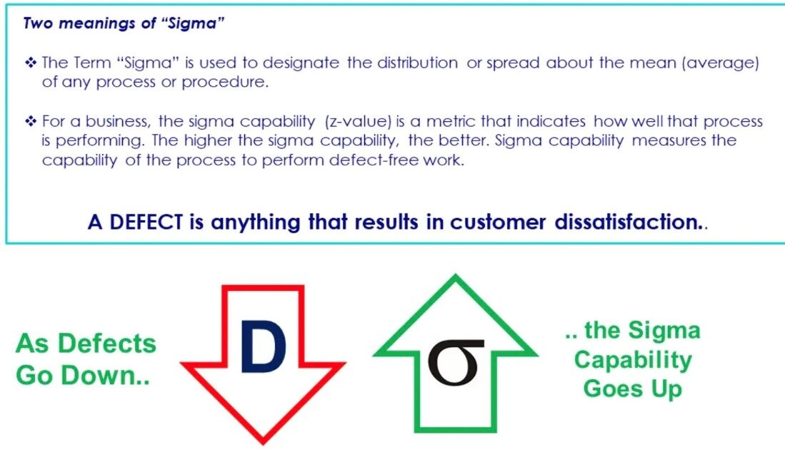

# Management

- [Mental Models](mental-models)
- [Project / Product / Business Tools / SAAS](project-product-business-tools-saas)
- [Business](business/readme.md)
    - [Business Terms](management/business/business-terms.md)
    - [Indian Market](business/indian-market)
    - [Business Case Studies](business/business-case-studies)
    - [Service Based Model](management/business/service-based-model.md)
- [Product Management](product-management/readme.md)
- [Product Analytics](management/product-analytics/readme.md)
- [Project Management](project-management/readme.md)
- [People Management](management/people-management/readme.md)
- [Decision Making](decision-making/readme.md)
    - [Ethics](decision-making/ethics)
- [Growth Hacking](growth-hacking)
- [Growth Hacking Metrics](management/growth-hacking-metrics.md)
- [Marketing](management/marketing.md)
	- [Digital Advertising](management/digital-advertising.md)
- [Sales](management/sales.md)
- [Customer Engagement / CX](customer-engagement-cx)
- [Community Building](community-building)
- [Six Sigma](management/six-sigma.md)
- [Books / Blinkist - Management](books-blinkist-management)
- [Others](management/others.md)

## Roles

- [Principle Software Engineer](roles/principle-software-engineer)
- [Engineering Manager / Tech Lead](roles/engineering-manager)
- [Data Roles](management/roles/data.md)
- [Other Roles](management/roles/others.md)
- [Jobs](management/jobs/readme.md)

## Management Basics

- [Management Basics](https://www.managementstudyguide.com/management-basics-articles.htm)

## Management Functions

- [Planning Function](https://www.managementstudyguide.com/planning-function-articles.htm)
- [Organizing Function](https://www.managementstudyguide.com/organizing-function-articles.htm)
- [Staffing Function](https://www.managementstudyguide.com/staffing-function-articles.htm)
- [Directing Function](https://www.managementstudyguide.com/directing-function-articles.htm)
- [Controlling Function](https://www.managementstudyguide.com/controlling-function-articles.htm)

## Organizational Behaviour

- [Motivation](https://www.managementstudyguide.com/motivation-articles.htm)
- [Leadership](https://www.managementstudyguide.com/leadership-articles.htm)
- [Communication - Basics & Strategies](https://www.managementstudyguide.com/communication-basics-articles.htm)
- [Business Communication](https://www.managementstudyguide.com/business-communication-articles.htm)
- [Managerial Communication](https://www.managementstudyguide.com/managerial-communication-articles.htm)
- [Public Speaking](https://www.managementstudyguide.com/public-speaking-articles.htm)
- [Time Management](https://www.managementstudyguide.com/time-management-articles.htm)
- [Corporate Etiquettes](https://www.managementstudyguide.com/corporate-etiquettes-articles.htm)
- [Corporate Dressing](https://www.managementstudyguide.com/corporate-dressing-articles.htm)
- [Personality Development](https://www.managementstudyguide.com/personality-development-articles.htm)
- [Organization Culture](https://www.managementstudyguide.com/organization-culture-articles.htm)
- [Organization Management](https://www.managementstudyguide.com/organization-management-articles.htm)
- [Change Management](https://www.managementstudyguide.com/change-management-articles.htm)
- [Organizational Diversity](https://www.managementstudyguide.com/organizational-diversity-articles.htm)
- [Decision Making](https://www.managementstudyguide.com/decision-making-articles.htm)
- [Interpersonal Relationship](https://www.managementstudyguide.com/interpersonal-relationship-articles.htm)
- [Team Building](https://www.managementstudyguide.com/team-building-articles.htm)
- [Values & Ethics](https://www.managementstudyguide.com/values-and-ethics-articles.htm)
- [Conflict Management](https://www.managementstudyguide.com/conflict-management-articles.htm)
- [Workplace Politics](https://www.managementstudyguide.com/workplace-politics-articles.htm)
- [Negotiation](https://www.managementstudyguide.com/negotiation-articles.htm)
- [Public Relations](https://www.managementstudyguide.com/public-relations-articles.htm)
- [Risk Management](https://www.managementstudyguide.com/risk-management-articles.htm)
- [Crisis Management](https://www.managementstudyguide.com/crisis-management-articles.htm)
- [Workplace Violence](https://www.managementstudyguide.com/workplace-violence-articles.htm)
- [Virtual Teams](https://www.managementstudyguide.com/virtual-teams-articles.htm)
- [Public Administration](https://www.managementstudyguide.com/public-administration-articles.htm) - [How to make traffic better, not worse](https://youtu.be/AR7caWQvWBQ)
- Transit oriented development
- [Non Profit Organizations](https://www.managementstudyguide.com/non-profit-organizations-articles.htm)
- [Political Science](https://www.managementstudyguide.com/political-science-articles.htm)
- [Group Behavior](https://www.managementstudyguide.com/group-behavior-articles.htm)
- [Business Agility](https://www.managementstudyguide.com/business-agility-articles.htm)

## Marketing

- [Marketing Management](https://www.managementstudyguide.com/marketing-management-articles.htm)
- [Marketing Research](https://www.managementstudyguide.com/marketing-research-articles.htm)
- [Advertising Management](https://www.managementstudyguide.com/advertising-management-articles.htm)
- [Mass Communication](https://www.managementstudyguide.com/mass-communication-articles.htm)
- [Strategic Management](https://www.managementstudyguide.com/strategic-management-articles.htm)
- [Corporate Governance](https://www.managementstudyguide.com/corporate-governance-articles.htm)
- [Corporate Social Responsibility](https://www.managementstudyguide.com/corporate-social-responsibility-articles.htm)
- [Competency Management](https://www.managementstudyguide.com/competency-management-articles.htm)
- [Brand Management](https://www.managementstudyguide.com/brand-management-articles.htm)
- [Strategic Brand Management](https://www.managementstudyguide.com/strategic-brand-management-articles.htm)
- [Brand Leadership](https://www.managementstudyguide.com/brand-leadership-articles.htm)
- [Market Segmentation](https://www.managementstudyguide.com/market-segmentation-articles.htm)
- [Product Management](https://www.managementstudyguide.com/product-management-articles.htm)
- [Consumer Behaviour](https://www.managementstudyguide.com/consumer-behaviour-articles.htm)
- [Sales Management](https://www.managementstudyguide.com/sales-management-articles.htm)
- [Retail Management](https://www.managementstudyguide.com/retail-management-articles.htm)
- [International Retailing](https://www.managementstudyguide.com/international-retailing-articles.htm)
- [Services Marketing](https://www.managementstudyguide.com/services-marketing-articles.htm)
- [E - Marketing](https://www.managementstudyguide.com/e-marketing-articles.htm)
- [Integrated Marketing Communications](https://www.managementstudyguide.com/integrated-marketing-communications-articles.htm)
- [Customer Relationship Management](https://www.managementstudyguide.com/customer-relationship-management-articles.htm)
- [Relationship Marketing](https://www.managementstudyguide.com/relationship-marketing-articles.htm)
- [Business to Business Marketing](https://www.managementstudyguide.com/business-to-business-marketing-articles.htm)
- [Consultative Selling](https://www.managementstudyguide.com/consultative-selling-articles.htm)
- [Multi Level Marketing](https://www.managementstudyguide.com/multi-level-marketing-articles.htm)
- [Social Media Marketing](https://www.managementstudyguide.com/social-media-marketing-articles.htm)
- [Social Research Methods](https://www.managementstudyguide.com/social-research-methods-articles.htm)

## People Management

- [Personnel Management](https://www.managementstudyguide.com/personnel-management-articles.htm)
- [Human Resource Management](https://www.managementstudyguide.com/human-resource-management-articles.htm)
- [Human Resource Development](https://www.managementstudyguide.com/human-resource-development-articles.htm)
- [Compensation Management](https://www.managementstudyguide.com/compensation-management-articles.htm)
- [Job Analysis & Design](https://www.managementstudyguide.com/job-analysis-and-design-articles.htm)
- [Performance Management](https://www.managementstudyguide.com/performance-management-articles.htm)
- [Rewards Management](https://www.managementstudyguide.com/rewards-management-articles.htm)
- [Competency Based Assessment](https://www.managementstudyguide.com/competency-based-assessment-articles.htm)
- [Employee Development](https://www.managementstudyguide.com/employee-development-articles.htm)
- [Training & Development](https://www.managementstudyguide.com/training-and-development-articles.htm)
- [Participative Management](https://www.managementstudyguide.com/participative-management-articles.htm)
- [Employee Relationship Management](https://www.managementstudyguide.com/employee-relationship-management-articles.htm)
- [Career Development](https://www.managementstudyguide.com/career-development-articles.htm)
- [Talent Management](https://www.managementstudyguide.com/talent-management-articles.htm)
- [Human Capital Management](https://www.managementstudyguide.com/human-capital-management-articles.htm)
- [Knowing Your Employees](https://www.managementstudyguide.com/knowing-your-employees-articles.htm)
- [Relationship Building](https://www.managementstudyguide.com/relationship-building-articles.htm)
- [Employee Behaviour](https://www.managementstudyguide.com/employee-behaviour-articles.htm)
- [Workplace Efficiency](https://www.managementstudyguide.com/workplace-efficiency-articles.htm)
- [Employee Engagement](https://www.managementstudyguide.com/employee-engagement-articles.htm)
- [Employee Satisfaction](https://www.managementstudyguide.com/employee-satisfaction-articles.htm)
- [Knowledge Management](https://www.managementstudyguide.com/knowledge-management-articles.htm)
- [Employee Retention](https://www.managementstudyguide.com/employee-retention-articles.htm)
- [Entrepreneurship](https://www.managementstudyguide.com/entrepreneurship-articles.htm)
- [Social Entrepreneurship](https://www.managementstudyguide.com/social-entrepreneurship-articles.htm)
- [Youth Entrepreneurship](https://www.managementstudyguide.com/youth-entrepreneurship-articles.htm)
- [Management Consulting](https://www.managementstudyguide.com/management-consulting-articles.htm)
- [Employer Branding](https://www.managementstudyguide.com/employer-branding-articles.htm)

## Operations

- [Supply Chain Management](https://www.managementstudyguide.com/supply-chain-management-articles.htm)
- [Inventory Management](https://www.managementstudyguide.com/inventory-management-articles.htm)
- [Enterprise Resource Planning - I](https://www.managementstudyguide.com/enterprise-resource-planning-1-articles.htm)
- [Enterprise Resource Planning - II](https://www.managementstudyguide.com/enterprise-resource-planning-2-articles.htm)
- [Business Process Management](https://www.managementstudyguide.com/business-process-management-articles.htm)
- [Globalization](https://www.managementstudyguide.com/globalization-articles.htm)
- [International Business](https://www.managementstudyguide.com/international-business-articles.htm)
- [Business Process Outsourcing](https://www.managementstudyguide.com/business-process-outsourcing-articles.htm)
- [Disaster Recovery Management](https://www.managementstudyguide.com/disaster-recovery-management-articles.htm)
- [Business Continuity Management](https://www.managementstudyguide.com/business-continuity-management-articles.htm)
- [Project Management](https://www.managementstudyguide.com/project-management-articles.htm)
- [Production & Operations Management](https://www.managementstudyguide.com/production-and-operations-management-articles.htm)
- [Management Information System](https://www.managementstudyguide.com/management-information-system-articles.htm)
- [Database Management System](https://www.managementstudyguide.com/database-management-system-articles.htm)
- [Business Process Improvement](https://www.managementstudyguide.com/business-process-improvement-articles.htm)
- [Total Quality Management](https://www.managementstudyguide.com/total-quality-management-articles.htm)
- [Six Sigma - Introduction](https://www.managementstudyguide.com/six-sigma-articles.htm)

- [Six Sigma - Define Phase](https://www.managementstudyguide.com/six-sigma-define-phase-articles.htm)
- [Six Sigma - Measure Phase](https://www.managementstudyguide.com/six-sigma-measure-phase-articles.htm)
- [Six Sigma - Analyze Phase](https://www.managementstudyguide.com/six-sigma-analyze-phase-articles.htm)
- [Six Sigma - Control Phase](https://www.managementstudyguide.com/six-sigma-control-phase-articles.htm)
- [Six Sigma - Team](https://www.managementstudyguide.com/six-sigma-team-articles.htm)
- [Six Sigma - Tools](https://www.managementstudyguide.com/six-sigma-tools-articles.htm)
- [Import & Export Management](https://www.managementstudyguide.com/import-and-export-management-articles.htm)
- [Intellectual Property Rights](https://www.managementstudyguide.com/intellectual-property-rights-articles.htm)
- [Decision Support Systems](https://www.managementstudyguide.com/decision-support-systems-articles.htm)
- [Human Resource Information System](https://www.managementstudyguide.com/human-resource-information-system-articles.htm)

## Finance

- [Financial Management](https://www.managementstudyguide.com/financial-management-articles.htm)
- [Financial Accounting](https://www.managementstudyguide.com/financial-accounting-articles.htm)
- [Ratio Analysis](https://www.managementstudyguide.com/ratio-analysis-articles.htm)
- [Derivatives](https://www.managementstudyguide.com/derivatives-articles.htm)
- [Forex Markets](https://www.managementstudyguide.com/forex-markets-articles.htm)
- [Commodities Trading](https://www.managementstudyguide.com/commodities-trading-articles.htm)
- [Banking](https://www.managementstudyguide.com/banking-articles.htm)
- [Portfolio Management](https://www.managementstudyguide.com/portfolio-management-articles.htm)
- [Corporate Finance](https://www.managementstudyguide.com/corporate-finance-articles.htm)
- [Equity Valuation](https://www.managementstudyguide.com/equity-valuation-articles.htm)
- [Job Order Costing](https://www.managementstudyguide.com/job-order-costing-articles.htm)

## Economics

- [Managerial Economics](https://www.managementstudyguide.com/managerial-economics-articles.htm)
- [Gross Domestic Product](https://www.managementstudyguide.com/gross-domestic-product-articles.htm)
- [Economics of Human Resources](https://www.managementstudyguide.com/economics-of-human-resources-articles.htm)
- [Econometrics of Human Resources](https://www.managementstudyguide.com/econometrics-of-human-resources-articles.htm)
- [Unemployment](https://www.managementstudyguide.com/unemployment-articles.htm)
- [Subprime Mortgage Crisis](https://www.managementstudyguide.com/subprime-mortgage-crisis-articles.htm)
- [Quantitative Easing](https://www.managementstudyguide.com/quantitative-easing-articles.htm)
- [Real Estate](https://www.managementstudyguide.com/real-estate-articles.htm)

## Courses

https://www.managementstudyguide.com/all-subjects.htm

https://www.class-central.com/report/mooc-mba-top-b-schools

Management development program (Executive programme in Business and Data Analysis)
