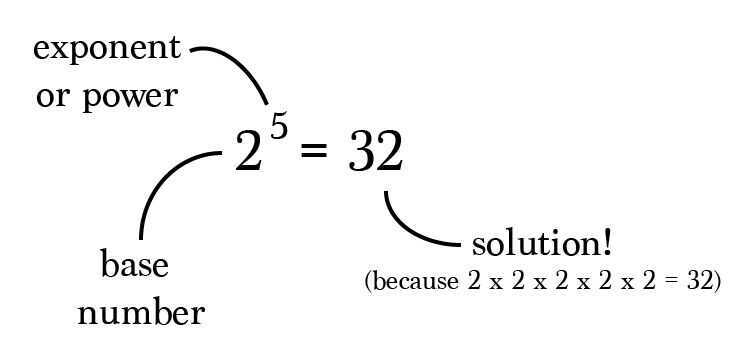
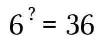
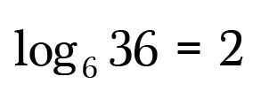
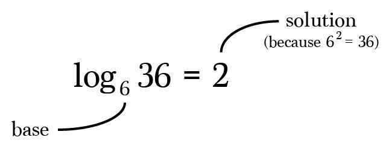
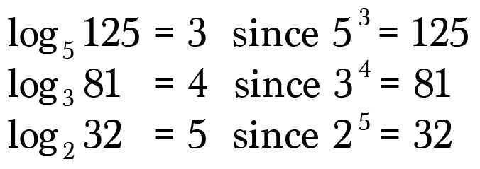
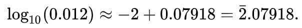
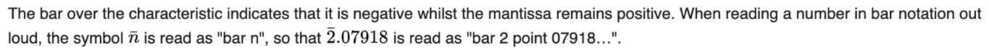

# 2.7. Exponential & logarithms

1. Introduction to logarithms
   - Intro to logarithms
       - Common Logarithm
       - Natural Logarithm

   - Relationship between exponential and logarithms
   - Relationship between exponential and logarithms: Graphs
   - Relationship between exponential and logarithms: Tables

2. The constant *e* and the natural logarithm

   - e and compound interest
   - e as a limit
   - Evaluating natural logarithm with calculator

3. Properties of logarithms

   - The product rule = log~B~ A + log ~B~ C = log ~B~ (A.C)
   - The quotient rule = log~B~ A - log ~B~ C = log ~B~ (A/C)
   - The power rule = A . log~B~ C = log~B~ ( C^A^ )
   - Change of base rule= log~B~ A = log~C~ A / log~C~ B

4. The change of base formula for logarithms
5. Solving exponential equations with logarithms
6. Solving exponential models
7. Graphs of exponential functions
8. Graphs of logarithmic functions
9. Logarithmic scale

   - Richter Scale (is a logarithmic scale)
   - Benford's Law

## Exponentiation

Exponentiation is a [mathematical](https://en.wikipedia.org/wiki/Mathematics)[operation](https://en.wikipedia.org/wiki/Operation_(mathematics)), written as*b^n^*, involving two numbers, the [*base*](https://en.wikipedia.org/wiki/Base_(exponentiation))*b*and the *exponentn*. When *n* is a positive [integer](https://en.wikipedia.org/wiki/Integer), exponentiation corresponds to repeated [multiplication](https://en.wikipedia.org/wiki/Multiplication) of the base: that is,*b^n^*is the [product](https://en.wikipedia.org/wiki/Product_(mathematics)) of multiplying *n* bases

The number we multiply with itself is called the **base**.The number of times we multiply it with itself is called the **power** or **exponent**.

## Properties of exponents

1. Product of powers property

   `x^a^⋅x^b^ = x^(a+b)`

2. Power of a power property

   `(x^a^)^b^ = x^a*b^`

3. Power of a product property

   `(x.y)^a^ = x^a^ * y^a^`

4. Quotient of powers property

   `x^a^/x^b^ = x**^a-b^** , x≠0`

5. Power of a quotient power

   `(x/y)^a^ = x^a^/y^a^ , y≠0`

6. Identity Exponent

   `x^0^ = 1, x≠0`

7. Negative Exponent

   `x **^-a^** = 1/x^a^ , x≠0`

8. Square root of exponents

   `√x =x**^1/2^**`

## Exponentiation by Squaring

- Square and Multiply algorithm
- Binary Exponentiation
<https://www.youtube.com/watch?v=BfNlzdFa_a4&ab_channel=mCoding>

## References

<https://medium.com/i-math/understanding-logarithms-and-roots-2fee92c3317f># Logarithms

thelogarithmis the [inverse operation](https://en.wikipedia.org/wiki/Inverse_operation) to [exponentiation](https://en.wikipedia.org/wiki/Exponentiation), just as division is the inverse of multiplication. That means the logarithm of a number is the [exponent](https://en.wikipedia.org/wiki/Exponent) to which another fixed number, the [base](https://en.wikipedia.org/wiki/Base_(exponentiation)), must be raised to produce that number.
What if we wanted to solve for the exponent in an exponential equation? In other words, we want to reverse the exponentiation. For example, what is the solution to this problem?

Since we've memorized the common powers and roots, we easily identify the solution as 2 since 6 to the power of 2 is 36.
Writing a question mark in the equation isn't formal mathematics, instead we'll write the above expression using**logarithm notation, orlog**for short.

Read: "the log, base six, of thirty-six is2."

The terminology:

Another way to look at this is to ask,

"How many sixes need to be multiplied together to get36?"

Algorithm **solves for the number of repeated multiplications**. Simple as that. Here are a few more examples.

## Special logarithms

While the base of a logarithm can have many different values, there are two bases that are used more often than others.
Specifically, most calculators have buttons for only these two types of logarithms. Let's check them out.

## The common logarithm

Thecommon logarithmis a logarithm whose base is10("base-10logarithm").
When writing these logarithms mathematically, we omit the base. It is understood to be10.

`log10(x)=log(x)`

## The natural logarithm

Thenatural logarithmis a logarithm whose base is the numbere("base-e logarithm").
Instead of writing the base ase, we indicate the logarithm withln.

`loge(x)=ln(x)`

This table summarizes what we need to know about these two special logarithms:

| **Name** | **Base** | **Regular notation** | **Special notation** |
|---|---|---|---|
| Common logarithm | 10 | log10(x) | log(x) |
| Natural logarithm | e | loge(x) | ln(x) |

While the notation is different, the idea behind evaluating the logarithm is exactly the same!

Mathematical Constant -> Euler's Number -> e = 2.71828

e is the epitome of universal growth

Like π, *e* is irrational, it is not ratio of integers
Like π, *e* is transcendental, it is not root of any non-zero polynomial with rational coefficients.
Sequence - A001113 in OEIS (On-Line Encyclopedia of Integer Sequences, Sloane's)
The mathematical constant *e,* is the base of natural logarithm.

## Steps for sketching a graph for any logarithm

1. Determine the correct shape of the graph

2. Determine the position of its asymptote

3. Find two points on the graph
For finding the shape, recall what graph looks like so it can be reduced from that.

## Facts

- Numbers greater than 0 and less than 1 have negative logarithms.

To avoid the need for separate tables to convert positive and negative logarithms back to their original numbers, a bar notation is used:

<https://en.wikipedia.org/wiki/Common_logarithm>
