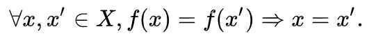
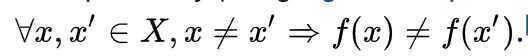
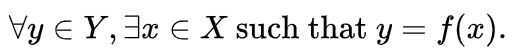

# Sets

Symmetric Difference (**△**) - The symmetric difference of two sets is the collection of elements which are members of either set but not both - in other words, the union of the sets excluding their intersection. Forming the symmetric difference of two sets is simple, but forming the symmetric difference of three sets is a bit trickier

Ex - Given two sets (for example set A = {1, 2, 3} and set B = {2, 3, 4}), the mathematical term "symmetric difference" of two sets is the set of elements which are in either of the two sets, but not in both (A △ B = C = {1, 4}).

## Bijection, injection and surjection

In [mathematics](https://en.wikipedia.org/wiki/Mathematics), injections, surjectionsandbijectionsare classes of [functions](https://en.wikipedia.org/wiki/Function_(mathematics)) distinguished by the manner in which [arguments](https://en.wikipedia.org/wiki/Parameter)(input [expressions](https://en.wikipedia.org/wiki/Expression_(mathematics)) from the [domain](https://en.wikipedia.org/wiki/Domain_(mathematics))) and [images](https://en.wikipedia.org/wiki/Image_(mathematics))(output expressions from the [codomain](https://en.wikipedia.org/wiki/Codomain)) are related ormapped toeach other.
A function [maps](https://en.wikipedia.org/wiki/Map_(mathematics)) elements from its domain to elements in its codomain. Given a function*f: X -> Y*- The function is [injective](https://en.wikipedia.org/wiki/Injective_function), orone-to-one, if each element of the codomain is mapped to byat mostone element of the domain, or equivalently, if distinct elements of the domain map to distinct elements in the codomain. An injective function is also called aninjection.Notationally:

Or, equivalently (using [logical transposition](https://en.wikipedia.org/wiki/Transposition_(logic))),

- The function is [surjective](https://en.wikipedia.org/wiki/Surjective_function), oronto, if each element of the codomain is mapped to byat leastone element of the domain. That is, the image and the codomain of the function are equal. A surjective function is asurjection.Notationally:

- The function is [bijective](https://en.wikipedia.org/wiki/Bijective_function)(one-to-one and ontoorone-to-one correspondence) if each element of the codomain is mapped to byexactlyone element of the domain. That is, the function isbothinjective and surjective. A bijective function is also called abijection.
An injective function need not be surjective (not all elements of the codomain may be associated with arguments), and a surjective function need not be injective (some images may be associated withmore than oneargument). The four possible combinations of injective and surjective features are illustrated in the adjacent diagrams.
<https://en.wikipedia.org/wiki/Bijection,_injection_and_surjection>
