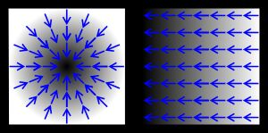

# Gradient

In [mathematics](https://en.wikipedia.org/wiki/Mathematics), the **gradient** is a multi-variable generalization of the [derivative](https://en.wikipedia.org/wiki/Derivative). While a derivative can be defined on functions of a single variable, for [functions of several variables](https://en.wikipedia.org/wiki/Function_of_several_variables), the gradient takes its place. The gradient is a [vector-valued function](https://en.wikipedia.org/wiki/Vector-valued_function), as opposed to a derivative, which is [scalar-valued](https://en.wikipedia.org/wiki/Scalar-valued_function).

Like the derivative, the gradient represents the [slope](https://en.wikipedia.org/wiki/Slope) of the [tangent](https://en.wikipedia.org/wiki/Tangent) of the [graph of the function](https://en.wikipedia.org/wiki/Graph_of_a_function). More precisely, the gradient points in the direction of the greatest rate of increase of the function, and its [magnitude](https://en.wikipedia.org/wiki/Magnitude_(mathematics)) is the slope of the graph in that direction. The components of the gradient in coordinates are the coefficients of the variables in the equation of the [tangent space](https://en.wikipedia.org/wiki/Tangent_space) to the graph. This characterising property of the gradient allows it to be defined independently of a choice of coordinate system, as a [vector field](https://en.wikipedia.org/wiki/Vector_field) whose components in a coordinate system will transform when going from one coordinate system to another.

In the above two images, the values of the function are represented in black and white, black representing higher values, and its corresponding gradient is represented by blue arrows.

https://en.wikipedia.org/wiki/Gradient
