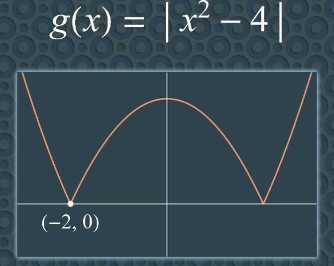
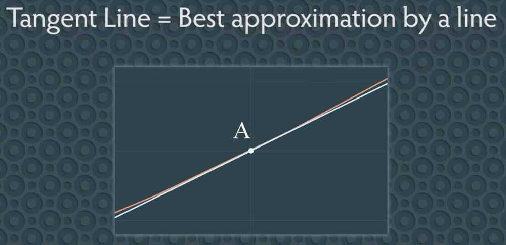

# Tangent Line and the Derivative

## Tangent Line

A line that touches the curve at only one point, and is perpendicular to the point it touches.

Definition - A tangent line to a point A is the limit of the secant lines as P approaches A.

Alternative Definition - The tangent line through a point A is the line that passes through A and whose slope is the derivative at A.

1. Tangent line must touch the curve
2. Limit from left = Limit from right

Therefore this line doesn't have a tangent line at point (0,1), since tangent lines must touch the curve

Since the left hand limit line not equal to right hand limit line, we say limit does not exists, therefore there is no tangent line for the curve at point (-2, 0)

## Secant Line

A line that touches the curve at two points.

### Derivative

## References

[The Tangent Line and the Derivative (Calculus)](https://www.youtube.com/watch?v=O_cwTAfjgAQ)
