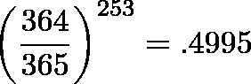

# Birthday Paradox

## Problem - Exponents aren't intuitive

The Birthday Paradox is one of the most surprising results in math. In a room of just 23 people there's a 50-50 chance of two people having the same birthday. In a room of 75 there's a 99.9% chance of two people matching.

Whoa -- why does this happen? It turns out the "paradox" happens because of two common misunderstandings: we think with multiplication (not exponents), and we forget about everyone else in the room.

Instead of just accepting the paradox as true ("fine, it works"), see it as a chance to dig into why math gets confusing. By fixing the root cause, we improve our overall math sense. (This philosophy was a turning point for me: being confused, while frustrating in the moment, is a chance to finally fix a leaky roof.)
1. Exponents aren't Intuitive

2. Humans are a tad bit selfish - They only compare themselves to others, not everyone to everyother person.
