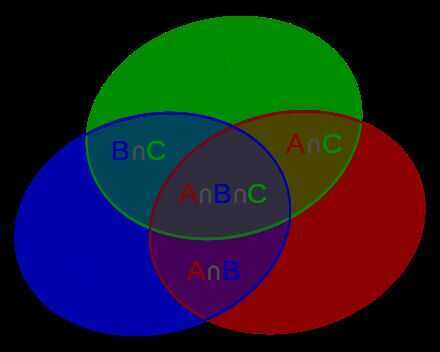

# Inclusion-Exclusion Principle

In [combinatorics](https://en.wikipedia.org/wiki/Combinatorics)(combinatorial mathematics), the**inclusion--exclusion principle**is a counting technique which generalizes the familiar method of obtaining the number of elements in the [union](https://en.wikipedia.org/wiki/Union_(set_theory)) of two finite [sets](https://en.wikipedia.org/wiki/Set_(mathematics)); symbolically expressed as

where *A* and *B* are two finite sets and |*S*| indicates the [cardinality](https://en.wikipedia.org/wiki/Cardinality) of a set*S*(which may be considered as the number of elements of the set, if the set is [finite](https://en.wikipedia.org/wiki/Finite_set)). The formula expresses the fact that the sum of the sizes of the two sets may be too large since some elements may be counted twice. The double-counted elements are those in the [intersection](https://en.wikipedia.org/wiki/Intersection_(set_theory)) of the two sets and the count is corrected by subtracting the size of the intersection.

The principle is more clearly seen in the case of three sets, which for the sets *A*, *B* and *C* is given by

## Illustration using Venn Diagram

## References

- <https://en.wikipedia.org/wiki/Inclusion%E2%80%93exclusion_principle>
