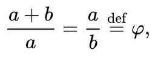
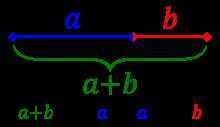

# Golden Ratio - phi

Two quantities are in the**golden ratio** if their [ratio](https://en.wikipedia.org/wiki/Ratio) is the same as the ratio of their [sum](https://en.wikipedia.org/wiki/Summation) to the larger of the two quantities. Expressed algebraically, for quantities *a* and *b* w ith*a*>*b*>0,

where the Greek letter [phi](https://en.wikipedia.org/wiki/Phi_(letter))(ϕorφ) represents the golden ratio. It is an [irrational number](https://en.wikipedia.org/wiki/Irrational_number) with a value of:

The Geometric Relationship -

The golden ratio is also called the **golden mean** or **golden section**. Other names include **extreme and mean ratio**, **medial section**, **divine proportion**, **divine section**, **golden proportion**, **golden cut**, and **golden number**.
