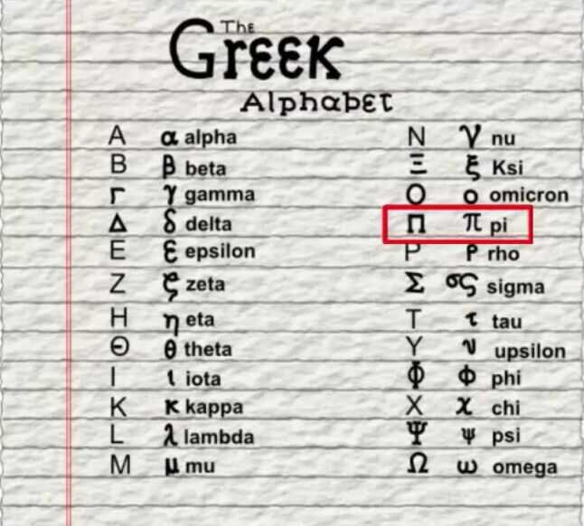

# Greek Letters / Latin

| **Name**                                                                                                                    | **Symbol** | **Name**                                                                                                                    | **Symbol** | **Name**                                                                                                                  | **Symbol** | **Name**                                                                                                                    | **Symbol** | **Name**                                                                                                                    | **Symbol** |
|--------|-------|---------|-------|--------|-------|--------|-------|-------|-------|
| [Alpha](https://en.wikipedia.org/wiki/Greek_letters_used_in_mathematics,_science,_and_engineering#%CE%91%CE%B1_(alpha))     | Α α        | [Digamma](https://en.wikipedia.org/wiki/Greek_letters_used_in_mathematics,_science,_and_engineering#%CF%9C%CF%9D_(digamma)) | Ϝ ϝ        | [Kappa](https://en.wikipedia.org/wiki/Greek_letters_used_in_mathematics,_science,_and_engineering#%CE%9A%CE%BA_(kappa))   | Κ κ ϰ      | [Omicron](https://en.wikipedia.org/wiki/Greek_letters_used_in_mathematics,_science,_and_engineering#%CE%9F%CE%BF_(omicron)) | Ο ο        | [Upsilon](https://en.wikipedia.org/wiki/Greek_letters_used_in_mathematics,_science,_and_engineering#%CE%A5%CF%85_(upsilon)) | Υ υ        |
| [Beta](https://en.wikipedia.org/wiki/Greek_letters_used_in_mathematics,_science,_and_engineering#%CE%92%CE%B2_(beta))       | Β β        | [Zeta](https://en.wikipedia.org/wiki/Greek_letters_used_in_mathematics,_science,_and_engineering#%CE%96%CE%B6_(zeta))       | Ζ ζ        | [Lambda](https://en.wikipedia.org/wiki/Greek_letters_used_in_mathematics,_science,_and_engineering#%CE%9B%CE%BB_(lambda)) | Λ λ        | [Pi](https://en.wikipedia.org/wiki/Greek_letters_used_in_mathematics,_science,_and_engineering#%CE%A0%CF%80_(pi))           | Π π ϖ      | [Phi](https://en.wikipedia.org/wiki/Greek_letters_used_in_mathematics,_science,_and_engineering#%CE%A6%CF%86_(phi))         | Φ ϕ φ      |
| [Gamma](https://en.wikipedia.org/wiki/Greek_letters_used_in_mathematics,_science,_and_engineering#%CE%93%CE%B3_(gamma))     | Γ γ        | [Eta](https://en.wikipedia.org/wiki/Greek_letters_used_in_mathematics,_science,_and_engineering#%CE%97%CE%B7_(eta))         | Η η        | [Mu](https://en.wikipedia.org/wiki/Greek_letters_used_in_mathematics,_science,_and_engineering#%CE%9C%CE%BC_(mu))         | Μ μ        | [Rho](https://en.wikipedia.org/wiki/Greek_letters_used_in_mathematics,_science,_and_engineering#%CE%A1%CF%81_(rho))         | Ρ ρ ϱ      | [Chi](https://en.wikipedia.org/wiki/Greek_letters_used_in_mathematics,_science,_and_engineering#%CE%A7%CF%87_(chi))         | Χ χ        |
| [Delta](https://en.wikipedia.org/wiki/Greek_letters_used_in_mathematics,_science,_and_engineering#%CE%94%CE%B4_(delta))     | Δ δ        | [Theta](https://en.wikipedia.org/wiki/Greek_letters_used_in_mathematics,_science,_and_engineering#%CE%98%CE%B8_(theta))     | Θ θ ϑ      | [Nu](https://en.wikipedia.org/wiki/Greek_letters_used_in_mathematics,_science,_and_engineering#%CE%9D%CE%BD_(nu))         | Ν ν        | [Sigma](https://en.wikipedia.org/wiki/Greek_letters_used_in_mathematics,_science,_and_engineering#%CE%A3%CF%83_(sigma))     | Σ σ ς      | [Psi](https://en.wikipedia.org/wiki/Greek_letters_used_in_mathematics,_science,_and_engineering#%CE%A8%CF%88_(psi))         | Ψ ψ        |
| [Epsilon](https://en.wikipedia.org/wiki/Greek_letters_used_in_mathematics,_science,_and_engineering#%CE%95%CE%B5_(epsilon)) | Ε ϵ ε      | [Iota](https://en.wikipedia.org/wiki/Greek_letters_used_in_mathematics,_science,_and_engineering#%CE%99%CE%B9_(iota))       | Ι ι        | [Xi](https://en.wikipedia.org/wiki/Greek_letters_used_in_mathematics,_science,_and_engineering#%CE%9E%CE%BE_(xi)) / Ksi   | Ξ ξ        | [Tau](https://en.wikipedia.org/wiki/Greek_letters_used_in_mathematics,_science,_and_engineering#%CE%A4%CF%84_(tau))         | Τ τ        | [Omega](https://en.wikipedia.org/wiki/Greek_letters_used_in_mathematics,_science,_and_engineering#%CE%A9%CF%89_(omega))     | Ω ω        |

## Others

Union - ∪

Intersection - **∩**

Subset - ⊆

Proper subset - ⊂

Not subset - ⊄

Superset - ⊇

Proper superset - ⊃

Not superset - ⊅

Symmetric difference - ∆ / ⊖

Element of - ∈

Not element of - ∉

Universal quantifier - ∀

Plus-minus sigh - ±

## Hebrew Letter

aleph - א

## References

<https://en.wikipedia.org/wiki/Greek_letters_used_in_mathematics,_science,_and_engineering>
