# Logic

## Conceptions of logic

- Logic as a way to evaluate reasoning
- Logic as a way of looking at language in general

## Concpets of Logic

- Informal logic
- Formal logic
- Symbolic logic
- Mathematical logic

## Types of Logic

- Syllogistic logic
- Propositional logic
- Predicate logic
- Modal logic
- Informal reasoning and dialectic
- Mathematical logic
- Philosophical logic
- Computational logic
- Non-classical logic
Symbolic Logic
- Constants - symbols with fixed meaning
- Variables - symbols with no fixed meaning
  - for variables: x, y, z
  - for statements: p and q

## Statements

- have a subject and predicate
- composed of atleast one symbol
Subject

A subject is a term that a predicate says something about.

- part of sentence frame
- topic of a sentence
- main argument of verb
Predicate (denoted by capital alphabets)

A predicate is a term that says something about a subject.

- part of sentence frame
- comments on subject
- verb and all non-subject arguments

Predicate comes first

## Valency

This is the number of terms that predicate says something about.

Lx,Rx - 1 slots (x), Valency - 1

Sxy - 2 slots (x, y), Valency - 2

Gxyz - 3 slots (x, y, z), Valency - 3

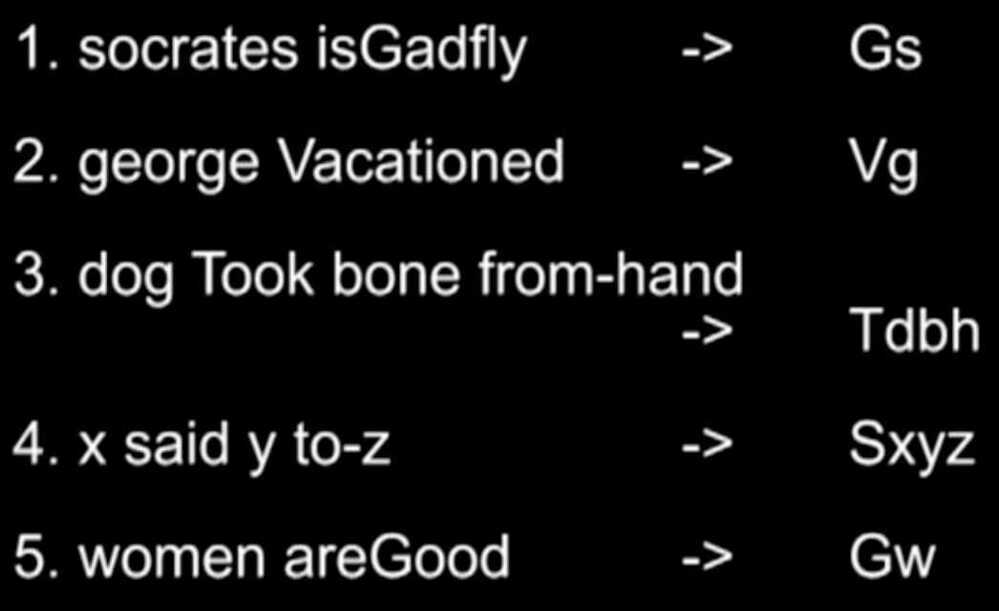

## Quantifiers & Bound Variables

- quantity: how many?
- examples from language include singular (1) & plural (1 or more)
- three logical quantifiers
  - all
  - some (at least 1)
  - none

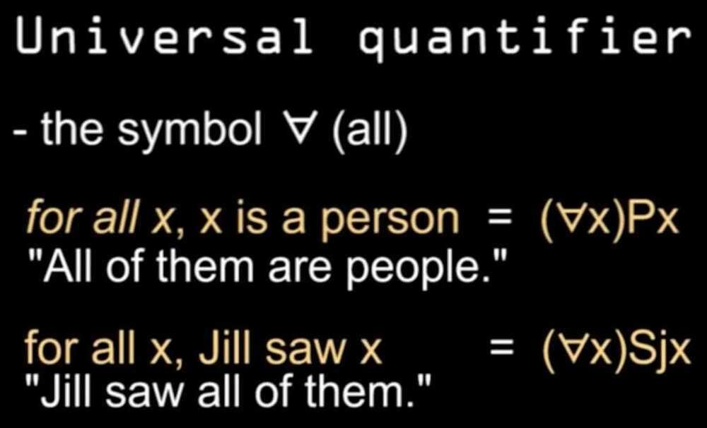

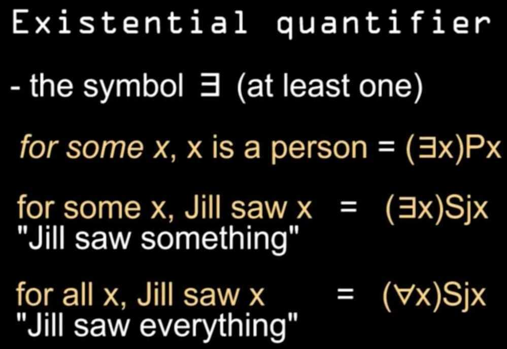

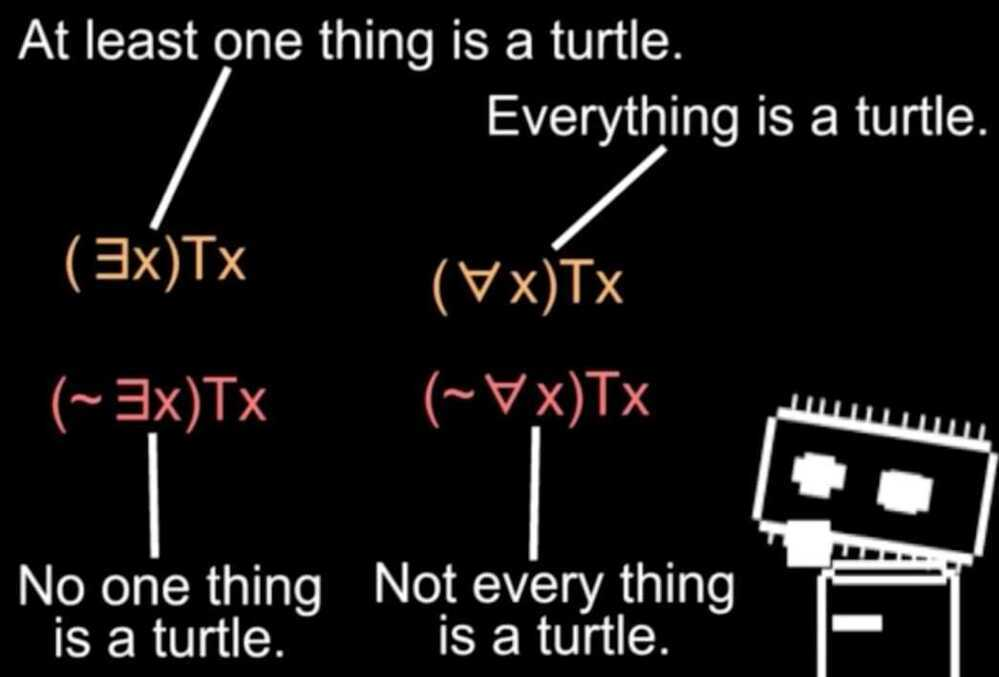

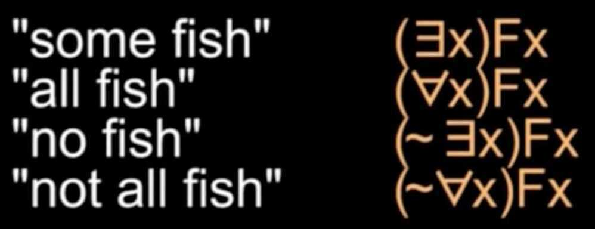

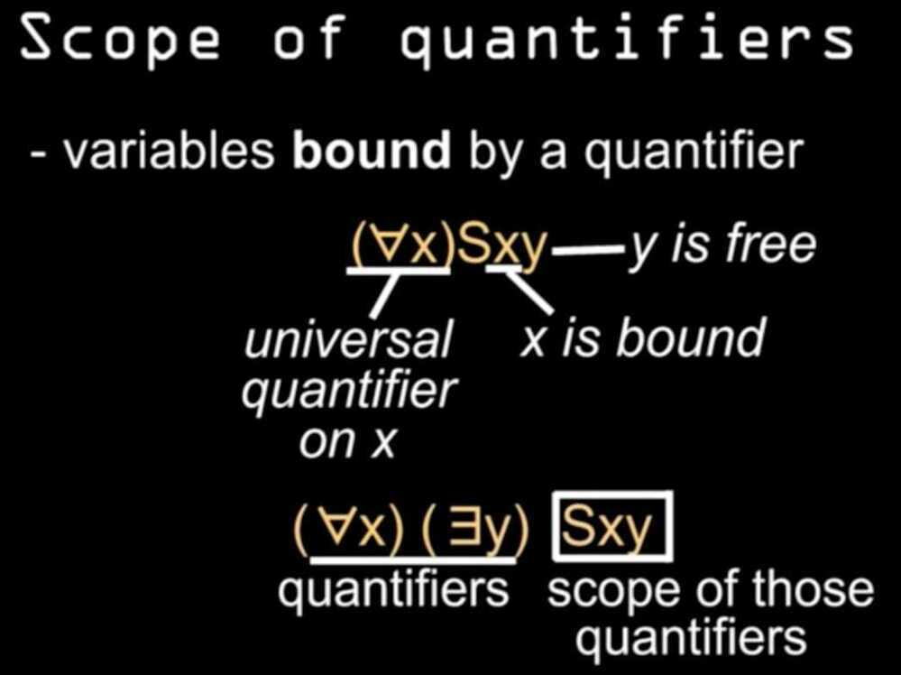

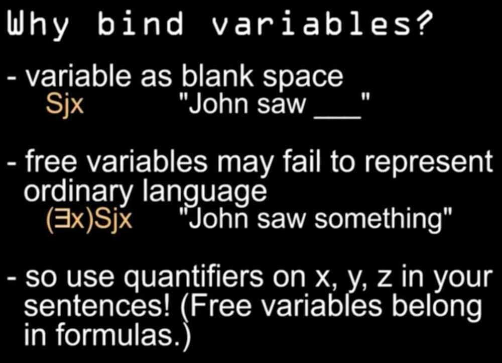

# Logical Operators/Connectives

- **Logical conjuction**
- join symbols with "and" (. & Λ)
- conjuction with statements p.q
- conjunction with variables x.y

- **Logical disjunction**
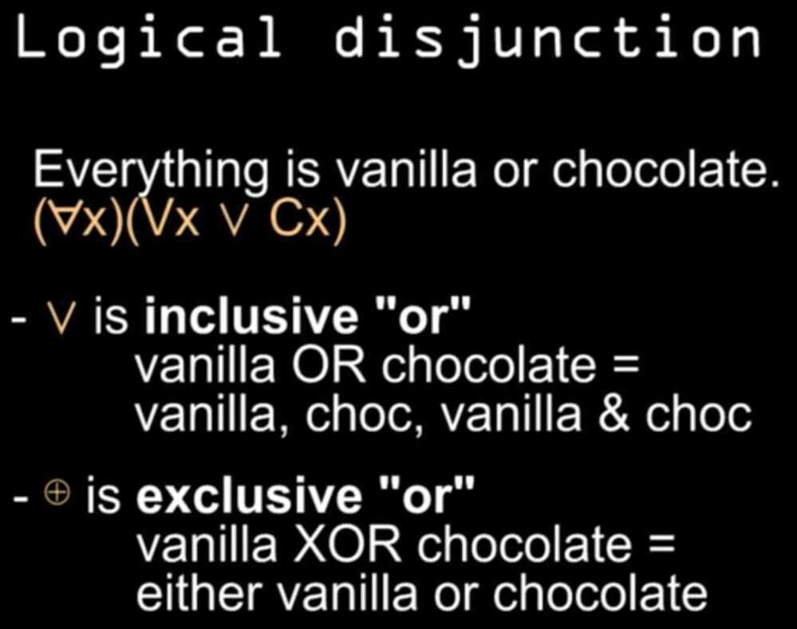

## Logical Equivalence ( = )

## Conditional

## Biconditional

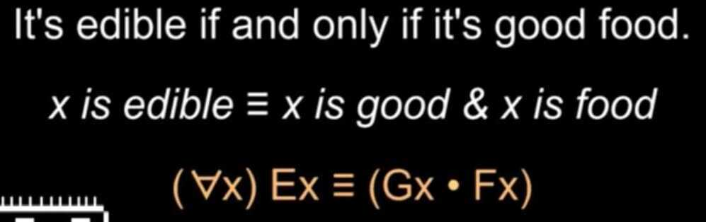

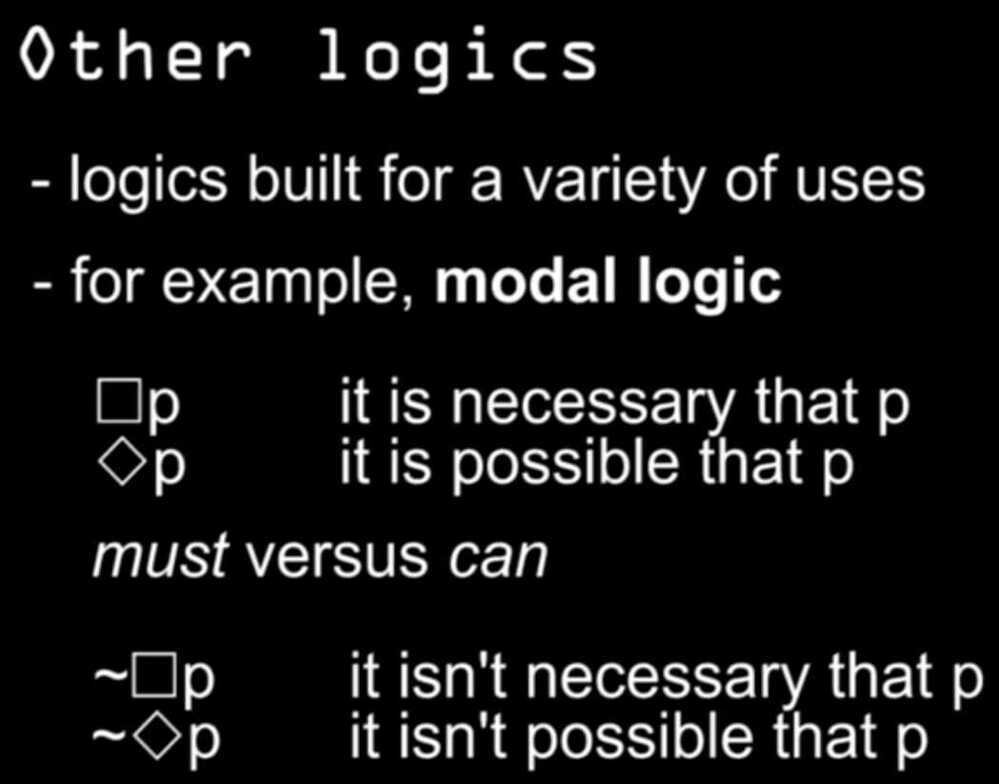

## The language of sets & probability

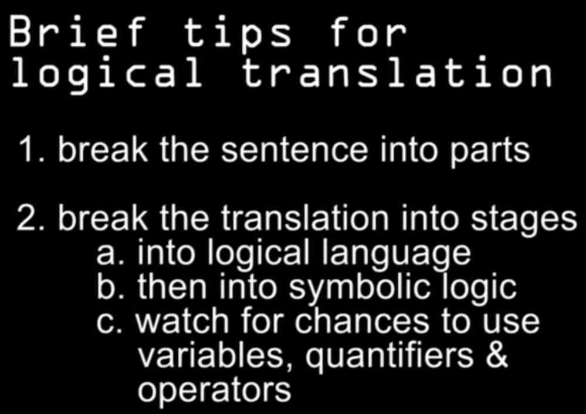

- Intersection

- Union

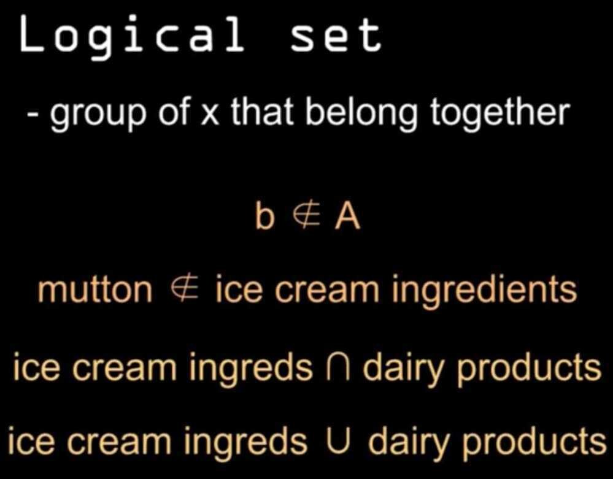

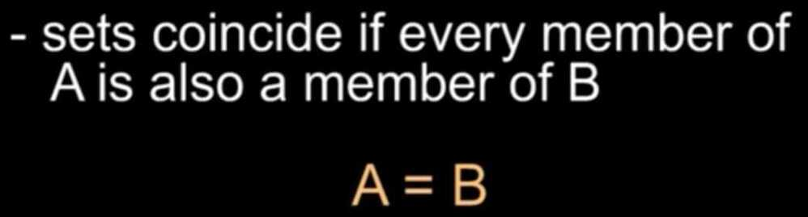

## Probability

- probability of A or B, P(A U B)
- probability of A and B, P(A **∩** B)
- probability of A given B, P(A | B)
- probability of B given A, P(B | A)

## Other Logics

- Inverse
- Converse
- Contrapositive

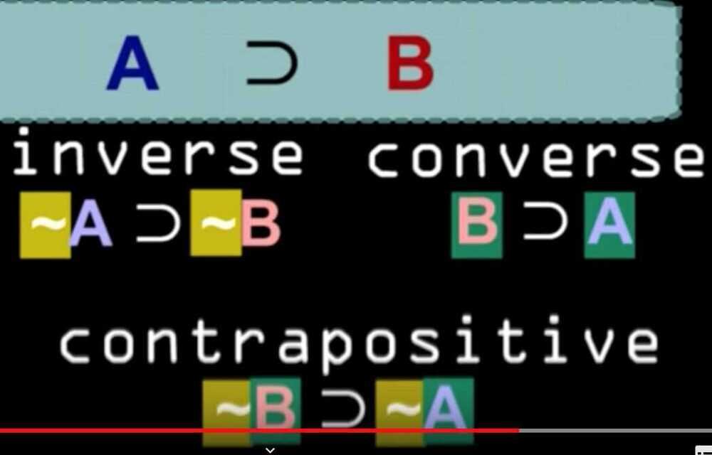

## Fallacy

A logical fallacy allows an argument to persuade even though the conclusion does not follow the premises.

- Ad Baculum - *I'll hit you unless* you accept that A is C. Therefore A is C

This only supports the conclusion *I'll hit you*, Not that A is C

- Ad Hominem - *John's an idiot* and he says that A is not C. Therefore A is C

This only supports the conclusion *One idiot doesn't agree.* Not that A is C.

- Ad Verecundiam - *Experts agree* that A is C. Therefore A is C

This only supports the conclusion *Experts agree.* Not that A is C.

- Ad Misericordiam - *It will be so tragic* if A isn't C. Therefore A is C

This only supports the conclusion *It's tragic.* Not that A is C.

## Logic

- Arguments (premises, conclusion)
- Validity
- Truth values
- Soundness
- Basic Syllogism
- Deduction (deductive reasoning)
- Induction (inductive reasoning)
- Cogent argument
- coherence
- correspondence
- foundationalism
- pragmatic
- consensus
- deflationary

## References

[Logic & Language - a short introduction to logic](https://www.youtube.com/playlist?list=PL48654681292CF456)
