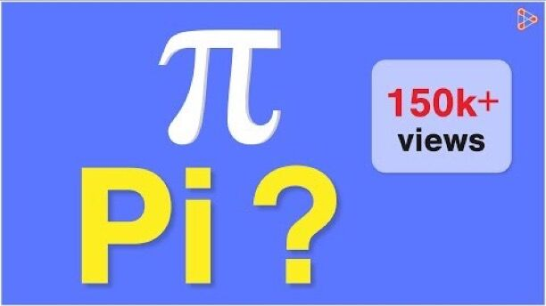
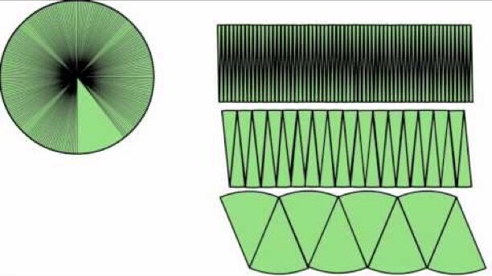

# Pie

Pie is the ratio of circumference of a circle to its diameter

[What is Pi?](https://www.youtube.com/watch?v=DLcjed7qy4I)

[Area of a circle, how to get the formula.](https://www.youtube.com/watch?v=YokKp3pwVFc)

