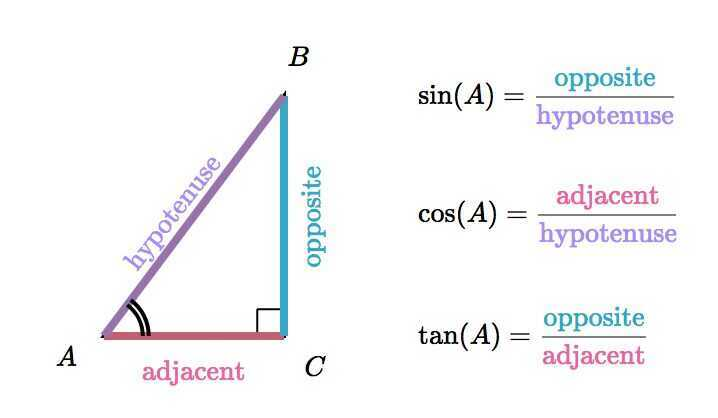

# Right Triangles and Geometry

1. [Pythagorean theorem](https://www.khanacademy.org/math/geometry/hs-geo-trig#hs-geo-pyth-theorem)

2. [Pythagorean theorem proofs](https://www.khanacademy.org/math/geometry/hs-geo-trig#hs-geo-pythagorean-proofs)

3. [Special right triangles](https://www.khanacademy.org/math/geometry/hs-geo-trig#hs-geo-special-right-triangles)
    - 30-60-90 triangle rule

    

4. [Introduction to the trigonometric ratios](https://www.khanacademy.org/math/geometry/hs-geo-trig#hs-geo-trig-ratios-intro)

    

    Mnemonic - SOH CAH TOA

    Sine - Opposite / Hypotenuse

    Cosine - Adjacent / Hypotenuse

    Tangent - Opposite / Adjacent

    

5. [Solving for a side in a right triangle using the trigonometric ratios:](https://www.khanacademy.org/math/geometry/hs-geo-trig#hs-geo-solve-for-a-side)

6. [Solving for an angle in a right triangle using the trigonometric ratios](https://www.khanacademy.org/math/geometry/hs-geo-trig#hs-geo-solve-for-an-angle)

7. [Modeling with right triangles](https://www.khanacademy.org/math/geometry/hs-geo-trig#hs-geo-modeling-with-right-triangles)

8. [Trigonometric ratios & similarity](https://www.khanacademy.org/math/geometry/hs-geo-trig#hs-geo-trig-ratios-similarity)

9. [Sine & cosine of complementary angles](https://www.khanacademy.org/math/geometry/hs-geo-trig#hs-geo-complementary-angles)

10. [Law of sines](https://www.khanacademy.org/math/geometry/hs-geo-trig#hs-geo-law-of-sines)

11. [Law of cosines](https://www.khanacademy.org/math/geometry/hs-geo-trig#hs-geo-law-of-cosines) `C^2^ = A^2^ + B^2^ - 2.A.B.cos **Θ**`

12. [Solving general triangles](https://www.khanacademy.org/math/geometry/hs-geo-trig#hs-geo-solving-general-triangles)
