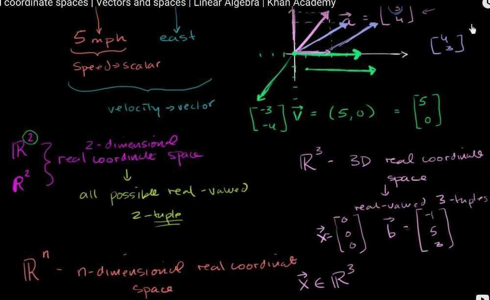

# Vectors and Spaces

## [Vectors](https://www.khanacademy.org/math/linear-algebra/vectors-and-spaces#vectors)

- Vector = Magnitude + Direction

Ex - 5mph is a scaler quantity, because it doesn't tell the direction in which object is moving.

Ex - 5mph East is a vector quantity (and we will not call this as speed, we will call this as velocity, therefore velocity is a vector quantity)



- Real Coordinate Space - Can be any dimensions, all possible real-valued ordered 2-tuple for a 2 dimensional real coordinate space.

- Adding Vectors algebraically and graphically
- Multiplying vector by a scaler ( change its magnitude, but scale it only on the same dimension, colinear )
- Unit Vectors


- Parametric representations of the line

## [Linear combinations and spans](https://www.khanacademy.org/math/linear-algebra/vectors-and-spaces#linear-combinations)

`span(v1 + v2 + v3 + ... + vn) = {c1v1 + c2v2 + c3v3 + ... + cnvn | ci belongs to set of Real numbers and 1 <= i <= n}`

## [Linear dependence and independence](https://www.khanacademy.org/math/linear-algebra/vectors-and-spaces#linear-independence)

- Linear dependent - Means one vector in the set can be represented as other vectors in the set.

- Linear Independent - If we cannot scale using any scalar one vector to the other vector in the set, than both are linearly independent of each other

C1 and C2 must be equal to 0 for R2

## [Subspaces and the basis for a subspace](https://www.khanacademy.org/math/linear-algebra/vectors-and-spaces#subspace-basis)

- Must contain 0 vector
- **Closure under scalar Multiplication -** In order to be in a subspace, any vector multiplied by a real scalar must also be in the subspace
- **Closure under Addition -** If we add two vectors belonging to the same subspace, than the addition of both the vectors must also belong to the same subspace.
- Span of n vectors is a valid subspace of Rn
- **S is a basis of V**, if something is a basis for a set, that means that, if you take the span of those vectors, you can get to any of the vectors in that subspace and that those vectors are linearly independent.
  - Span (s) = R2
  - Must be Linearly Independent
  - Standard Basis = `T = {[1 0] , [0 1]}`

## [Vector dot and cross products](https://www.khanacademy.org/math/linear-algebra/vectors-and-spaces#dot-cross-products)

- Dot product
- Vector dot product is commutative, V.W = W.V
- Vector dot product is distributive, (V + W).X = (V.X + W.X)
- Vector dot product is associative ( (c.V).W = c.(V.W) )
- Length of vector X = ||X||
- `||X||^2^ = X.X`
- Cauchy -Schwarz inequality

```bash
  - |X.Y|<= ||X||.||Y||
  - |X.Y| = ||X||.||Y|| only when X and Y are colinear i.e. X = c.Y
```

- Vector Triangle Inequality
- Angles between Vectors
  - (A.B) = ||A||*||B||*cos **Θ**
  - If A and B are perpendicular than there dot product is 0, since cos **90 = 0**
  - If A.B = 0 (dot product of vector A and dot product of vector B is equal to 0) and A and B are non zero vectors than A and B are perpendicular to each other.
  - But if only A.B = 0 satisfies, than A and B are orthogonal
  - All perpendicular vectors are Orthogonal
  - Zero vector is orthogonal to everything else, even to itself

## [Matrices for solving systems by elimination](https://www.khanacademy.org/math/linear-algebra/vectors-and-spaces#matrices-elimination)

## [Null space and column space](https://www.khanacademy.org/math/linear-algebra/vectors-and-spaces#null-column-space)

## References

https://www.khanacademy.org/math/linear-algebra/vectors-and-spaces
