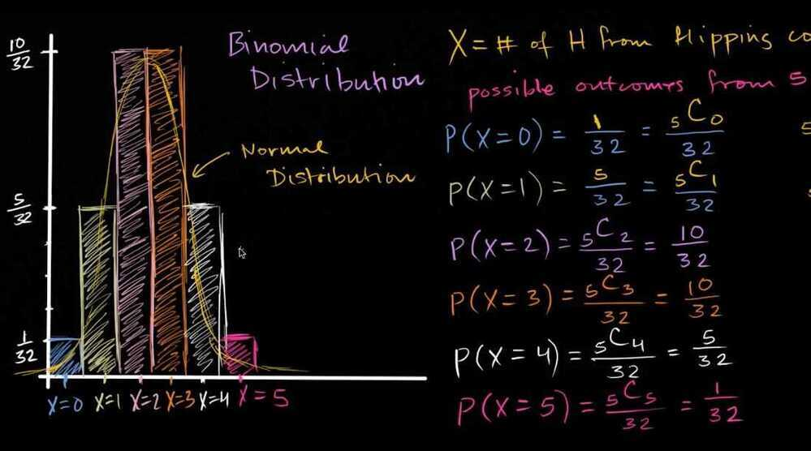

# Binomial Random Variables

1. Binomial Random Variables

The conditions of a binomial random variable are -

- Made up of independent trials
- Each trial can be classified as either success or failure
- Fixed number of trials
- Probability of success on each trial is constant
Ex - X = Number of heads after 10 flips of a coin with P(H) = 0.6 and P(T) = 0.4

Not binomial variable - Number of kings after taking 2 cards from standard deck without replacement (It doesn't meet independent trial, the second trial depends on 1st trial)
SRS - Simple Random Sample, is a sample taken so that each member in a set of n members has an equal chance of being in the sample.
2. Distributions

- Normal distribution, (Continuous distribution - bell curve)

- Binomial distributions (Normal distributions with discrete steps)

- 10% rule of assuming independence between trials

- Binomial Distribution

- Binompdf (Binomial Probability Distribution Function) and Binomcdf (Binomial Cumulative Distribution Function) functions

- Bimodal distribution

- Uniform distribution

- Bernoulli distribution

## Others

- **Galton Board** - Every time creates normal distribution, pegs are arranged in pattern of **Quincunx (pattern of 5 pegs, where 4 are on sides of square and 1 in middle, like dice - 5)**
- Follow Binomial Distribution (**Central limit theorem**, says that under large number of trials like 3000 balls a binomial distribution approximates a normal distribution)
- **Pascal's Triangle**

- **Creates Fibonacci Series**

- **Rows gives sequence of coefficients in binomial powers**

## (a + b)^2^ = a^2^ + 2.a.b + b^2^ [FOIL - First, Outer, Inner, Last]

(a+b)^4^ = a^4^+ **4** a^3^b + **6** a^2^b^2^+ **4** ab^3^+ b^4^

These have same coefficients as 4th row of pascal's triangle
[The Galton Board](https://www.youtube.com/watch?v=UCmPmkHqHXk)

## References

<https://www.khanacademy.org/math/statistics-probability/random-variables-stats-library/binomial-random-variables/v/binomial-variables>
