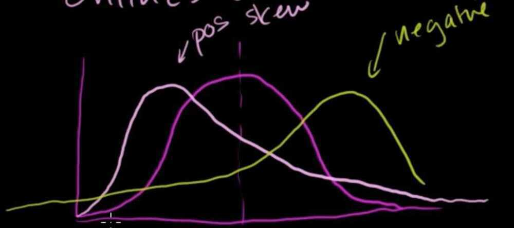
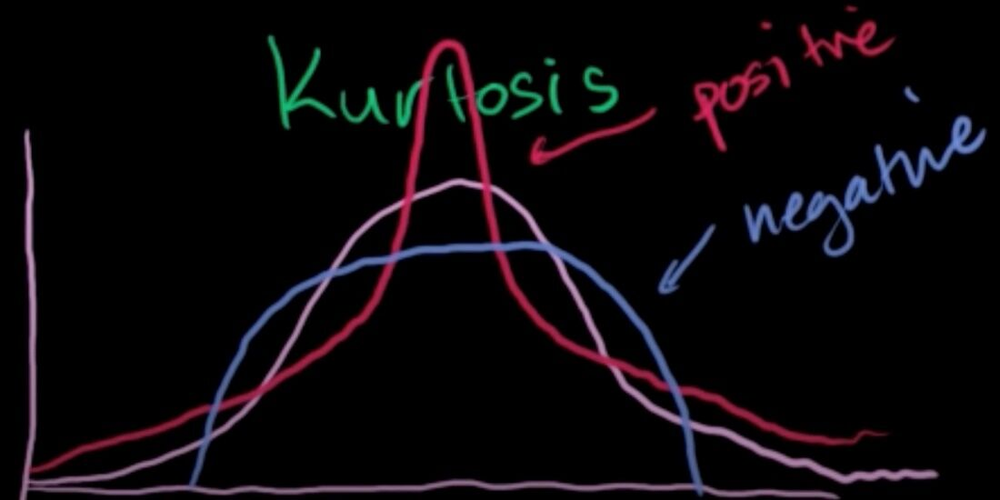

# Central Limit Theorem

In [probability theory](https://en.wikipedia.org/wiki/Probability_theory), thecentral limit theorem(CLT) establishes that, in some situations, when [independent random variables](https://en.wikipedia.org/wiki/Statistical_independence) are added, their properly normalized sum tends toward a [normal distribution](https://en.wikipedia.org/wiki/Normal_distribution)(informally a "bell curve") even if the original variables themselves are not normally distributed. The theorem is a key concept in probability theory because it implies that probabilistic and statistical methods that work for normal distributions can be applicable to many problems involving other types of distributions.
The distribution of sample means for an independent random variable, will get closer and closer to a normal distribution as the size of the sample gets bigger and bigger, even if the original population distribution isn't normal itself

## What is the Central Limit Theorem and why is it important?

Suppose that we are interested in estimating the average height among all people. Collecting data for every person in the world is impossible. While we can't obtain a height measurement from everyone in the population, we can still sample some people. The question now becomes, what can we say about the average height of the entire population given a single sample. The Central Limit Theorem addresses this question exactly.
Formally, it states that if we sample from a population using a sufficiently large sample size, the mean of the samples (also known as thesample population) will be normally distributed (assuming true random sampling). What's especially important is that this will be trueregardlessof the distribution of the original population.
<https://spin.atomicobject.com/2015/02/12/central-limit-theorem-intro>

<https://en.wikipedia.org/wiki/Central_limit_theorem>

<https://www.khanacademy.org/math/statistics-probability/sampling-distributions-library/sample-means/v/central-limit-theorem>

## What is the fundamental difference between the Law of large numbers & the Central limit theorom?

The Law of Large Numbers basically tells us that if we take a sample (n) observations of our random variable & avg the observation (mean)-- it will approach the expected value E(x) of the random variable.
The Central Limit Theorem, tells us that if we take the mean of the samples (n) and plot the frequencies of their mean, we get a normal distribution! And as the sample size (n) increases --> approaches infinity, we find a normal distribution.

## Sampling distribution of the sample mean

## Positive skew and negative skew in a probability distribution

## Positive Kurtosis and Negative Kurtosis in a probability distribution

Positive Kurtosis - Fatter tails and pointy middle

Negative Kurtosis

## Chebyshev's inquality

In a normal distribution, for instance, roughly two thirds of the values have to fall within one standard deviation of the mean and 95% within two standard deviations. Chebyshev's inequality is more general, stating that a minmum of just 75% of values must lie within two standard deviations of the mean and 88.89% within three standard deviations for a broad range of different probability distributions
