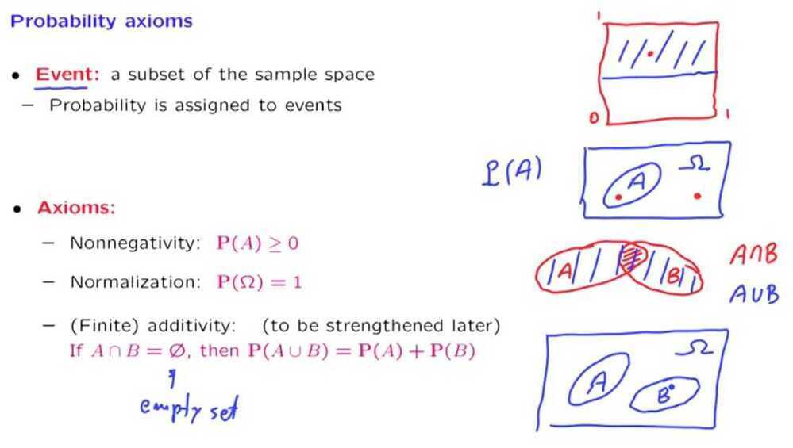
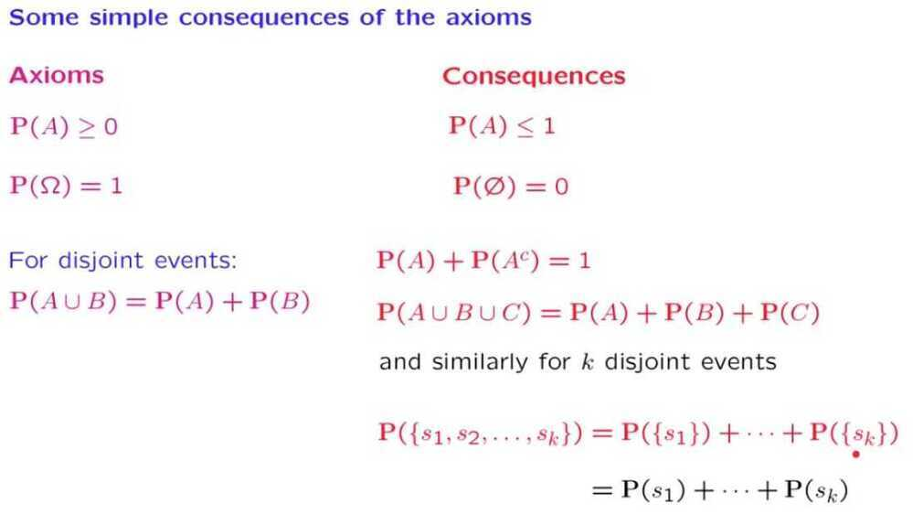
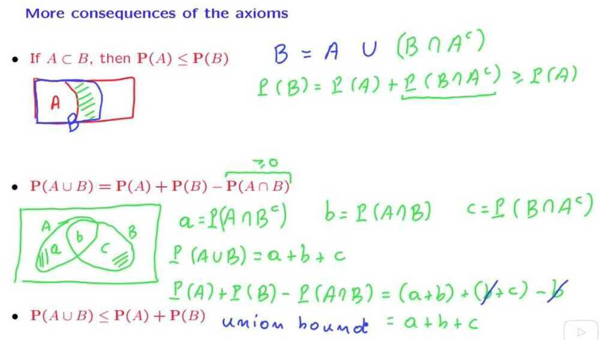
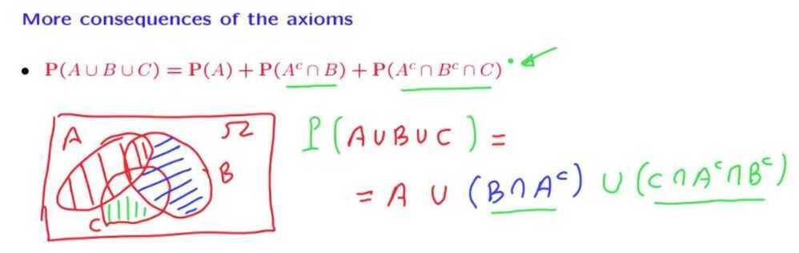
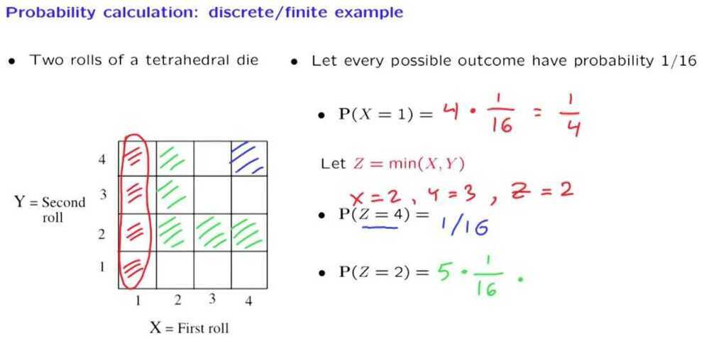
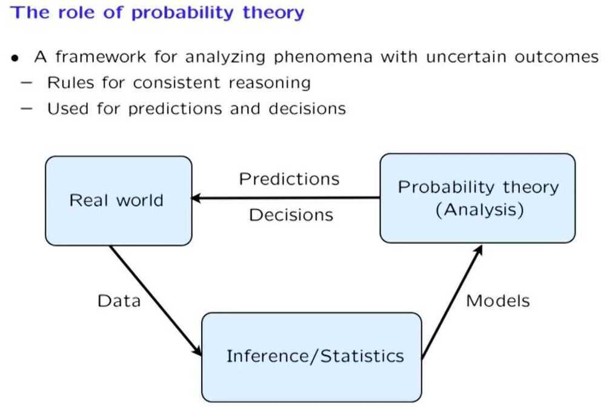

# 1. Probability Models and Axioms

Basic structure of probability models, including the sample space and the axioms that any probabilistic model should obey, together with some consequences of the axioms and some simple examples.

## Probabilistic Model

A probabilistic model is a quantitative description of a situation, a phenomenon or an experiment whose outcome is uncertain.

Putting together such a model involves two key steps -

1. We need to describe the possible outcomes of the experiment. This is done by specifying a so-called sample space.

2. We specify a probability law, which assigns probabilities to outcomes or to collections of outcomes. (tells us whether one outcome is much more likely than some other outcome)

Probabilities have to satisfy certain basic properties in order to be meaningful, these are the axioms of probability theory. For example probabilities cannot be negative.

Sample spaces are sets. And a set can be discrete, finite, infinite, continuous, and so on.

### Discrete Uniform Law

It says that when our sample space is discrete, and when the outcomes in our sample space are equally likely, then to compute the probability of any event A, we can simply count the number of outcomes in A and divide it by the total number of possible outcomes

Discrete and Infinite sample space - We toss a coin until we see a head

