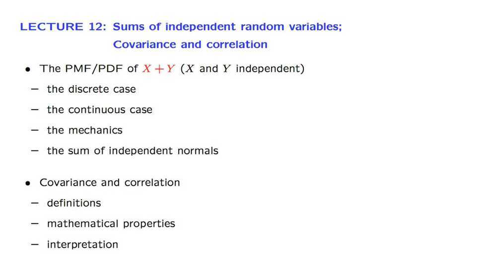

# 12. Sums of independent r.v.'s; Covariance and Correlation

Covariance in general tells us whether two random variables tend to move together, both being high or both being low, in some average or typical sense.
