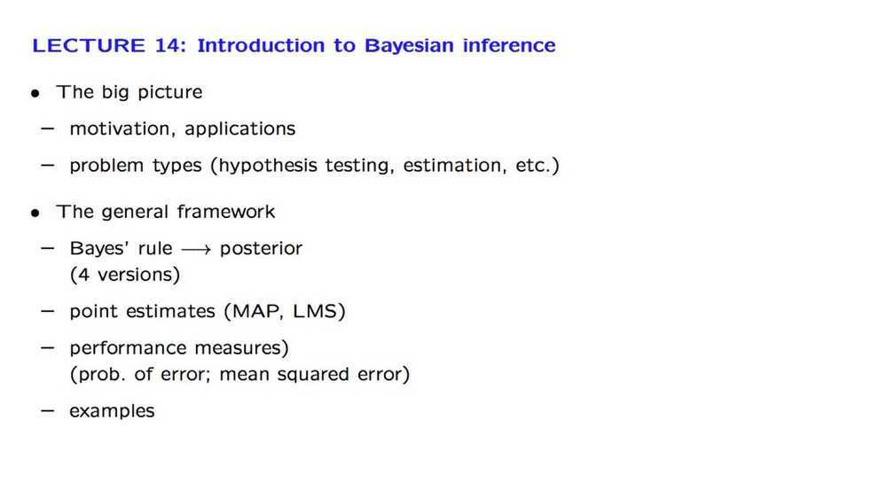
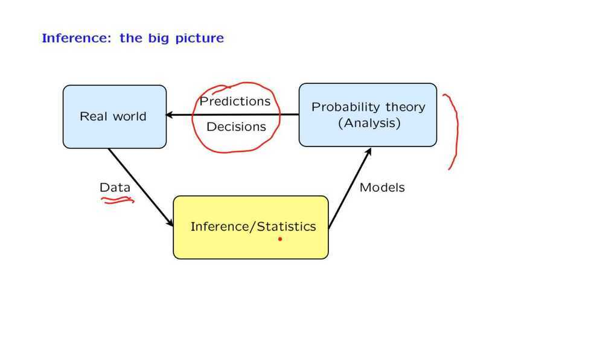
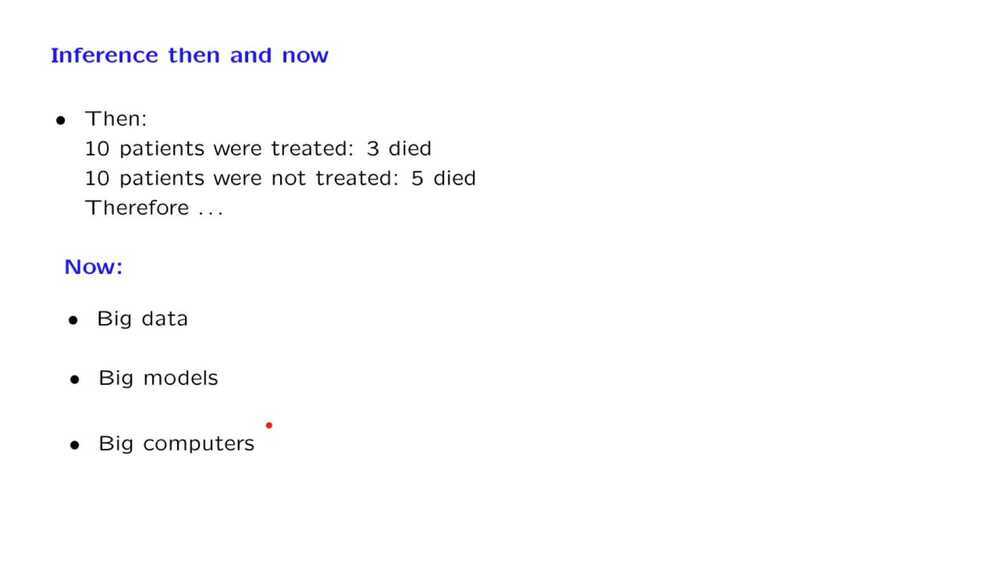
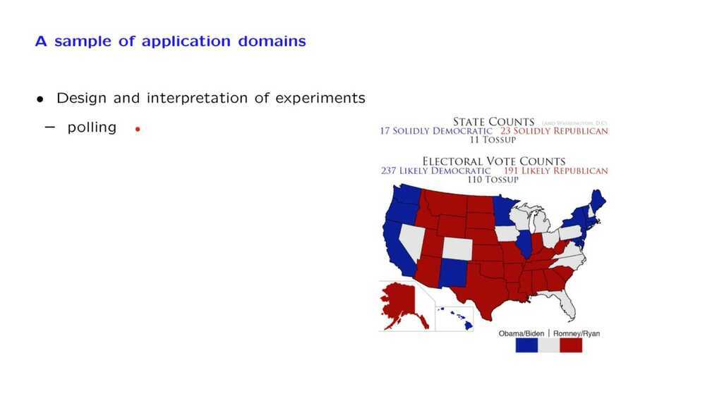
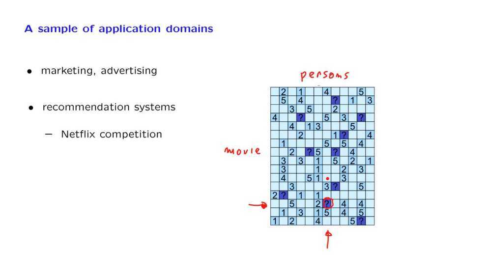
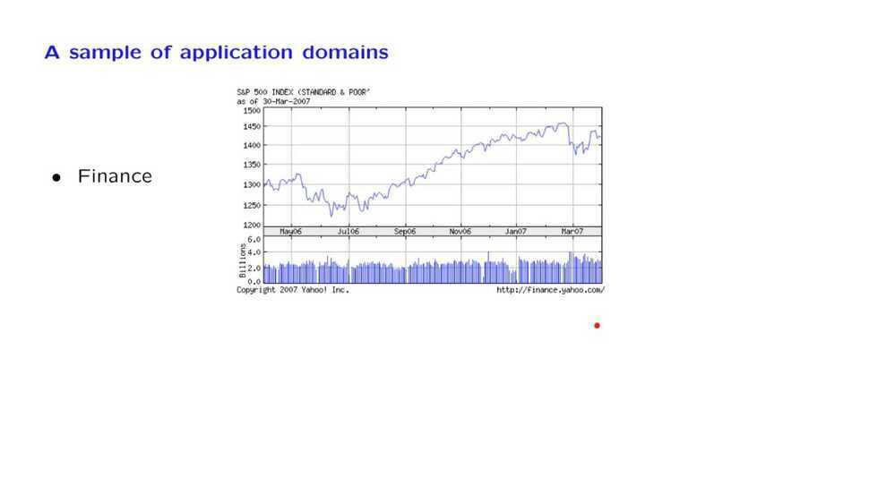
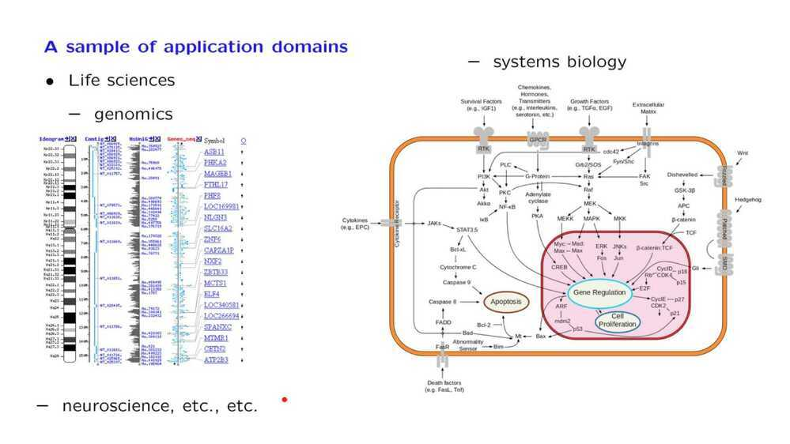
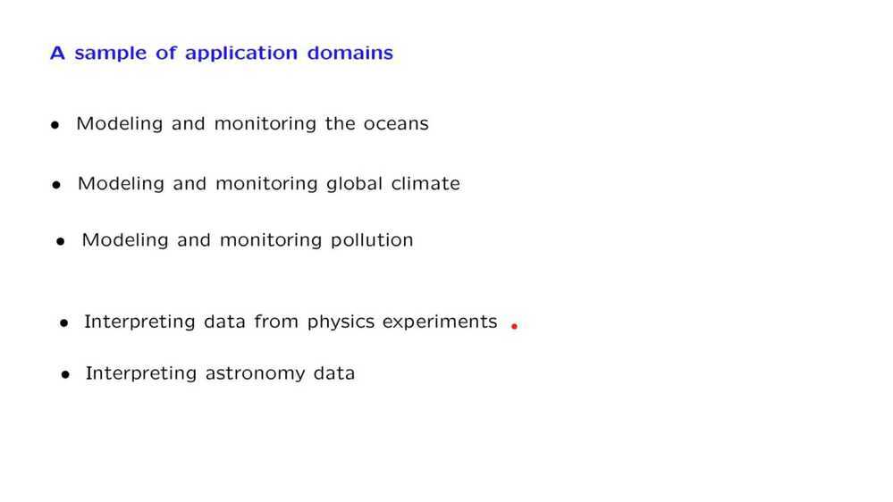
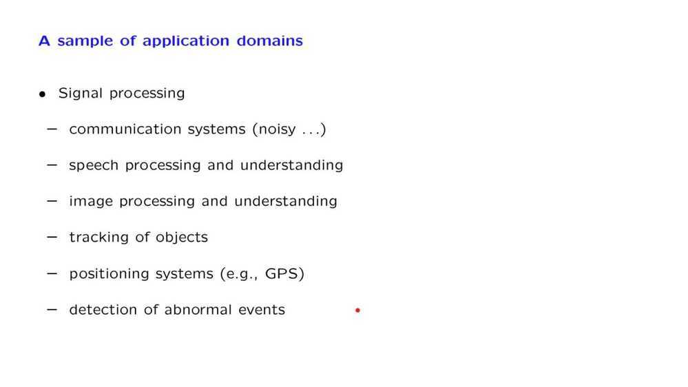

# 14. Intro to Bayesian Inference

## The power of Bayesian statistics

- Outcome characterization - This is the distribution of things that happened
- Latent factor analysis - These are the things affect your outcome
- Decision making - Given all the potential outcomes here's the most optimal choice we should make today

<https://www.youtube.com/watch?v=pJH_2y9J9-I>

- We apply the Bayes rule to find the posterior distribution of an unknown random variable given one or multiple observations of related random variables.

- We discuss the most common methods for coming up with a point estimate of the unknown random variable (Maximum a Posteriori probability estimate, Least Mean Squares estimate, and Linear Least Mean Squares estimate).

- We consider the question of performance analysis, namely, the calculation of the probability of error in hypothesis testing problems or the calculation of the mean squared error in estimation problems.

- To illustrate the methodology, we pay special attention to a few canonical problems such as linear normal models and the problem of estimating the unknown bias of a coin.

[Bayes theorem, and making probability intuitive](https://www.youtube.com/watch?v=HZGCoVF3YvM)- Bayes' theorem describe the probability of an event occurring, based upon prior knowledge of other variables related to that event
    - In effect, it is a conditional probability, with the probability of an event conditioned on the information/knowledge you have
    - Since the information/knowledge that different individuals can have about an event can vary, Bayes' thorem allows for differences in probability estimates for the same event across individuals

- In Bayesian Inference, you update the probability of an event happening as you receive new evidence or information
  - The probability that you assign to an event before you receive the new information represent your priors
  - The probability that you assign to that same event after receiving and processing new information represent your posterior estimate
