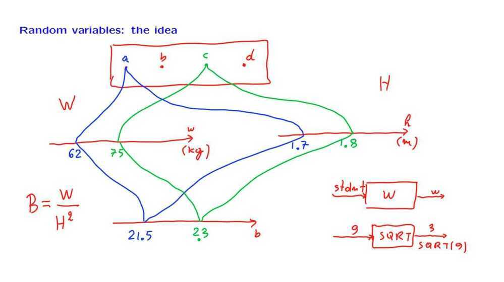
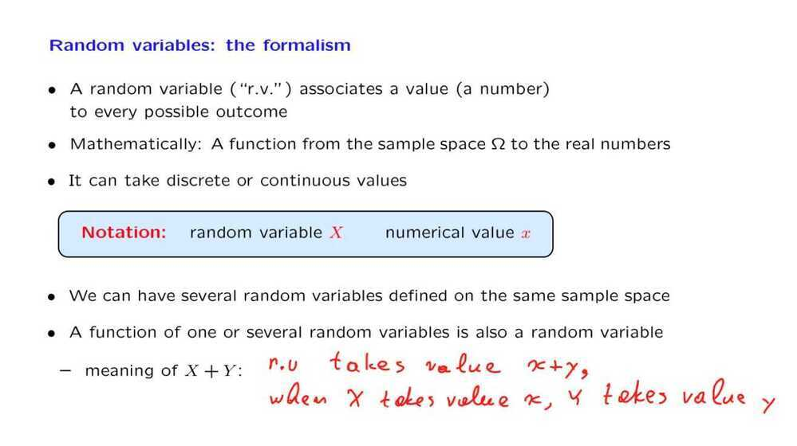

# 5. Probability Mass Functions and Expectations

A random variable that takes a value of 0 or 1, with certain probabilities. Such a probability is called a Bernoulli random variable.

Some useful random variable -

1. Discrete uniform random variable

    It takes a value in a certain range, and each one of the values in that range has the same probability

2. Binomial random variable
3. Geometric random variable

In the above experiment where P(no heads ever) is extremely unlikely since (1-p)^k^ tends to 0 for k tends to infiinity.
Mean of a random variable is a single number that provides some kind of summary of a random variable by telling us what it is on the average

Whenever we have a PMF which is symmetric around a certain point, then the expected value will be the center of symmetry.

- If X >= 0, then E [X] >= 0. If a random variable is non-negative, it's expected value is non-negative
- Expectation has a linearity property

No reason to believe that one value

is more likely than the other
PMF notation instead of simple probability notation
