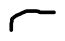

# 9. Conditioning on an event; Multiple continuous r.v.'s

Used light bulb does not remember and it is not affected by how long it has been running. And this is the memorylessness property of exponential random variables.

Green PDF is the form of a conditional PDF

Total area under green curve is 1.
Here Conditional probability of event X occuring in a conditional universe where A occurred is 0, since event A and x are disjoint (x lies outside A)

Case when x lies outside A

Case when x lies inside A
Sums become integrals, and PMFs are replaced by PDFs
