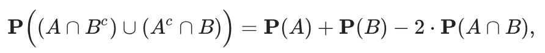
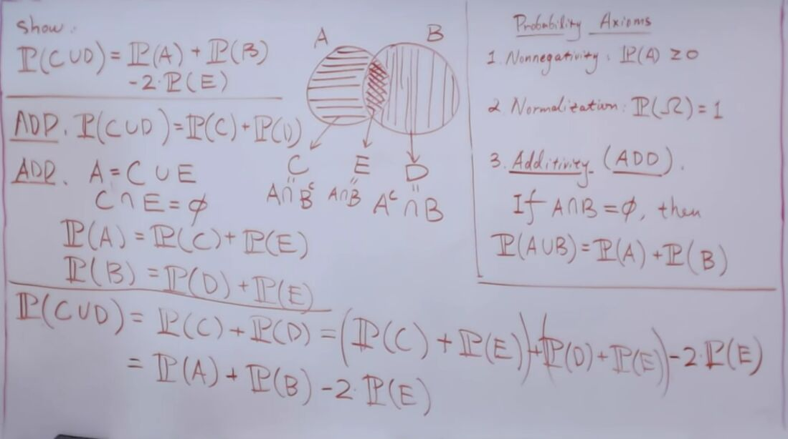
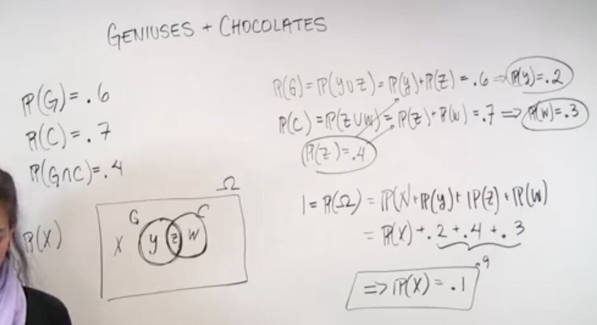

# Unit 1 - Solved Problems

## The probability of difference of two sets

Geniuses and chocolates.Out of the students in a class, 60% are geniuses, 70% love chocolate, and 40% fall into both categories. Determine the probability that a randomly selected student is neither a genius nor a chocolate lover

Uniform probabilities on a square.Romeo and Juliet have a date at a given time, and each will arrive at the meeting place with a delay between 0 and 1 hour, with all pairs of delays being "equally likely," that is, according to a uniform probability law on the unit square. The first to arrive will wait for 15 minutes and will leave if the other has not arrived. What is the probability that they will meet?

## Bonferroni's inequality

Using union bound for P(A1^c^ U A2^c^) <= P(A1^c^) + P(A2^c^)
