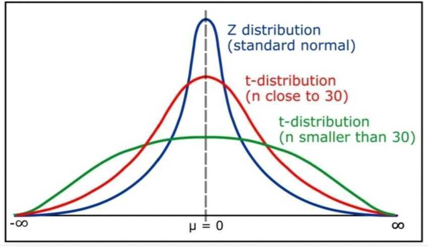
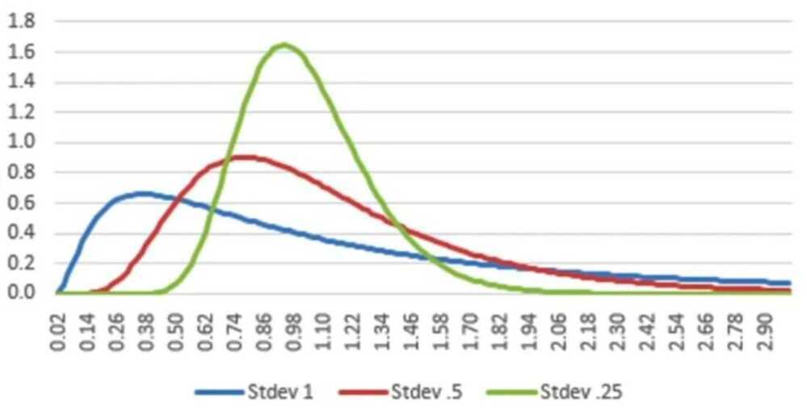
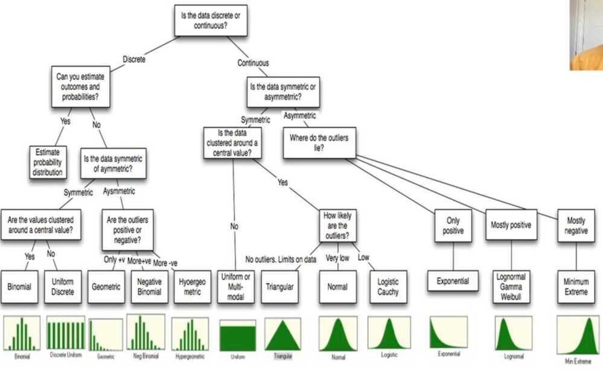

# Normal Distributions

In [probability theory](https://en.wikipedia.org/wiki/Probability_theory), the**normal(orGaussianorGaussorLaplace--Gauss)**distributionis a very common [continuous probability distribution](https://en.wikipedia.org/wiki/Continuous_probability_distribution). Normal distributions are important in [statistics](https://en.wikipedia.org/wiki/Statistics) and are often used in the [natural](https://en.wikipedia.org/wiki/Natural_science) and [social sciences](https://en.wikipedia.org/wiki/Social_science) to represent real-valued [random variables](https://en.wikipedia.org/wiki/Random_variable) whose distributions are not known. A [random variable](https://en.wikipedia.org/wiki/Random_variable) with a Gaussian distribution is said to benormally distributedand is called anormal deviate.
The normal distribution is useful because of the [central limit theorem](https://en.wikipedia.org/wiki/Central_limit_theorem). In its most general form, under some conditions (which include finite [variance](https://en.wikipedia.org/wiki/Variance)), it states that averages of samples of observations of [random variables](https://en.wikipedia.org/wiki/Random_variables) independently drawn from independent distributions [converge in distribution](https://en.wikipedia.org/wiki/Convergence_in_distribution) to the normal, that is, become normally distributed when the number of observations is sufficiently large. Physical quantities that are expected to be the sum of many independent processes (such as [measurement errors](https://en.wikipedia.org/wiki/Measurement_error)) often have distributions that are nearly normal.Moreover, many results and methods (such as [propagation of uncertainty](https://en.wikipedia.org/wiki/Propagation_of_uncertainty) and [least squares](https://en.wikipedia.org/wiki/Least_squares) parameter fitting) can be derived analytically in explicit form when the relevant variables are normally distributed.
- 99% of the data should fall in 3 standard deviations from the mean

## Properties of normal distributions

- **Dispersion:** The standard deviation in a normal distribution measures the spread around the mean, but with links to probabilities of a number occuring in the sample falling within or out of that spread
- **Skewness:** A normal distribution is symmetric and has no skewness
- **Kurtosis:** A variable that is normally distributed can take on values from minus infinity to plus infinity, but the likelihood of extreme values is contrained. The kurtosis for a normal distribution is three, which becomes the standard against which other distributions are measured

- The t distribution

- The Symmetric Triangular Distribution

- A Uniform Distribution

- Negative Skew: Minimum Extreme Value

- Positive Skew: Log Normal Distribution

- Thin tails and Fat tails

## Measured with kurtosis

- Kurtosis is a measure of the combined weights of the tails, relative to the rest of the distribution
- Most often, kurtosis is measured against the **normal distribution.** Pearson's kurtosis is the excess kurtosis over three
  - If the Pearson kurtosis is close to 0, then a normal distribution is often assumed. These are called mesokurtic distributions
  - If the Pearson kurtosis is less than 0, then the distribution has thin tails and is called a platykurtic distribution. (Uniform distribution is a good example)
  - If the Pearson kurtosis is greater than 0, then the distribution has fat tails and is called a leptokurtic distribution

## Properties of Normal Distribution are as follows

1. Unimodal-onemode

2. Symmetrical -left and right halves are mirror images

3. Bell-shaped-maximum height (mode) at the mean

4. Mean, Mode, and Median are all located in the center

5. Asymptotic
<https://en.wikipedia.org/wiki/Normal_distribution>
