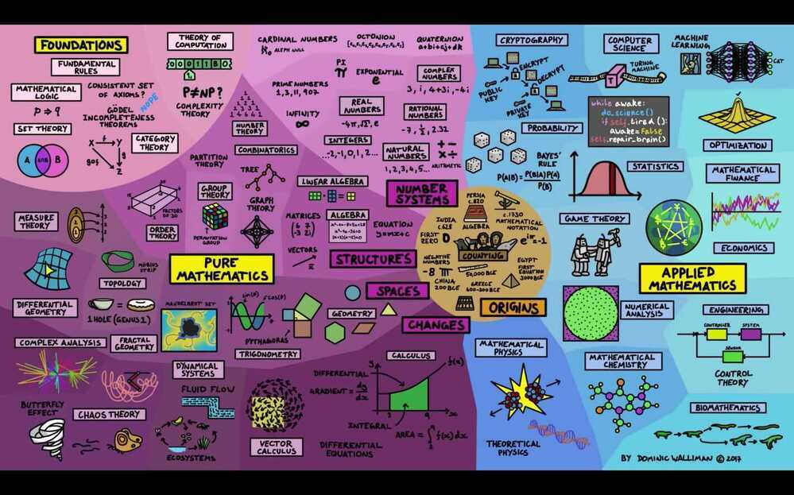
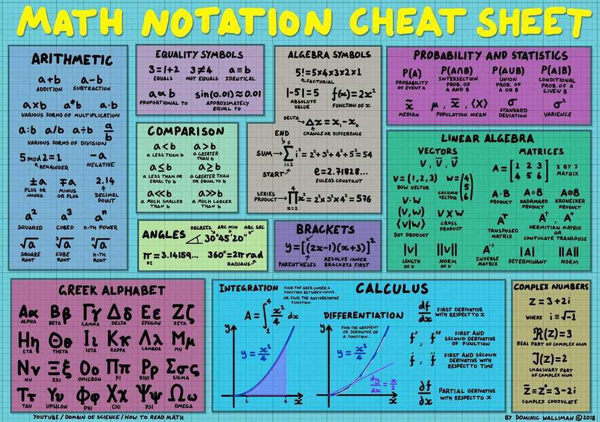

# Mathematics

- [Mahematics General](mathematics/general/readme.md)
- [Geometry](geometry/readme.md)
- [Algebra](algebra/readme.md)
- [Linear Algebra](linear-algebra/readme.md)
- [Statistics](statistics/readme.md)
- [Probability](probability/readme.md)
- [Combinatorics](combinatorics/readme.md)
- [Calculus](calculus/readme.md)
- [Aptitude](aptitude/readme.md)

## Outline

[**Pure mathematics**](https://en.wikipedia.org/wiki/Pure_mathematics)

- [Mathematical logic](https://en.wikipedia.org/wiki/Mathematical_logic) and [Foundations of mathematics](https://en.wikipedia.org/wiki/Foundations_of_mathematics)

Foundation which underlies mathematic logic and the rest of mathematics. It tries to formalize valid reasoning. It attempts to define what constitutes a proof.- [Intuitionistic logic](https://en.wikipedia.org/wiki/Intuitionistic_logic)

- [Modal logic](https://en.wikipedia.org/wiki/Modal_logic)
- [Model theory](https://en.wikipedia.org/wiki/Model_theory)
- [Proof theory](https://en.wikipedia.org/wiki/Proof_theory)
- [Recursion theory](https://en.wikipedia.org/wiki/Recursion_theory)
- [Set theory](https://en.wikipedia.org/wiki/Set_theory)- [Algebra](https://en.wikipedia.org/wiki/Algebra)([outline](https://en.wikipedia.org/wiki/Outline_of_algebra))

Study of algebraic structures, which are sets and operations defined on these sets satisfying certain axioms.- [Associative algebra](https://en.wikipedia.org/wiki/Associative_algebra)

- [Category theory](https://en.wikipedia.org/wiki/Category_theory)
    - [Topos theory](https://en.wikipedia.org/wiki/Topos)
- [Differential algebra](https://en.wikipedia.org/wiki/Differential_algebra)
- [Field theory](https://en.wikipedia.org/wiki/Field_theory_(mathematics))
- [Group theory](https://en.wikipedia.org/wiki/Group_theory)
    - [Group representation](https://en.wikipedia.org/wiki/Group_representation)
- [Homological algebra](https://en.wikipedia.org/wiki/Homological_algebra)
- [K-theory](https://en.wikipedia.org/wiki/K-theory)
- [Lattice theory](https://en.wikipedia.org/wiki/Lattice_theory)([Order theory](https://en.wikipedia.org/wiki/Order_theory))
- [Lie algebra](https://en.wikipedia.org/wiki/Lie_algebra)
- [Linear algebra](https://en.wikipedia.org/wiki/Linear_algebra)([Vector space](https://en.wikipedia.org/wiki/Vector_space))
- [Multilinear algebra](https://en.wikipedia.org/wiki/Multilinear_algebra)
- [Non-associative algebra](https://en.wikipedia.org/wiki/Non-associative_algebra)
- [Representation theory](https://en.wikipedia.org/wiki/Representation_theory)
- [Ring theory](https://en.wikipedia.org/wiki/Ring_theory)
    - [Commutative algebra](https://en.wikipedia.org/wiki/Commutative_algebra)
    - [Noncommutative algebra](https://en.wikipedia.org/wiki/Noncommutative_algebra)
- [Universal algebra](https://en.wikipedia.org/wiki/Universal_algebra)- [Analysis](https://en.wikipedia.org/wiki/Mathematical_analysis)

Calculus and Analysis - Studies the computation of limits, derivatives, and integrals of functions of real numbers, and in particular studies instantaneous rates of change.- [Complex analysis](https://en.wikipedia.org/wiki/Complex_analysis)

- [Functional analysis](https://en.wikipedia.org/wiki/Functional_analysis)
    - [Operator theory](https://en.wikipedia.org/wiki/Operator_theory)
- [Harmonic analysis](https://en.wikipedia.org/wiki/Harmonic_analysis)
    - [Fourier analysis](https://en.wikipedia.org/wiki/Fourier_analysis)
- [Non-standard analysis](https://en.wikipedia.org/wiki/Non-standard_analysis)
- [Ordinary differential equations](https://en.wikipedia.org/wiki/Ordinary_differential_equations)
- [p-adic analysis](https://en.wikipedia.org/wiki/P-adic_analysis)
- [Partial differential equations](https://en.wikipedia.org/wiki/Partial_differential_equations)
- [Real analysis](https://en.wikipedia.org/wiki/Real_analysis)
    - [Calculus](https://en.wikipedia.org/wiki/Calculus)([outline](https://en.wikipedia.org/wiki/Outline_of_calculus))- [Probability theory](https://en.wikipedia.org/wiki/Probability_theory)

[Probability theory](https://en.wikipedia.org/wiki/Probability_theory) is the formalization and study of the mathematics of uncertain events or knowledge. The related field of [mathematical statistics](https://en.wikipedia.org/wiki/Mathematical_statistics) develops [statistical theory](https://en.wikipedia.org/wiki/Statistical_theory) with mathematics.[Statistics](https://en.wikipedia.org/wiki/Statistics), the science concerned with collecting and analyzing data,- [Ergodic theory](https://en.wikipedia.org/wiki/Ergodic_theory)

- [Measure theory](https://en.wikipedia.org/wiki/Measure_theory)
    - [Integral geometry](https://en.wikipedia.org/wiki/Integral_geometry)
- [Stochastic process](https://en.wikipedia.org/wiki/Stochastic_process)- [Geometry](https://en.wikipedia.org/wiki/Geometry)([outline](https://en.wikipedia.org/wiki/Outline_of_geometry)) and [Topology](https://en.wikipedia.org/wiki/Topology)

Study of spatial figures like circles and cubes.

Topology developed from geometry; it looks at those properties that do not change even when the figures are deformed by stretching and bending, like dimension- [Affine geometry](https://en.wikipedia.org/wiki/Affine_geometry)

- [Algebraic geometry](https://en.wikipedia.org/wiki/Algebraic_geometry)
- [Algebraic topology](https://en.wikipedia.org/wiki/Algebraic_topology)
- [Convex geometry](https://en.wikipedia.org/wiki/Convex_geometry)
- [Differential topology](https://en.wikipedia.org/wiki/Differential_topology)
- [Discrete geometry](https://en.wikipedia.org/wiki/Discrete_geometry)
- [Finite geometry](https://en.wikipedia.org/wiki/Finite_geometry)
- [Galois geometry](https://en.wikipedia.org/wiki/Galois_geometry)
- [General topology](https://en.wikipedia.org/wiki/General_topology)
- [Geometric topology](https://en.wikipedia.org/wiki/Geometric_topology)
- [Integral geometry](https://en.wikipedia.org/wiki/Integral_geometry)
- [Noncommutative geometry](https://en.wikipedia.org/wiki/Noncommutative_geometry)
- [Non-Euclidean geometry](https://en.wikipedia.org/wiki/Non-Euclidean_geometry)
- [Projective geometry](https://en.wikipedia.org/wiki/Projective_geometry)- [Number theory](https://en.wikipedia.org/wiki/Number_theory)

Studies natural, whole and prime numbers.- [Algebraic number theory](https://en.wikipedia.org/wiki/Algebraic_number_theory)

- [Analytic number theory](https://en.wikipedia.org/wiki/Analytic_number_theory)
- [Arithmetic combinatorics](https://en.wikipedia.org/wiki/Arithmetic_combinatorics)
- [Geometric number theory](https://en.wikipedia.org/wiki/Geometric_number_theory)
[Applied mathematics](https://en.wikipedia.org/wiki/Applied_mathematics)
- [Approximation theory](https://en.wikipedia.org/wiki/Approximation_theory)
- [Combinatorics](https://en.wikipedia.org/wiki/Combinatorics)([outline](https://en.wikipedia.org/wiki/Outline_of_combinatorics))

Study of discrete (and usually finite) objects

- Enumerative combinatorics

Counting the objects satisfying certain criteria

- Combinatorial designs and matroid theory

Deciding when the criteria can be met, and constructing and analyzing objects meeting the criteria

- External combinatorics and combinatorial optimization

Finding "largest", "smallest", or "optimal" objects

- Algebraic combinatorics

Finding algebraic structures these objects may have- [Coding theory](https://en.wikipedia.org/wiki/Coding_theory)- [Cryptography](https://en.wikipedia.org/wiki/Cryptography)

- [Dynamical systems](https://en.wikipedia.org/wiki/Dynamical_systems)

A differential equation is an equation involving an unknown function and its derivatives- [Chaos theory](https://en.wikipedia.org/wiki/Chaos_theory)

- [Fractal geometry](https://en.wikipedia.org/wiki/Fractal_geometry)- [Game theory](https://en.wikipedia.org/wiki/Game_theory)

[Game theory](https://en.wikipedia.org/wiki/Game_theory) is a branch of [mathematics](https://en.wikipedia.org/wiki/Mathematics) that uses [models](https://en.wikipedia.org/wiki/Model_(abstract)) to study interactions with formalized incentive structures ("games").- [Graph theory](https://en.wikipedia.org/wiki/Graph_theory)

- [Information theory](https://en.wikipedia.org/wiki/Information_theory)
- [Mathematical physics](https://en.wikipedia.org/wiki/Mathematical_physics)
    - [Quantum field theory](https://en.wikipedia.org/wiki/Quantum_field_theory)
    - [Quantum gravity](https://en.wikipedia.org/wiki/Quantum_gravity)
        - [String theory](https://en.wikipedia.org/wiki/String_theory)
    - [Quantum mechanics](https://en.wikipedia.org/wiki/Quantum_mechanics)
    - [Statistical mechanics](https://en.wikipedia.org/wiki/Statistical_mechanics)
- [Numerical analysis](https://en.wikipedia.org/wiki/Numerical_analysis)
- [Operations research](https://en.wikipedia.org/wiki/Operations_research)

[Operations research](https://en.wikipedia.org/wiki/Operations_research) is the study and use of mathematical models, statistics and algorithms to aid in decision-making, typically with the goal of improving or optimizing performance of real-world systems.- [Assignment problem](https://en.wikipedia.org/wiki/Assignment_problem)

- [Decision analysis](https://en.wikipedia.org/wiki/Decision_analysis)
- [Dynamic programming](https://en.wikipedia.org/wiki/Dynamic_programming)
- [Inventory theory](https://en.wikipedia.org/wiki/Inventory_theory)
- [Linear programming](https://en.wikipedia.org/wiki/Linear_programming)
- [Mathematical optimization](https://en.wikipedia.org/wiki/Mathematical_optimization)
- [Optimal maintenance](https://en.wikipedia.org/wiki/Optimal_maintenance)
- [Real options analysis](https://en.wikipedia.org/wiki/Real_options_analysis)
- [Scheduling](https://en.wikipedia.org/wiki/Job_shop_scheduling)
- [Stochastic processes](https://en.wikipedia.org/wiki/Stochastic_processes)
- [Systems analysis](https://en.wikipedia.org/wiki/Systems_analysis)- [Statistics](https://en.wikipedia.org/wiki/Statistics)([outline](https://en.wikipedia.org/wiki/Outline_of_statistics))
    - [Actuarial science](https://en.wikipedia.org/wiki/Actuarial_science)
    - [Demography](https://en.wikipedia.org/wiki/Demography)
    - [Econometrics](https://en.wikipedia.org/wiki/Econometrics)
    - [Mathematical statistics](https://en.wikipedia.org/wiki/Mathematical_statistics)
    - [Data visualization](https://en.wikipedia.org/wiki/Data_visualization)
- [Theory of computation](https://en.wikipedia.org/wiki/Theory_of_computation)

Study of algorithms and data structures- [Computational complexity theory](https://en.wikipedia.org/wiki/Computational_complexity_theory)- Information theory and signal processing

Quantification of information (fundamental limits on compressing and reliably communicating data)

Processing signals (filtering, storage and reconstruction, separation of information from noise, compression, and feature extraction)

## References

[A few of the best math explainers from this summer](https://www.youtube.com/watch?v=F3Qixy-r_rQ)

[How a Computer Broke a 50-Year Math Record - YouTube](https://www.youtube.com/watch?v=fDAPJ7rvcUw&ab_channel=QuantaMagazine)

[The hidden networks of everything | Albert-László Barabási - YouTube](https://www.youtube.com/watch?v=RfgjHoVCZwU)

[How can maths help us make better predictions? - with Kit Yates - YouTube](https://www.youtube.com/watch?v=ehXZHY_jgI0)
